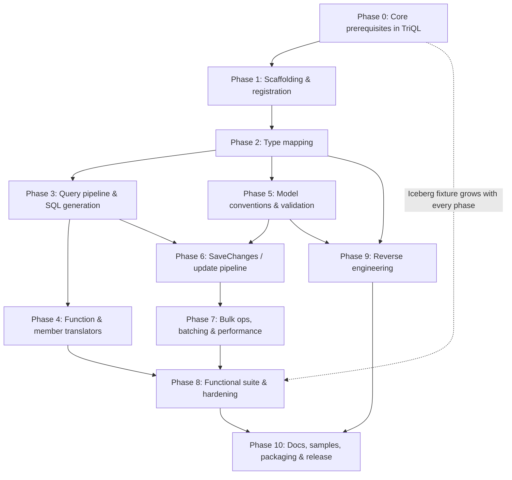

# TriQL.EntityFrameworkCore — Implementation Plan

| Field | Value |
|---|---|
| Document | EF Core provider — phased implementation plan |
| Product | `TriQL.EntityFrameworkCore` — Entity Framework Core 10 provider for Trino |
| Builds on | `TriQL.Data.ADO` 1.x (`TrinoConnection`, `TrinoCommand`, `TrinoDataReader`) |
| Modelled on | `BricksNet.EntityFrameworkCore` (`C:\DevelopmentRep\BricksNet\docs\EFCORE_PLAN.md`) |
| Date | 2026-10-07 |
| Status | Phases 0–6 complete (2026-10-08, branch `feature/efcore-provider`); Phase 7 next |

---

## Table of Contents

1. [Overview](#1-overview)
2. [Trino dialect facts that drive the design](#2-trino-dialect-facts-that-drive-the-design)
3. [Gap analysis of the current TriQL ADO.NET layer](#3-gap-analysis-of-the-current-triql-adonet-layer)
4. [Target layout](#4-target-layout)
5. [Dependency graph](#5-dependency-graph)
6. [Cross-cutting rules](#6-cross-cutting-rules)
7. [Phase 0 — Core prerequisites in TriQL](#phase-0--core-prerequisites-in-triql)
8. [Phase 1 — Project scaffolding and provider registration](#phase-1--project-scaffolding-and-provider-registration)
9. [Phase 2 — Type mapping](#phase-2--type-mapping)
10. [Phase 3 — Query pipeline and SQL generation](#phase-3--query-pipeline-and-sql-generation)
11. [Phase 4 — Function and member translators](#phase-4--function-and-member-translators)
12. [Phase 5 — Model conventions and validation](#phase-5--model-conventions-and-validation)
13. [Phase 6 — SaveChanges and the update pipeline](#phase-6--savechanges-and-the-update-pipeline)
14. [Phase 7 — Bulk operations, batching and performance](#phase-7--bulk-operations-batching-and-performance)
15. [Phase 8 — Functional test suite and hardening](#phase-8--functional-test-suite-and-hardening)
16. [Phase 9 — Reverse engineering (scaffolding)](#phase-9--reverse-engineering-scaffolding)
17. [Phase 10 — Docs, samples, packaging and release](#phase-10--docs-samples-packaging-and-release)
18. [Risks and mitigations](#18-risks-and-mitigations)
19. [Remaining open questions](#19-remaining-open-questions)

---

## 1. Overview

`TriQL.EntityFrameworkCore` is an **Entity Framework Core 10 relational database provider** for
Trino. It is a separate project and NuGet package on top of the existing TriQL ADO.NET provider.

```csharp
services.AddDbContext<SalesContext>(o => o.UseTrino(
    "Server=https://trino.example.com;Catalog=lake;Schema=sales;User=analyst",
    t => t.EnableRetryOnFailure()));

var top = await db.Orders
    .Where(o => o.OrderDate >= new DateOnly(2026, 1, 1))
    .GroupBy(o => o.Region)
    .Select(g => new { g.Key, Total = g.Sum(o => o.Amount) })
    .OrderByDescending(x => x.Total)
    .Take(10)
    .ToListAsync();
```

### 1.1 Scope (agreed)

| In scope | Out of scope |
|---|---|
| LINQ query translation on **any** connector (`tpch`, Hive, Iceberg, Delta, PostgreSQL, …) | Migrations (`Migrate()`, `dotnet ef migrations`) — throw with guidance |
| Raw SQL (`FromSql`, `SqlQuery`, `ExecuteSql`) | Multi-statement transactions |
| `SaveChanges` INSERT/UPDATE/DELETE, **verified against the Iceberg connector** | Store-generated values (identity, sequences, defaults, computed read-back) |
| `ExecuteUpdate` / `ExecuteDelete` (Iceberg) | Spatial types, full-text search |
| Optimistic concurrency via Trino's `updateCount` | Write verification on connectors other than Iceberg (best effort, clear server errors) |
| Three-part names `catalog.schema.table` | `ARRAY`/`MAP`/`ROW` mappings and primitive collections (future) |
| `EnsureCreated` / `EnsureDeleted` / `GenerateCreateScript` for development and tests | |
| **Reverse engineering** (`dotnet ef dbcontext scaffold`) from `information_schema` | |

### 1.2 Decisions taken

1. **Writes target Iceberg.** Queries must work on every connector. `SaveChanges`,
   `ExecuteUpdate` and `ExecuteDelete` are designed for and verified against the Iceberg
   connector. A new Iceberg + MinIO test fixture runs these tests in CI. On other connectors, writes
   pass through and fail with the server's own error ("This connector does not support …").
2. **No transactions.** `BeginTransaction`, `UseTransaction`, `EnlistTransaction` and
   `TransactionScope` throw `NotSupportedException`, consistent with `TriQL.Data.ADO` (FR-9.1.11).
   `SaveChanges` runs statements without a transaction and is **not atomic across statements**.
   The provider logs `TrinoEventId.NonAtomicSaveChanges` and marks the entities of statements that
   already committed as saved when a later statement fails (same model as BricksNet).
3. **No store-generated values.** Trino has no `RETURNING`/`OUTPUT`, and Iceberg has no identity
   columns or sequences. Keys and defaults are set in .NET. `Guid` keys get UUIDv7 values. Integer
   keys are not treated as generated. Model validation rejects store-generated configuration with
   guidance.
4. **Scaffolding yes, migrations no.** Trino is mostly used over tables that already exist, so
   reverse engineering (Phase 9) is in scope. Migrations are not: `Migrate()` and
   `dotnet ef migrations` throw.
5. **Naming.** Package `TriQL.EntityFrameworkCore`, entry point `UseTrino(...)`, service
   registration `AddEntityFrameworkTrino()`, type prefix `Trino*` (e.g. `TrinoQuerySqlGenerator`).
   This is the convention of `UseSqlServer`/`UseNpgsql`, and it matches the existing `Trino*`
   ADO.NET types.
6. **Versioning.** Ships as `1.1.0-preview.N` while the core packages stay on stable 1.x. It moves
   to stable once Phases 0–10 are complete and the functional suite is green on the CI matrix.
7. **Core fixes in TriQL where EF needs them** (Phase 0). They are additive to the 1.x public API,
   which `PublicAPI.Shipped.txt` locks, and they also benefit Dapper and other ADO.NET users.
8. **EF Core version range `[10.0.x, 11.0.0)`.** The provider uses EF's "internal" (pubternal) APIs,
   as every provider does, and these can change in a major release.

### 1.3 Guiding principles (inherited from the TriQL requirements)

- Async all the way, with `ConfigureAwait(false)` and a `CancellationToken` everywhere.
- Fail loudly and early. An unsupported LINQ construct throws `InvalidOperationException` at
  translation time with a Trino-specific explanation. It must never produce SQL that fails
  cryptically on the server.
- Security (SEC-4): values are always sent as **bound parameters**. Literals are inlined only where
  EF already inlines constants, and they go through one escaping helper that is fuzz-tested.
- Mirror EF Core's own providers' structure so contributors can navigate by analogy.
- Follow the repo's build rules: `TreatWarningsAsErrors`, analyzers at `latest-recommended`,
  `BannedSymbols.txt`, central package management with lock files, and PublicAPI baselines.

### 1.4 Reference implementations

| Concern | Reference |
|---|---|
| Overall provider skeleton, minimal feature set | `EFCore.Sqlite` (dotnet/efcore `src/EFCore.Sqlite.Core`) |
| Double-quote identifiers, `OFFSET`/`FETCH`, `IS DISTINCT FROM`, native boolean, reverse engineering | Npgsql.EntityFrameworkCore.PostgreSQL |
| Non-transactional SaveChanges, rows-affected mapping, UUIDv7 keys, throwing migrator | `BricksNet.EntityFrameworkCore` |
| Trino dialect | Trino SQL reference: functions, literals, `EXECUTE IMMEDIATE`, `MERGE`, Iceberg connector |
| Trino JDBC driver | Reference for the `EXECUTE IMMEDIATE` parameter path (`explicitPrepare=false`) and `DatabaseMetaData` |

---

## 2. Trino dialect facts that drive the design

Each fact is re-verified against the Trino container (floor `466` and `latest`) in the phase that
relies on it. Facts marked **(verify)** are believed correct but have not yet been tested.

| # | Fact | Consequence |
|---|---|---|
| T1 | No usable multi-statement transactions: Iceberg and most connectors only support autocommit writes. | Decision 2 |
| T2 | DML (`INSERT`/`UPDATE`/`DELETE`/`MERGE`) reports `updateType` and `updateCount` in the protocol, and also returns a one-column `rows` result set. | Rows affected come from `updateCount` (Phase 0 G4); EF uses it for concurrency checks (Phase 6) |
| T3 | No `RETURNING`/`OUTPUT`; Iceberg has no identity columns, sequences or column defaults. | Decision 3 |
| T4 | Identifiers use `"double quotes"`, with `""` as the escape. **Identifiers are case-insensitive and stored lower-case**, even when quoted. | `TrinoSqlGenerationHelper`; model validation rejects names that differ only by case (Phase 5); scaffolding maps lower-case names back to PascalCase (Phase 9) |
| T5 | String literals use `'…'` with `''` as the escape. There are no backslash escapes. `U&'…'` exists for Unicode escapes. | One escaping helper, shared with `SqlLiteralEncoder` |
| T6 | Parameters are bound with `PREPARE`/`EXECUTE … USING` (the prepared SQL travels in the `X-Trino-Prepared-Statement` **HTTP header**) or with `EXECUTE IMMEDIATE '<sql>' USING …` (Trino 418+; the SQL travels in the body). **Measured on 466 (2026-10-07):** the coordinator accepts the header path up to ~1.7 MB of statement text (HTTP 431 by 3.5 MB); `EXECUTE IMMEDIATE` fails earlier, with `QUERY_TEXT_TOO_LARGE` (`query.max-length`, 1,000,000 characters) at ~1 MB. | The coordinator is not the constraint; proxies/gateways in front of it (8–16 KB per header is common) are. `ParameterBinding=ExecuteImmediate` (EF0-T1) is the opt-in for those deployments. |
| T7 | Integer `/` truncates, like .NET; `%` is modulo; `\|\|` and `concat()` concatenate strings. | No integer-division rewrite (unlike Databricks); `+` on strings → `\|\|` |
| T8 | Paging syntax is `OFFSET m` **before** `LIMIT n`. **Measured:** parameters are accepted in both. | `TrinoQuerySqlGenerator.GenerateLimitOffset`; no literal inlining needed |
| T9 | Native `BOOLEAN`; `IS [NOT] DISTINCT FROM` is supported. | No `CASE` wrapping for predicates; null-safe equality optimisation |
| T10 | No `APPLY`; `CROSS JOIN LATERAL (…)` and `LEFT JOIN LATERAL (…) ON TRUE` exist. Correlated-subquery support is partial; the measured matrix is in Phase 3's status. | `VisitCrossApply`/`VisitOuterApply` → `LATERAL`; `TrinoQueryTranslationPostprocessor` rejects the unsupported shapes |
| T11 | `UPDATE … SET … WHERE` and `DELETE … WHERE` accept subqueries in `WHERE` on Iceberg. There is no `UPDATE … FROM`. `MERGE INTO` is supported on Iceberg. | `ExecuteUpdate` with joins → `WHERE EXISTS (…)`; values from another table → generated `MERGE` (Phase 7) |
| T12 | Bare `timestamp` means `timestamp(3)`. Iceberg only stores `timestamp(6)` and `timestamp(6) with time zone`. | `DateTime` → `timestamp(6)`, `DateTimeOffset` → `timestamp(6) with time zone` |
| T13 | **Measured on 466:** Iceberg accepts `tinyint`/`smallint`/`char(n)`/`varchar(n)`/`timestamp(3)` in DDL but silently stores `integer`/`integer`/`varchar`/`varchar`/`timestamp(6)`. | DDL does not fail; columns read back wider, and the EF0-T3 conversions narrow them. Default DDL types still use the stored types, so `GenerateCreateScript` shows the truth (Phase 2) |
| T14 | Iceberg `timestamp with time zone` is stored as a UTC instant, so the offset is not preserved. | Documented; `DateTimeOffset` values read back in UTC |
| T15 | `round()` rounds half away from zero; .NET's `Math.Round` defaults to half-to-even. | `Math.Round(x)` needs an emulation or translates only with `MidpointRounding.AwayFromZero` (Phase 4) |
| T16 | String comparison is binary and case-sensitive. `LIKE` has no default escape character; `ESCAPE` must be stated. | Matches C# `==`; `StartsWith` etc. emit `LIKE … ESCAPE '\'` |
| T17 | Native `uuid`, `varbinary`, `date`, `time(p)`, `decimal(p ≤ 38)`. | Direct mappings for `Guid`, `byte[]`, `DateOnly`, `TimeOnly`, `decimal` |
| T18 | Iceberg commits are optimistic; concurrent writers to one table can fail with `ICEBERG_COMMIT_ERROR`. | Retrying execution strategy (Phase 6) classifies it as transient |
| T19 | Every statement is at least one HTTP round trip, plus polling. Coordinator queueing adds latency. | Multi-row inserts, `ExecuteUpdate`/`ExecuteDelete`, HTTP connection reuse (Phase 0 G2) |
| T20 | Session time zone comes from `X-Trino-Time-Zone`. `TrinoSessionOptions.TimeZone` defaults to the **client machine's** zone. | `current_timestamp`, `DateTimeOffset` parts and timestamp casts depend on it. The EF provider defaults to UTC (Phase 0 G6). |
| T21 | `information_schema` exposes tables, columns and data types per catalog, but no primary or foreign keys for Iceberg. | Scaffolded entities are keyless unless a key is configured (Phase 9) |

---

## 3. Gap analysis of the current TriQL ADO.NET layer

Findings from reading `src/TriQL.Client` and `src/TriQL.Data.ADO`:

| # | Gap | Where | Impact on EF |
|---|---|---|---|
| G1 | Parameterized SQL is registered as a session prepared statement and sent in the `X-Trino-Prepared-Statement` header on every request. | [TrinoClient.cs:143](../src/TriQL.Client/TrinoClient.cs#L143), [ProtocolHeaders.cs:40](../src/TriQL.Client/Internal/ProtocolHeaders.cs#L40) | **Revised after measurement (T6):** the default coordinator accepts ~1.7 MB headers, so this only fails behind proxies or gateways with small header limits. Addressed by the opt-in `ExecuteImmediate` binding (EF0-T1), not by changing the default. |
| G2 | Each `TrinoConnection.Open()` creates a new `TrinoClient` and, without an `IHttpClientFactory`, a new `SocketsHttpHandler`. `Close()` disposes it. | [TrinoConnection.cs:117-118](../src/TriQL.Data.ADO/TrinoConnection.cs#L117-L118), `TrinoClient.CreateOwnedInvoker` | EF opens and closes the connection around every command, so every query pays a TCP + TLS handshake, and sockets churn. |
| G3 | `GetFieldValue<T>` returns only the exact CLR type (or `JsonDocument`). | `TrinoRow.GetFieldValue<T>` ([TrinoRow.cs:81-105](../src/TriQL.Client/TrinoRow.cs#L81-L105)) | EF materialisers call `GetFieldValue<T>` for types without a dedicated getter. Fails for `long` on `integer`, `decimal` on `decimal(p > 28)` (which returns `TrinoBigDecimal`), `DateTime` on `timestamp(p > 7)`, `byte`/`ushort`/`uint`/`ulong`, `char`, enums. |
| G4 | `TrinoDataReader.RecordsAffected` returns `-1` whenever the result has columns. | [TrinoDataReader.cs:92-111](../src/TriQL.Data.ADO/TrinoDataReader.cs#L92-L111) | Trino DML returns a `rows` column (T2), so a reader over `UPDATE` reports `-1`. EF's concurrency checks would then fail. Also verify that `TrinoResultSet.UpdateCount` reflects the **final** page, not only the initial response. |
| G5 | `TrinoDbParameter.Precision`/`Scale` are declared with `new`, hiding `DbParameter.Precision`/`Scale` instead of overriding them. | [TrinoDbParameter.cs:81-84](../src/TriQL.Data.ADO/TrinoDbParameter.cs#L81-L84) | EF's `RelationalTypeMapping.ConfigureParameter` sets precision and scale through the `DbParameter` base type, so the values are silently lost. |
| G6 | The session time zone defaults to the client machine's zone. | `TrinoSessionOptions.TimeZone` | Results of `DateTime.Now`, `DateTimeOffset` parts and timestamp casts differ between machines. **No core change needed:** `TrinoConnectionStringBuilder.TimeZone` is `null` unless the connection string sets it, so the EF provider can default to UTC on its own (EF1-T5). |
| G7 | A `null` parameter renders as an untyped `NULL`, even when `DbType`/`TrinoType` is set. | [SqlLiteralEncoder.cs:19-22](../src/TriQL.Client/Internal/SqlLiteralEncoder.cs#L19-L22) | `COALESCE(?, col)`, `CASE`, `SELECT ?` and some function arguments fail type inference with `unknown`. |
| G8 | `DbType.DateTime` maps to bare `timestamp`, which is `timestamp(3)`. | [DbTypeMapping.cs](../src/TriQL.Client/Internal/DbTypeMapping.cs) | Only matters on the explicit-type path (CLR-type encoding wins today), but EF sends typed nulls through it once G7 is fixed, so this needs `timestamp(6)`. |
| G9 | Query failures carry `ErrorName`/`ErrorType`, but there is no notion of a *transient* query error. `IsRetryable` covers transport failures only. | `TrinoQueryException`, `RetryPolicy` | The EF execution strategy needs a shared classification (`ICEBERG_COMMIT_ERROR`, `SERVER_STARTING_UP`, `CLUSTER_OUT_OF_MEMORY`, `TOO_MANY_REQUESTS_FAILED`, 429/503). |
| G10 | One command at a time per connection (FR-9.1.15). | `TrinoConnection.BeginCommand` | EF split queries and nested readers must buffer. Verify that EF buffers when the connection does not support multiple active result sets (Phase 3). No core change is planned. |
| G11 | `src/` projects inherit `IsTrimmable`/`IsAotCompatible` and PublicAPI analyzers from `Directory.Build.props`. | `Directory.Build.props` | EF Core's runtime is not trim/AOT safe, so the EF project must opt out of trimming and AOT. It keeps the PublicAPI analyzers. |

Not gaps: `CommandType.Text` only, input-only parameters, `CanCreateBatch = false`, and `Prepare()`
as a no-op are all fine for EF.

---

## 4. Target layout

```
src/
  TriQL.Client/                    (existing; Phase 0 changes only)
  TriQL.Data.ADO/                  (existing; Phase 0 changes only)
  TriQL.EntityFrameworkCore/
    TriQL.EntityFrameworkCore.csproj
    PublicAPI.Shipped.txt / PublicAPI.Unshipped.txt
    Extensions/
      TrinoDbContextOptionsBuilderExtensions.cs     UseTrino(...)
      TrinoServiceCollectionExtensions.cs           AddEntityFrameworkTrino()
      TrinoDbFunctionsExtensions.cs                 EF.Functions.* (Phase 4)
      TrinoModelBuilderExtensions.cs                HasDefaultCatalog / HasCatalog (Phase 5)
    Infrastructure/
      TrinoDbContextOptionsBuilder.cs
      TrinoRetryingExecutionStrategy.cs
      Internal/TrinoOptionsExtension.cs, TrinoModelValidator.cs
    Diagnostics/
      TrinoEventId.cs
      Internal/TrinoLoggingDefinitions.cs, TrinoLoggerExtensions.cs
    Metadata/
      Conventions/TrinoConventionSetBuilder.cs, TrinoValueGenerationConvention.cs
      Internal/TrinoAnnotationNames.cs, TrinoAnnotationProvider.cs
    Storage/Internal/
      TrinoRelationalConnection.cs
      TrinoSqlGenerationHelper.cs
      TrinoTypeMappingSource.cs
      Mapping/                                      one file per type mapping
      TrinoDatabaseCreator.cs
      TrinoTransientExceptionDetector.cs
    Query/Internal/
      TrinoQuerySqlGenerator(.Factory).cs
      TrinoSqlTranslatingExpressionVisitor(.Factory).cs
      TrinoQueryableMethodTranslatingExpressionVisitor(.Factory).cs
      TrinoParameterBasedSqlProcessor(.Factory).cs
      TrinoSqlNullabilityProcessor.cs
      TrinoMethodCallTranslatorProvider.cs, TrinoMemberTranslatorProvider.cs,
      TrinoAggregateMethodCallTranslatorProvider.cs
      Translators/                                  String, Math, DateTime, DateOnly, DateTimeOffset,
                                                    Convert, ObjectToString, Guid, ByteArray, Regex, DbFunctions
    Update/Internal/
      TrinoUpdateSqlGenerator.cs
      TrinoModificationCommandBatch(.Factory).cs
      TrinoBatchExecutor.cs                         non-transactional
    Migrations/Internal/
      TrinoMigrationsSqlGenerator.cs                EnsureSchema/CreateTable/DropTable only
      TrinoMigrator.cs, TrinoHistoryRepository.cs   throw "migrations not supported"
    Scaffolding/Internal/                           (Phase 9)
      TrinoDatabaseModelFactory.cs
      TrinoCodeGenerator.cs
    Design/Internal/TrinoDesignTimeServices.cs      (Phase 9)
    ValueGeneration/Internal/
      TrinoValueGeneratorSelector.cs, GuidV7ValueGenerator.cs
tests/
  TriQL.EntityFrameworkCore.Tests/                  unit + SQL-baseline tests (no server; CI)
  TriQL.EntityFrameworkCore.FunctionalTests/        live Trino via Testcontainers (memory + Iceberg; CI)
samples/
  TriQL.Samples.EntityFrameworkCore/                query, SaveChanges, ExecuteUpdate, scaffolded context
docs/
  efcore-plan.md                                    this plan
  efcore.md                                         user guide + limitations (Phase 10)
```

Namespaces follow EF provider conventions. The public extension methods (`UseTrino`,
`AddEntityFrameworkTrino`, `HasCatalog`, `EF.Functions.*`) live in `Microsoft.EntityFrameworkCore`
(or `Microsoft.Extensions.DependencyInjection`) so they are discoverable. Implementation types live
in `TriQL.EntityFrameworkCore.*.Internal`. They are `public` because EF's dependency-injection model
requires it, and they carry EF's standard "internal API" XML doc remark.

---

## 5. Dependency graph



Each phase ends in a mergeable PR with green CI. Phases 4 and 5 can run in parallel, and so can
Phase 9 and Phases 6–8.

---

## 6. Cross-cutting rules

**Definition of done (per phase)**

- `dotnet build` is warning-free under `TreatWarningsAsErrors`.
- New public API is recorded in `PublicAPI.Unshipped.txt`.
- Lock files are updated (`dotnet restore --force-evaluate`).
- Every behaviour has a unit or SQL-baseline test, and every server-dependent fact has a
  functional test.
- `CHANGELOG`/release notes are updated for any core (`TriQL.Client`/`TriQL.Data.ADO`) change.

**Test lanes**

| Lane | Project | Needs | Runs in |
|---|---|---|---|
| Unit / SQL baseline | `TriQL.EntityFrameworkCore.Tests` | Nothing (fake connection) | `ci.yml`, every PR |
| Functional — read | `TriQL.EntityFrameworkCore.FunctionalTests`, `Category=EfRead` | `trinodb/trino` (memory + tpch catalogs) | `ci.yml` |
| Functional — write | `TriQL.EntityFrameworkCore.FunctionalTests`, `Category=EfIceberg` | Trino + the fixture's local-disk Iceberg catalog | `ci.yml` and `nightly.yml` matrix `{466, latest}` |

Unlike BricksNet, which can only run live tests locally, every test lane here runs in CI. The
existing Testcontainers and MinIO fixtures do most of the work.

**EF1001**: EF's internal-API analyzer warning is suppressed project-wide in the EF csproj, with
a comment explaining why, as BricksNet does.

---

## Phase 0 — Core prerequisites in TriQL

### Goal
Close the ADO.NET gaps EF depends on (§3) without breaking 1.x behaviour. All changes are additive
to the public API, or change behaviour behind an opt-in.

### Implementation steps
- **EF0-T1 — `EXECUTE IMMEDIATE` parameter path (G1).** Add
  `TrinoSessionOptions.ParameterBinding { PreparedStatementHeader, ExecuteImmediate }`, with the
  connection-string keyword `ParameterBinding`. `ExecuteImmediate` sends
  `EXECUTE IMMEDIATE '<rewritten sql, '' escaped>' USING <literals>` in the request body and
  registers nothing in the session. Values are still bound by the server, so the "no client-side
  interpolation" rule (FR-8.x, SEC-4) still holds. The 1.x default stays `PreparedStatementHeader`.
  Traces keep reporting the caller's original SQL. **Done.** Measurement (T6) showed the header
  path has the higher ceiling at the coordinator, so the EF provider does *not* force
  `ExecuteImmediate`; it is a documented setting for proxied deployments.
- **EF0-T2 — HTTP connection reuse (G2).** **Done, with a simpler design than first planned.** A
  process-wide handler cache would have to be keyed on TLS settings, certificate objects and
  credential-bearing authenticators, which is fragile and could share a handler between different
  credentials. Instead:
  - a `TrinoConnection` builds its handler on the first `Open()` and reuses it on every later
    `Open()`, until it is disposed or its `ConnectionString` changes. EF reuses one `DbConnection`
    per `DbContext`, and context pooling reuses those;
  - a `TrinoDataSource` owns one handler that all its connections share, disposed with the data
    source. EF exposes it through `UseTrino(TrinoDataSource)` (EF1-T3) for sharing across contexts.

  The `IHttpClientFactory` constructor overload is unchanged. No new connection-string keyword.
- **EF0-T3 — Converting `GetFieldValue<T>` (G3).** Replace the exact-type check with a conversion
  table. Unwrap `Nullable<T>` first. Cover:
  - checked numeric widening and narrowing across `sbyte`/`byte`/`short`/`ushort`/`int`/`uint`/`long`/`ulong`/`float`/`double`/`decimal`;
  - `TrinoBigDecimal` → `decimal`, throwing `OverflowException` on loss;
  - `TrinoTimestamp` → `DateTime` and `TrinoTimestampWithTimeZone` → `DateTimeOffset`, truncating to 100 ns;
  - `DateTime` ↔ `DateOnly`, and `DateTimeOffset` → `DateTime` (UTC);
  - `string` → `Guid`/`char`;
  - enums from their underlying integral type.

  The thrown `InvalidCastException` names the column, the source type and the target type. Apply
  the same rules to `TrinoDataReader.GetFieldValue<T>`.
- **EF0-T4 — `RecordsAffected` for DML (G4).** Return `UpdateCount` when `UpdateType` is non-null,
  whether or not the result has columns. Keep `-1` for queries. Add a test that `UpdateCount` is
  taken from the final protocol page.
- **EF0-T5 — Override `Precision`/`Scale` (G5).** Change `TrinoDbParameter.Precision`/`Scale`
  from `new` to `override`. Callers keep binary compatibility, because the accessor methods stay on
  `TrinoDbParameter`. Update the PublicAPI baselines.
- **EF0-T6 — Explicit time-zone tracking (G6).** **Not needed.** `TrinoConnectionStringBuilder.TimeZone`
  is already `null` unless the connection string sets it; the EF provider reads it in EF1-T5. Callers
  who pass `TrinoSessionOptions` directly keep whatever zone they set.
- **EF0-T7 — Typed nulls and precise timestamps (G7, G8).** When `Value` is null and
  `TrinoType`/`DbType` is known, render `CAST(NULL AS <type>)`. Map `DbType.DateTime`/`DateTime2` to
  `timestamp(6)` and `DbType.DateTimeOffset` to `timestamp(6) with time zone`.
- **EF0-T8 — Transient classification (G9).** Add `bool TrinoQueryException.IsTransient`, computed
  from a documented `ErrorName` set and the HTTP status. The EF detector reuses it, and so can other
  callers' retry policies.
- **EF0-T9 — Iceberg test fixture.** **Done, without MinIO.** `TrinoContainerFixture` starts the
  container with `CATALOG_MANAGEMENT=dynamic` and runs `CREATE CATALOG iceberg USING iceberg`, using
  `iceberg.catalog.type=testing_file_metastore` and `fs.hadoop.enabled=true` with `file://` paths on
  the container's disk. Verified on 466 and 483. Every integration test class can use
  `TrinoContainerFixture.IcebergCatalog`, so the Iceberg lane is part of the normal integration job
  rather than a separate MinIO job. `AdoIcebergDmlTests` asserts UPDATE (including a stale
  concurrency token → 0), DELETE (filtered by subquery, and unconditional) and MERGE counts.

### Tests
- Extend `TrinoCommandAndReaderTests` (the conversion matrix, `RecordsAffected` on DML, typed
  nulls) and `TrinoConnectionStringBuilderTests` (new keywords).
- Add a `SqlLiteralEncoder`/`EXECUTE IMMEDIATE` escaping fuzz test (quotes, newlines, `--`, `/*`,
  Unicode, `\u0000`).
- Integration: a 2,000-parameter statement succeeds under `ExecuteImmediate` and fails under the
  header path; `Open`/`Close` 100 times reuses one TCP connection (observed via handler metrics or a
  test listener); Iceberg DML counts.

### Exit criteria
All existing tests pass, and the AOT smoke test still passes. Each new behaviour has a test. The
PublicAPI baselines and release notes are updated.

---

## Phase 1 — Project scaffolding and provider registration

### Goal
An empty but working provider: `UseTrino(...)` works, a `DbContext` can run
`Database.ExecuteSqlRawAsync` and `Database.SqlQueryRaw<int>`, and EF's service-provider
validation passes.

> **Status: done.** 27 unit/SQL-baseline tests and 6 functional tests (466 and 483) pass. Deviations
> from the steps below:
> - **Options (EF1-T3).** `CommandTimeout` and `MaxBatchSize` are EF's built-in relational options,
>   not new ones. `DefaultCatalog` moves to Phase 5, as the model annotation `HasDefaultCatalog`.
>   Each overload of `UseTrino` replaces whatever connection an earlier call configured; EF's base
>   class does not do this by itself.
> - **Connection (EF1-T5).** `ParameterBinding` is not forced (see EF0-T1). No `AutoTransactionBehavior`
>   hook is needed yet: `SaveChanges` throws `NotSupportedException` until Phase 6 replaces the batch
>   factory, so EF's transactional default pipeline never runs.
> - **Registration (EF1-T4).** `TrinoConventionSetBuilder` is registered now rather than in Phase 5:
>   without a relational convention set builder, entity types have no table mapping.
> - **Also added:** `Database.IsTrino()`.
> - **Core fix found here:** ADO parameters named `@p0` (EF's naming) did not bind to `@p0`
>   placeholders; `TrinoCommand` now strips a leading `@`/`:`.
> - **Harness (EF1-T6).** `FakeTrino` uses the existing `FakeTrinoCoordinator` for scripted pages and
>   EF's `CommandExecuting` event for `AssertSql`.
> - **Functional tests (EF1-T7).** The project links `TrinoContainerFixture.cs` from the integration
>   tests. It runs in `ci.yml` (after the integration tests) and in the nightly `{466, latest}` matrix.
> - **Analyzers.** RS0026/RS0027 are suppressed in the EF project, because EF's API conventions
>   require overloads with optional parameters. EF1001 is suppressed in both EF test projects.

### Implementation steps
- **EF1-T1 — Project.** Create `src/TriQL.EntityFrameworkCore/TriQL.EntityFrameworkCore.csproj`:
  - `ProjectReference` to `TriQL.Data.ADO`;
  - `PackageReference` to `Microsoft.EntityFrameworkCore.Relational`;
  - `IsTrimmable=false` and `IsAotCompatible=false`, overriding `Directory.Build.props`, with a
    comment explaining why;
  - `NoWarn` for `EF1001`;
  - PackageTags `$(CommonPackageTags);entity-framework-core;efcore;orm`;
  - `InternalsVisibleTo` for the test projects;
  - an empty `PublicAPI.Shipped.txt`.
- **EF1-T2 — Packages.** Add `Microsoft.EntityFrameworkCore.Relational` (latest 10.0.x, aligned with
  the 10.0.12 `Microsoft.Extensions.*` line) and, for Phase 9, `Microsoft.EntityFrameworkCore.Design`
  to `Directory.Packages.props`. Add the new projects to `TriQL.slnx`.
- **EF1-T3 — Options.**
  - `TrinoOptionsExtension : RelationalOptionsExtension` holds the connection string, `DbConnection`
    or `TrinoSessionOptions`. Provider settings: `DefaultCatalog`, `CommandTimeout` (default 0, no
    client timeout), `MaxBatchSize`, `UseUtcSessionTimeZone` (default true).
  - `TrinoDbContextOptionsBuilder : RelationalDbContextOptionsBuilder<…>`.
  - Overloads: `UseTrino(string connectionString, Action<TrinoDbContextOptionsBuilder>?)`,
    `UseTrino(DbConnection connection, bool contextOwnsConnection = false, …)`,
    `UseTrino(TrinoSessionOptions options, …)`, `UseTrino(TrinoDataSource dataSource, …)`, and the
    generic `DbContextOptionsBuilder<TContext>` variants. Repeated calls replace the earlier
    connection settings.
- **EF1-T4 — Service registration.** `AddEntityFrameworkTrino(IServiceCollection)` via
  `EntityFrameworkRelationalServicesBuilder`:
  - `IDatabaseProvider` → `DatabaseProvider<TrinoOptionsExtension>`
  - `LoggingDefinitions`, `IRelationalConnection`, `ISqlGenerationHelper`,
    `IRelationalTypeMappingSource` (minimal for now)
  - `IRelationalDatabaseCreator` (Phase 8 completes it)
  - `IMigrationsSqlGenerator`, plus `IMigrator` and `IHistoryRepository`, which throw
    `NotSupportedException("Migrations are not supported by the Trino EF Core provider; use
    EnsureCreated for development, or your own DDL tooling.")`. Register a throwing stub for any
    migrations-locking service EF 10 requires.
  - Stubs to be replaced later: the update services (Phase 6), the query factories (Phase 3), the
    convention set builder and `IModelValidator` (Phase 5), and `IExecutionStrategyFactory`
    (Phase 6).
  - Check the list of required services against the EF 10 source of
    `EntityFrameworkRelationalServicesBuilder`.
- **EF1-T5 — `TrinoRelationalConnection : RelationalConnection`.**
  - `CreateDbConnection()` → `new TrinoConnection(...)`, setting `TimeZone=UTC` unless the
    connection string sets a zone. `ParameterBinding` is left to the connection string (EF0-T1).
  - `BeginTransaction*`/`UseTransaction*`/`EnlistTransaction` throw (Decision 2), and
    `SupportsAmbientTransactions => false`.
  - Set the default `AutoTransactionBehavior` to `Never`. Verify which hook EF 10 honours, as
    BricksNet did.
- **EF1-T6 — SQL-baseline harness** in `tests/TriQL.EntityFrameworkCore.Tests`:
  - a `FakeTrinoCoordinator`-based `HttpMessageInvoker`, reusing `tests/TriQL.Client.Tests/Fakes`,
    that records submitted SQL and parameters and returns scripted pages;
  - an `AssertSql(...)` helper modelled on EF's `TestSqlLoggerFactory`.
- **EF1-T7 — Functional-test skeleton.** `tests/TriQL.EntityFrameworkCore.FunctionalTests` shares
  the Trino container fixture from `TriQL.IntegrationTests`, either by extracting it to a shared
  test-utilities project or by linking the source.

### Tests
Options round-trip; the service provider builds; `ExecuteSqlRaw` sends the expected SQL; the
transaction APIs throw the documented message; `Migrate()` throws.

### Exit criteria
Builds warning-free, the baseline harness works, and both new test projects run in CI.

---

## Phase 2 — Type mapping

### Goal
Map every supported CLR type to a Trino store type in both directions: DDL type, literal,
parameter configuration and reader method. Default DDL types are Iceberg-safe (T12, T13).

> **Status: done.** 116 unit tests. 160 live round-trip tests (literal, parameter, memory table and
> Iceberg table, for every type at its edge values) pass on 466 and 483. Deviations from the plan
> below:
> - **Natural Trino types instead of an Iceberg-safe profile (EF2-T4 dropped).** `sbyte`→`tinyint`,
>   `short`/`byte`→`smallint`, `HasMaxLength`→`varchar(n)`, `IsFixedLength`→`char(n)`. Iceberg accepts
>   these in DDL and widens them silently (T13), and values read back through the same mappings.
>   `TargetConnector` is therefore unnecessary.
> - **Bare temporal store types** (`HasColumnType("timestamp")`) get Trino's implicit precision 3, not
>   the mapping default of 6, so literals carry the digit count the column actually has.
> - **`DateTimeOffset` literals keep their offset,** like parameters, instead of converting to UTC:
>   a value reads back the same whether it was inlined or bound. Iceberg returns UTC; the memory
>   connector keeps the offset.
> - **Not mapped:** `json`, `ipaddress`, `interval …`, `time with time zone` (no mapping is reported).
>   Map `json` columns as `string` via a property, or read them with raw SQL.
> - **`TimeSpan` is `bigint` ticks** (open question 3, default taken).
> - **Core fixes found here (separate commits):**
>   - `float`/`double` parameters were sent as bare literals, which Trino types as `decimal`, so a
>     projected parameter could not be read back. They are now typed `REAL '…'`/`DOUBLE '…'`.
>   - `byte`/`ushort`/`uint`/`ulong` parameters threw. They are now encoded, and their `DbType`s
>     produce typed nulls.
>   - `TrinoDataReader.GetDateTime`/`GetGuid` now apply the `GetFieldValue<T>` conversions.
> - **Note:** a `timestamp(p > 7)` value with sub-100 ns digits throws `OverflowException` when read as
>   `DateTime`, rather than being truncated. This is the library's existing rule for its precision types.

### Mapping table

| CLR | Default store type | Literal form | Notes |
|---|---|---|---|
| `bool` | `boolean` | `true`/`false` | |
| `sbyte` / `byte` | `integer` | `1` | Iceberg has no `tinyint`; `HasColumnType("tinyint")` is accepted for other connectors |
| `short` / `ushort` | `integer` | `1` | Same reason (no `smallint`) |
| `int` | `integer` | `1` | |
| `uint` | `bigint` | `1` | |
| `long` | `bigint` | `1` | |
| `ulong` | `decimal(20,0)` | `DECIMAL '1'` | |
| `float` | `real` | `REAL '1.5'` | NaN/±Infinity via `CAST('NaN' AS real)` |
| `double` | `double` | `DOUBLE '1.5'` | |
| `decimal` | `decimal(18,2)` | `DECIMAL '1.50'` | Honours `HasPrecision(p,s)`, p ≤ 38; parameters keep their own precision |
| `string` | `varchar` | `'…'` (`''` escape) | `HasMaxLength(n)` → `varchar(n)` except on Iceberg profile (informational) |
| `char` | `varchar(1)` | | |
| `Guid` | `uuid` | `UUID '…'` | Native type; client-generated UUIDv7 keys |
| `byte[]` | `varbinary` | `X'0A0B'` | |
| `DateOnly` | `date` | `DATE '2026-01-01'` | |
| `TimeOnly` | `time(6)` | `TIME '12:34:56.123456'` | |
| `DateTime` | `timestamp(6)` | `TIMESTAMP '… .ffffff'` | Wall-clock; `Kind` not stored; microsecond precision |
| `DateTimeOffset` | `timestamp(6) with time zone` | `TIMESTAMP '… +00:00'` | Normalised to UTC; offset not preserved on Iceberg (T14) |
| `TimeSpan` | `bigint` (ticks) via value converter | | `interval day to second` is not storable in Iceberg. Ordering and comparisons stay correct. |
| enums | underlying integer mapping | | EF default |
| `JsonDocument` / `string` + `HasColumnType("json")` | `json` | `JSON '…'` | Read side only on Iceberg (no json column type); documented |

### Implementation steps
- **EF2-T1 — `TrinoTypeMappingSource : RelationalTypeMappingSource`.** Find mappings by CLR type and
  by store type name. Parse facets (`decimal(p,s)`, `varchar(n)`, `char(n)`, `time(p)`,
  `timestamp(p)`, `timestamp(p) with time zone`) case-insensitively. Recognise aliases (`int`,
  `string`, `numeric`, `timestamptz`) and the full read-side set of Trino types (`tinyint`,
  `smallint`, `char(n)`, `json`, `ipaddress`, `interval …`), so that `FromSql` and scaffolded models
  map.
- **EF2-T2 — Mapping classes.** One class per type, overriding `GenerateNonNullSqlLiteral`,
  `ConfigureParameter` (sets `TrinoDbParameter.TrinoType` plus `DbType`, `Precision` and `Scale`)
  and `GetDataReaderMethod`, which picks a typed getter to avoid boxing.
- **EF2-T3 — One literal escaping helper** (`TrinoSqlGenerationHelper.EscapeStringLiteral`), shared
  by the mappings and the SQL generator, and identical in behaviour to
  `SqlLiteralEncoder.EscapeString`. Fuzz-test it.
- **EF2-T4 — Store-type profile.** Add a `TrinoDbContextOptionsBuilder.TargetConnector(...)` option.
  `Iceberg` (the default) picks Iceberg-safe DDL types. `Generic` picks the narrowest Trino type
  (`tinyint`/`smallint`/`varchar(n)`). Only DDL defaults change; reads accept every type.

### Tests
- A mapping matrix (CLR ↔ store type, facets, aliases).
- Literal generation, including escaping and floating-point specials.
- A round trip through the fake coordinator.
- Functional (`EfIceberg`): insert and read back every type with minimum, maximum and null values.

---

## Phase 3 — Query pipeline and SQL generation

### Goal
Translate the core LINQ operators correctly:

> **Status: done.** 46 live query tests (Blogging model in the memory catalog, compared with
> LINQ-to-Objects, plus `tpch.tiny`), 10 SQL baselines, and 212/212 functional tests pass on 466 and 483.
> What was built and found:
> - **`TrinoQuerySqlGenerator`:** `OFFSET m` before `LIMIT n`, both parameterized. EF 10 parameterizes
>   even constant `Take` values; Trino accepts them, so EF3-T4 (literal inlining) is not needed.
>   Also `||` for string `+`, `LATERAL` for APPLY, and no `TOP`.
> - **Decimal `Average` (new):** Trino's `avg(decimal(p,s))` returns `decimal(p,s)`, rounding the result
>   (the plan had not foreseen this). `AVG` over a decimal is widened to `decimal(38, max(10, s))`.
> - **Split queries (EF3-T7):** they hit TriQL's one-command-per-connection rule, as predicted (G10).
>   `TrinoQueryCompilationContext` reports `IsBuffering` for split queries, as SQL Server's provider
>   does without MARS. Single queries still stream. Precompiled (NativeAOT) queries throw
>   `NotSupportedException`, because the EF API for them is experimental (EF9100) and AOT is out of scope.
> - **Unsupported shapes (EF3-T8):** `TrinoQueryTranslationPostprocessor` rejects them at translation
>   time with guidance, before any SQL is sent. Measured matrix for a subquery that references the
>   outer row (✓ runs, ✗ "Given correlated subquery is not supported"):
>
>   | Subquery | equality correlation | non-equality correlation | outer column in its projection |
>   |---|---|---|---|
>   | plain, `DISTINCT`, aggregate (`Any`/`Count`/`Max`) | ✓ | ✓ | ✗ |
>   | with `LIMIT` (`Take`/`First`) | ✓ (✗ inside `IN`) | ✗ | ✗ |
>   | with `GROUP BY` | ✓ | ✗ | ✗ |
>   | with `OFFSET` (`Skip`) | ✗ | ✗ | ✗ |
>
>   EF already rewrites equality-correlated `Skip`/`Take` in collection projections into a
>   `ROW_NUMBER() OVER (PARTITION BY …)` join, so the common "top N per parent" shapes work.
> - **Not done:**
>   - EF3-T3 (`IS DISTINCT FROM`): an optimisation only; EF's default null expansion is correct.
>   - EF3-T1 (parameter-name sanitising): not needed, because `ParameterRewriter` accepts EF's names.
> - **Parameter lists:** EF 10's default expansion (`IN (@ids1, @ids2, …)`) is used for `Contains` on lists.
> - **Fix found here:** the integer literal mappings unboxed EF's constants. `COALESCE(SUM(bigint), 0)`
>   passes an `Int32`, so they now convert the value instead.

- `Where`, `Select`, `OrderBy`/`ThenBy`, `Skip`/`Take`;
- `First*`/`Single*`, `Any`/`All`/`Contains`;
- `Count`/`LongCount`/`Sum`/`Min`/`Max`/`Average`, and `GroupBy` with aggregates;
- `Join`/`GroupJoin`/`SelectMany` (cross and left joins), `Distinct`, set operations;
- `Include` (single and split query), owned types, table splitting, keyless entities and views.

### Implementation steps
- **EF3-T1 — `TrinoSqlGenerationHelper`.**
  - `DelimitIdentifier` → `"name"` with `"` → `""`.
  - `StatementTerminator` → `""`. Trino accepts one statement per request, so the generator never
    emits batches.
  - Parameter placeholders → `@name`, which `ParameterRewriter` already understands. Sanitise EF
    parameter names into `[A-Za-z_][A-Za-z0-9_]*`.
- **EF3-T2 — `TrinoQuerySqlGenerator : QuerySqlGenerator`.**
  - `GenerateLimitOffset` → `OFFSET m ROWS` then `LIMIT n` (T8). `GenerateTop` is a no-op.
  - String `+` → `||`, keeping EF's null semantics. No integer-division rewrite is needed (T7).
  - `VisitCrossApply`/`VisitOuterApply` → `CROSS JOIN LATERAL (…)` / `LEFT JOIN LATERAL (…) ON TRUE`.
  - `VisitTable` emits `"catalog"."schema"."table"` when a catalog annotation is present (Phase 5).
  - `VisitLike` → `LIKE … ESCAPE '\'`, aligned with EF's escaping of `StartsWith`/`EndsWith`/`Contains`
    patterns.
- **EF3-T3 — `TrinoSqlNullabilityProcessor`.** Use `IS [NOT] DISTINCT FROM` where EF would expand
  to `(a = b OR (a IS NULL AND b IS NULL))`. This is an optimisation, done after correctness.
- **EF3-T4 — Parameters in `LIMIT`/`OFFSET`.** Verify them on 466 and latest. If they are rejected,
  inline `Take`/`Skip` values as literals in `TrinoParameterBasedSqlProcessor`, as BricksNet does.
- **EF3-T5 — Primitive collections.** `ids.Contains(x)` → `x IN (@p0, @p1, …)` by parameter
  expansion. A native `contains(ARRAY[...], x)` is deferred along with array mappings. Large lists
  rely on EF0-T1.
- **EF3-T6 — Type inference.** `COUNT(*)` is `bigint`; `Sum(int)` → `bigint`; `Average(int)` →
  `double`. Add casts where EF expects a different CLR type. EF0-T3 is a second safety net.
- **EF3-T7 — Single active command (G10).** Verify that split queries and `Include` collections
  with multiple readers buffer correctly. Where EF tries to open a second reader on the connection,
  enforce buffering (for example through the provider's `IRelationalConnection` capabilities) or
  document `AsSplitQuery()` with buffering.
- **EF3-T8 — Unsupported shapes.** Run every baseline query live. If the server rejects a shape (for
  example correlated subqueries with `LIMIT`, T10), add a translation-time
  `InvalidOperationException` with guidance and record it in `efcore.md`. Don't build a speculative
  detector; add rules only when the live run shows a failure (lesson from BricksNet).

### Tests
- SQL-baseline tests for every operator above, with exact SQL strings.
- Functional (`EfRead`): the operator suite against `tpch.tiny` (read-only, always available) and a
  Blog/Post/Tag model in the `memory` catalog, whose INSERT is enough for seeding.

### Exit criteria
The baseline suite and the `EfRead` suite pass on 466 and latest. The list of unsupported shapes is
documented.

---

## Phase 4 — Function and member translators

### Goal
Translate common .NET members and methods to Trino built-ins.

> **Status: done.** 43 SQL baselines (one per translation) and 29 live checks that run each translation
> on Trino and compare it with LINQ-to-Objects over edge-case rows (LIKE metacharacters, white space,
> empty and null strings, midpoints 2.5/-2.5/0.125, a Sunday, a leap day, non-UTC offsets). The full
> functional suite is 241/241 on 466 and 483. What was built and found:
> - **Translators** (`Query/Internal/Translators`): string, string length, math, date/time members and
>   `Add*` methods, `Convert`, `ToString`, `Guid.NewGuid`/`Regex.IsMatch`, `EF.Functions`, and the
>   aggregates `string.Join`/`string.Concat`/`ApproxDistinct`.
> - **`Math.Round` (open question 4, decided):** Trino's `round` rounds half away from zero (measured).
>   Half-to-even is emulated exactly with one `CASE` (`abs(x - r) = half AND mod(r·10^d, 2) <> 0 → step
>   back to the even neighbour`) for `double`/`decimal` to an integer and `decimal` to constant digits.
>   `double` to digits is **not** translated (its midpoints are inexact after scaling), and
>   `MidpointRounding.AwayFromZero` maps to `round` directly. The emulation costs only a few scalar ops.
> - **`Math.Max`/`Math.Min` (new):** EF 10 routes these through the SQL translator's
>   `GenerateGreatest`/`GenerateLeast`, which return nothing by default, so the projection was silently
>   evaluated on the client. `TrinoSqlTranslatingExpressionVisitor` generates `greatest`/`least`, except
>   over nullable values (Trino returns `NULL` if any argument is `NULL`; LINQ's `Max` skips nulls).
> - **String search:** a constant argument becomes `LIKE` with the pattern escaped at translation time
>   (`ESCAPE '\'` only when needed); any other argument stays a bound parameter in `strpos(s, x) > 0` /
>   `starts_with(s, x)`. Trino has no `ends_with` (measured): `EndsWith` is
>   `starts_with(reverse(s), reverse(x))`.
> - **`string.Join` over a group:** a custom `TrinoStringAggregateExpression`,
>   `array_join(array_agg(x ORDER BY …), sep)`, with ordering, filtering (`CASE`, as `array_join` skips
>   `NULL`) and `DISTINCT`. Needed `TrinoSqlNullabilityProcessor` and `TrinoParameterBasedSqlProcessor`.
> - **Measured differences, documented on the translators:** `trim()` keeps non-breaking spaces (U+00A0,
>   U+2007, U+202F) that .NET trims; `CAST(double AS integer)` rounds half away from zero (`Convert.ToInt32`
>   rounds half to even); `CAST(true AS varchar)` is `'true'`, so `bool.ToString()` is a `CASE` giving
>   .NET's `'True'`. `length`/`strpos` count code points, .NET UTF-16 units.
> - **Not translated, on purpose:** `ToString()` of `double`/`float`/dates (Trino prints `1.5E0` and ISO
>   dates; .NET's text is culture-dependent), `Trim(params char[])`, `TimeOfDay`, `MathF`.
> - **Return types:** `year()`, `length()`, `strpos()`, … return `bigint` where .NET has `int`; no casts
>   are added, as the reader narrows (EF0-T3). Fractional `AddDays(1.5)` etc. are applied in milliseconds.

| .NET | Trino SQL | Notes |
|---|---|---|
| `string.Length` | `length(s)` | Counts code points; .NET counts UTF-16 units (documented) |
| `ToUpper` / `ToLower` | `upper` / `lower` | |
| `Trim` / `TrimStart` / `TrimEnd` (no args; one char) | `trim` / `ltrim` / `rtrim`; `trim(BOTH c FROM s)` (verify char forms) | Trino trims whitespace; check the set of characters against .NET |
| `Substring(i[, n])` | `substr(s, i + 1[, n])` | 1-based |
| `IndexOf(x)` | `strpos(s, x) - 1` | Empty-string edge case → `0` |
| `Contains` / `StartsWith` / `EndsWith` | `strpos(s, x) > 0` / `starts_with(s, x)` / `LIKE` with escaping | Parameters stay bound |
| `Replace` | `replace` | |
| `string.IsNullOrEmpty` / `IsNullOrWhiteSpace` | `s IS NULL OR s = ''` / `trim(s) = ''` | |
| `string.Concat` / `+` | `\|\|` / `concat` | |
| `string.Join` (aggregate) | `array_join(array_agg(x ORDER BY …), sep)` | Trino supports ordered `array_agg`, so ordered groups translate (unlike Databricks) |
| `Regex.IsMatch` | `regexp_like(s, pattern)` | Java regex dialect (documented) |
| `Math.Abs/Ceiling/Floor/Pow/Sqrt/Cbrt/Exp/Log/Log10/Log2/Sign/Truncate`, trig | `abs/ceiling/floor/power/sqrt/cbrt/exp/ln/log10/log2/sign/truncate/...` | |
| `Math.Max` / `Math.Min` | `greatest` / `least` | |
| `Math.Round(x[, d])` | Emulated half-to-even: `CASE WHEN abs(x - truncate(x)) = 0.5 …` or translate only with `AwayFromZero` → `round` | T15; pick after measuring correctness |
| `DateTime.Now` / `UtcNow` / `Today` | `localtimestamp(6)` / `current_timestamp AT TIME ZONE 'UTC'` cast to `timestamp(6)` / `current_date` | Session time zone (T20) |
| `.Year/.Month/.Day/.Hour/.Minute/.Second/.Millisecond/.DayOfYear/.DayOfWeek/.Date` | `year/month/day/hour/minute/second/millisecond/day_of_year/day_of_week % 7/date_trunc('day', …)` | `day_of_week` is ISO (Mon = 1); .NET Sunday = 0 |
| `AddYears/AddMonths/AddDays/AddHours/AddMinutes/AddSeconds/AddMilliseconds` | `date_add('unit', n, ts)` | |
| `DateOnly.FromDateTime`, `DateOnly` members | `CAST(ts AS date)`, `year()` … | |
| `DateTimeOffset` members, `.UtcDateTime` | `… AT TIME ZONE 'UTC'` | |
| `Guid.NewGuid()` | `uuid()` | Server-side only, in queries |
| `Convert.ToXxx` / casts | `CAST(x AS T)` or `TRY_CAST`, never silently `NULL` | |
| `object.ToString()` | `CAST(x AS varchar)` | |
| `byte[].Length` | `length(b)` | |
| `EF.Functions.Like` | `LIKE` | |
| `EF.Functions.ILike` (provider-specific) | `lower(a) LIKE lower(b)` | Trino has no `ILIKE` |
| `EF.Functions.DateDiffYear/Month/Day/Hour/Minute/Second` | `date_diff('unit', a, b)` | Whole units |
| `EF.Functions.ApproxDistinct(x)` (provider-specific aggregate) | `approx_distinct(x)` | Common Trino analytics need |
| `EF.Functions.JsonExtractScalar(s, path)` | `json_extract_scalar(s, path)` | Optional; keep if cheap |

### Implementation steps
- **EF4-T1.** One `IMethodCallTranslator`/`IMemberTranslator` per area, registered in the provider
  classes. Copy the SQLite/Npgsql structure, and reuse the shape of BricksNet's `SqlFunctions`
  helper.
- **EF4-T2.** Provider-specific `EF.Functions` extensions in `TrinoDbFunctionsExtensions`, each
  throwing on client evaluation.
- **EF4-T3.** Aggregate translators (`string.Join`, `ApproxDistinct`) in
  `TrinoAggregateMethodCallTranslatorProvider`.

### Tests
- A baseline test per translation.
- Functional correctness: run each translated expression on the server and with LINQ-to-Objects
  over the same seeded data, and compare. This catches off-by-one (`substr`, `strpos`),
  day-of-week and rounding differences.

---

## Phase 5 — Model conventions and validation

### Goal
Steer users towards what Trino and Iceberg support, and reject what they don't when the model is
built rather than at run time.

> **Status: done.** 18 unit tests (conventions, one per validation rule, the warning) and 5 catalog SQL
> baselines; 2 live catalog tests. The functional suite is 243/243 on 466 and 483. What was built and found:
> - **Conventions (EF5-T1):** `TrinoValueGenerationConvention` drops EF's `OnAdd` for non-`Guid` keys;
>   `TrinoValueGeneratorSelector` gives `Guid` properties generated on add a `GuidV7ValueGenerator`
>   (not temporary values). Default values and computed columns keep their EF value generation, so
>   the validator reports them instead of silently dropping them.
> - **Validation (EF5-T2):** `TrinoModelValidator` rejects, each with guidance: row versions, computed
>   columns, `HasDefaultValue`/`HasDefaultValueSql`, any value generated on update, values generated on
>   add without a client generator (`Guid`/`string`/`byte[]` and `HasValueGenerator` are accepted),
>   sequences, an `OwnsMany` whose key still contains EF's shadow ordinal (a `Guid` key set with
>   `HasKey("Id")` is accepted), and table or column names that differ only by case. Client-managed
>   concurrency tokens are accepted.
> - **Warning, deviation:** `TrinoEventId.UniqueIndexNotEnforced` (30000, a warning that `ConfigureWarnings`
>   can make an error) is logged for unique indexes and **alternate** keys only. A warning for every
>   primary key would fire on every model and be noise.
> - **Catalogs (EF5-T3):** `HasDefaultCatalog`/`HasCatalog`, with `GetCatalog` resolving entity → base type
>   → owner → model default. `TrinoQuerySqlGenerator.VisitTable` emits `"catalog"."schema"."table"`, which
>   covers queries, `ExecuteUpdate` and `ExecuteDelete`. Verified live: from a `memory` connection,
>   `tpch.tiny.nation` is read and correlated with a `memory` table in one query. The update generator
>   (Phase 6) and the DDL generator (Phase 8) are still stubs; they read the same
>   `GetCatalog(ITableBase)` when they are built. **New rule:** a catalog needs a schema, and entity
>   types mapped to one schema-qualified table may not be in different catalogs (EF identifies a table
>   by schema and name only).
> - **Default schema (EF5-T4):** no code needed. Without `HasDefaultSchema`/`ToTable(name, schema)`, names
>   are unqualified, so Trino resolves them against the connection's catalog and schema.
> - **Naming (EF5-T5):** confirmed live that quoted PascalCase names match Trino's lower-case columns
>   (`"RegionKey"` → `regionkey`). The `EFCore.NamingConventions` recommendation goes in `efcore.md` (Phase 10).

### Implementation steps
- **EF5-T1 — `TrinoConventionSetBuilder` + `TrinoValueGenerationConvention`.** Integer keys are not
  `ValueGenerated.OnAdd`. `Guid` keys use a client-side `GuidV7ValueGenerator`
  (`Guid.CreateVersion7()`), stored as native `uuid`.
- **EF5-T2 — `TrinoModelValidator : RelationalModelValidator`.**
  - Reject with guidance: `ValueGeneratedOnAdd` without a client generator, `HasDefaultValue`,
    `HasDefaultValueSql`, `HasComputedColumnSql`, `IsRowVersion`, sequences/HiLo, and `OwnsMany`
    without a key that can be set.
  - Reject table and column names that collide case-insensitively (T4).
  - Warn (`TrinoEventId.UniqueIndexNotEnforced`) for unique indexes and declared keys, because
    Trino enforces neither.
  - Concurrency tokens are allowed only when the client manages them (for example
    `long Version`), and the pattern is documented.
- **EF5-T3 — Catalog support.** A model-level annotation (`modelBuilder.HasDefaultCatalog("lake")`)
  and an entity-level one (`entity.HasCatalog("archive").ToTable("orders", "sales")`). The SQL
  generator, the update generator and the DDL generator all read it. A table in a catalog must also
  have a schema. Without an annotation, names resolve against the connection's catalog and schema.
- **EF5-T4 — Default schema** comes from the connection's `Schema` unless `HasDefaultSchema` is set.
- **EF5-T5 — Naming.** No built-in renaming. Quoted PascalCase works, because Trino lower-cases
  identifiers. Document `EFCore.NamingConventions` (`UseSnakeCaseNamingConvention`) as the
  recommended companion.

### Tests
A validation test per rule, convention tests (`int Id` is not generated; `Guid Id` gets v7), and
catalog SQL baselines.

---

## Phase 6 — SaveChanges and the update pipeline

### Goal
Correct INSERT/UPDATE/DELETE through `SaveChanges` on Iceberg, with optimistic concurrency checks
and retries of transient conflicts.

> **Status: done.** 14 fake-coordinator tests (DML baselines, rows affected, partial failure, retries) and
> 6 live `EfIceberg` tests. What was built and found:
> - **SQL (EF6-T1):** `TrinoUpdateSqlGenerator` (ported from BricksNet) generates one statement per
>   command, with `"catalog"."schema"."table"` when the model assigns a catalog (deferred from Phase 5).
> - **Rows affected (EF6-T2), measured on 466:** every DML statement answers with a `rows` column and an
>   `updateCount`, **except** an Iceberg metadata-only `DELETE` (its predicate selects whole partitions)
>   that matches nothing: `rows` is `NULL` and `updateCount` is absent (risk R4 confirmed). The batch reads
>   the `rows` column and treats `NULL` as 0, so deleting a row another writer already removed from a
>   table partitioned by its key is still a `DbUpdateConcurrencyException` (verified live).
> - **Batches (EF6-T3):** `TrinoModificationCommandBatch` holds one command; Phase 7 adds multi-row inserts.
> - **Executor (EF6-T4):** `TrinoBatchExecutor` (ported from BricksNet) runs statements in order without a
>   transaction, accepts the entries of statements that committed before a failure, and logs
>   `TrinoEventId.NonAtomicSaveChanges` (30100, warning) once per multi-statement save.
> - **Concurrency (EF6-T5):** 0 rows on an `UPDATE`/`DELETE` throws `DbUpdateConcurrencyException`;
>   verified live between two contexts, with the reload-and-retry resolution. Never retried.
> - **Retries (EF6-T6):** `EnableRetryOnFailure()` sets `TrinoRetryingExecutionStrategy` (queries,
>   `ExecuteUpdate`/`ExecuteDelete` as a whole: transient query errors and transport failures) and
>   per-statement retries in `SaveChanges`. **Decision:** a `SaveChanges` statement is retried only when Trino
>   reported the statement itself as failed for a transient reason (`TrinoQueryException.IsTransient`); a
>   transport failure is not retried there, because the statement may have committed before the connection
>   was lost. The failure is marked so the strategy does not then retry the whole save.
> - **Measured:** 10 concurrent `SaveChanges` updating different rows of one Iceberg table conflict with
>   `ICEBERG_COMMIT_ERROR` (11 of 12 failed in a probe); with retries all succeed (≈50 statements for 10
>   updates), each applied exactly once.
> - **Raw DML (EF6-T7):** `ExecuteSql*` already returned `updateCount`; verified live.

### Implementation steps
- **EF6-T1 — `TrinoUpdateSqlGenerator`.** Generates `INSERT INTO t (cols) VALUES (…)`,
  `UPDATE t SET … WHERE key = … [AND token = …]` and `DELETE FROM t WHERE …`. There is no read-back
  (Phase 5 guarantees no store-generated values).
- **EF6-T2 — Rows affected.** Map each command as a rows-affected-only result set. Two options:
  read `TrinoDataReader.RecordsAffected` (fixed in EF0-T4), or read the `rows` column with
  `GetInt64(0)`, as BricksNet does with `num_affected_rows`. Choose after checking both on Iceberg
  for row-level and metadata-only deletes; a metadata delete may report no count (risk R4).
- **EF6-T3 — `TrinoModificationCommandBatchFactory`.** `MaxBatchSize = 1` here; Phase 7 adds
  multi-row inserts.
- **EF6-T4 — `TrinoBatchExecutor` (non-transactional).** Runs commands in order without a
  transaction. If command *k* of *n* fails:
  - commands *1..k-1* stay committed, and their entries are accepted;
  - `TrinoEventId.NonAtomicSaveChanges` is logged once per such save.

  Port BricksNet's `BricksNetBatchExecutor`.
- **EF6-T5 — Concurrency.** An `UPDATE` or `DELETE` that affects 0 rows throws
  `DbUpdateConcurrencyException`.
- **EF6-T6 — Execution strategy.** `TrinoRetryingExecutionStrategy` is enabled with
  `EnableRetryOnFailure()`. `TrinoTransientExceptionDetector` uses `TrinoQueryException.IsTransient`
  (EF0-T8) and transport retryability. As in BricksNet, `SaveChanges` retries **each failed
  statement on its own**, tagging statements so committed ones are never repeated. Queries,
  `ExecuteUpdate` and `ExecuteDelete` retry as whole operations.
- **EF6-T7 — Raw DML.** `ExecuteSql*` returns rows affected.

### Tests
- DML baselines.
- Fake-coordinator tests: zero rows → concurrency exception; failure of the 3rd of 5 statements →
  correct entity states and the warning.
- Functional (`EfIceberg`):
  - a CRUD round trip;
  - a conflict between two contexts;
  - an induced `ICEBERG_COMMIT_ERROR` (parallel writers to one table) that is retried and succeeds.

---

## Phase 7 — Bulk operations, batching and performance

### Goal
Make writes and repeated queries practical despite per-statement latency (T19).

### Implementation steps
- **EF7-T1 — `ExecuteDelete`.** `DELETE FROM t WHERE …`. When EF needs joins, rewrite to
  `WHERE EXISTS (…)`/`IN (…)`.
- **EF7-T2 — `ExecuteUpdate`.** A single table becomes `UPDATE t SET c = expr WHERE …`. A join
  filter becomes `WHERE EXISTS (…)`. Values from another table become a generated
  `MERGE INTO t USING (…) s ON <key match> WHEN MATCHED THEN UPDATE SET …`. Iceberg supports
  `MERGE`, unlike the Databricks case where BricksNet deferred it. Throw for shapes `MERGE` cannot
  express.
- **EF7-T3 — Multi-row inserts.** `TrinoModificationCommandBatch` combines consecutive inserts into
  the same table with identical column sets into `INSERT INTO t (…) VALUES (…), (…)`. The batch is
  bounded by `MaxBatchSize` (default 1000 rows) and a parameter cap. Measure the cap on the
  `EXECUTE IMMEDIATE` path, starting conservatively at 2,000. A combined insert is a single atomic
  Iceberg commit, which also cuts Iceberg snapshot/file churn.
- **EF7-T4 — Connection reuse check.** Confirm EF0-T2 removes per-query handshakes under
  `AddDbContextPool`. No session pool is needed, because Trino sessions are client-side headers.
- **EF7-T5 — Compiled queries.** Verify `EF.CompileAsyncQuery` and record any precompiled-query
  limitations. NativeAOT is out of scope (G11).
- **EF7-T6 — Benchmarks.** Add `tests/TriQL.Benchmarks/EfCore*` (BenchmarkDotNet, against a local
  container). Measure SaveChanges of 1/100/1,000 rows with and without combining, open/close
  overhead, and materialisation cost compared with raw `TrinoDataReader`. Publish the results in
  `docs/benchmarks.md`.

### Tests
Baselines for `ExecuteUpdate`/`ExecuteDelete`/`MERGE` and combined inserts; functional checks of
correctness and affected-row counts on Iceberg.

---

## Phase 8 — Functional test suite and hardening

### Goal
Broad confidence in behaviour, run in CI against real Trino.

### Implementation steps
- **EF8-T1 — Development DDL (not migrations).**
  - `TrinoMigrationsSqlGenerator` supports only `EnsureSchema` (`CREATE SCHEMA IF NOT EXISTS`),
    `CreateTable` and `DropTable`. `CreateTable` emits `CREATE TABLE … (cols) [WITH (format = 'PARQUET')]`
    with `NOT NULL` and `COMMENT`, and omits constraints and indexes. Everything else throws.
  - `TrinoDatabaseCreator`: `Exists`/`HasTables` via `information_schema`; `CanConnect` → `SELECT 1`;
    `EnsureDeleted` drops **only the model's tables**, never schemas or catalogs (BricksNet lesson);
    `GenerateCreateScript()` returns the DDL.
- **EF8-T2 — Curated functional suite** in `TriQL.EntityFrameworkCore.FunctionalTests`:
  - Each test class gets a unique schema `efct_<class>_<hash>` in the Iceberg catalog, dropped
    afterwards. Read-only tests use `tpch.tiny`.
  - Purpose-built suites first, following BricksNet's `LiveQueryTests`, `LiveTranslationTests`,
    `LiveSaveChangesTests` and `LiveTypeTests`.
  - **Stretch goal:** wire selected suites from `Microsoft.EntityFrameworkCore.Relational.Specification.Tests`
    (`NorthwindWhereQueryTestBase`, `NorthwindFunctionsQueryTestBase`, `NullSemanticsQueryTestBase`,
    `BuiltInDataTypesTestBase`, `FromSqlQueryTestBase`) via a `TrinoTestStore`. Seed Northwind once
    per run into a persistent Iceberg schema. BricksNet skipped these; CI-hosted Trino makes them
    affordable here.
- **EF8-T3 — Hardening loop.** Each failure ends in one of three outcomes: (a) a fix, (b) a
  documented limitation with a clear translation error, or (c) a core fix in `TriQL.Client`/`TriQL.Data.ADO`.
- **EF8-T4 — CI wiring.**
  - `ci.yml` runs `EfRead` + `EfIceberg` on Linux. Iceberg needs MinIO, so it reuses the spooling
    job's Docker setup.
  - `nightly.yml` adds the EF projects to the `{466, latest}` matrix.
- **EF8-T5 — Optional `RUN_EF_EXTERNAL=1` lane** for a user-supplied cluster (environment variables
  for server, catalog and credentials, as BricksNet does). Used before releases to check a non-MinIO
  object store.

### Exit criteria
The curated suites pass on both Trino versions, and every known limitation is asserted by a test
and documented.

---

## Phase 9 — Reverse engineering (scaffolding)

### Goal
`dotnet ef dbcontext scaffold "Server=…;Catalog=lake;Schema=sales" TriQL.EntityFrameworkCore`
produces a compiling `DbContext` and entities for existing tables and views.

### Implementation steps
- **EF9-T1 — `TrinoDatabaseModelFactory : DatabaseModelFactory`.**
  - Read `<catalog>.information_schema.tables` and `.columns`, filtered by the `--schema`/`--table`
    options with bound parameters, as `SchemaCollections` already does (SEC-4).
  - Build `DatabaseTable`/`DatabaseView`/`DatabaseColumn`, with store types mapped through
    `TrinoTypeMappingSource`.
  - Support several catalogs through the connection's catalog. A `--schema` value of
    `catalog.schema` is an open question (§19).
- **EF9-T2 — Keys.** Iceberg exposes no keys (T21), so tables scaffold as keyless (`HasNoKey()`),
  with a generated comment telling the user to add `HasKey`. Optional heuristic, off by default: a
  column named `id` or `<table>_id` becomes the key.
- **EF9-T3 — Naming.** Lower-case/snake_case store names map to PascalCase CLR names through EF's
  candidate-naming service, keeping `HasColumnName`. Comments flow from
  `information_schema.columns.comment` (verify that the column exists on 466) or from `SHOW CREATE`.
- **EF9-T4 — Design-time services.** `TrinoDesignTimeServices : IDesignTimeServices`, registered with
  `[assembly: DesignTimeProviderServices(...)]`, plus `TrinoCodeGenerator : ProviderCodeGenerator`
  (emits `UseTrino(...)`). `Microsoft.EntityFrameworkCore.Design` is referenced with
  `PrivateAssets=all`, following the SQLite/Npgsql packaging pattern.
- **EF9-T5 — Unmappable columns** (`row`, `map`, `array`, `ipaddress`, `interval year to month`) are
  skipped, with a scaffolding warning that names each column.

### Tests
- Unit tests for the model factory against fake `information_schema` pages.
- A functional test that scaffolds from an Iceberg schema the suite creates, compiles the output
  with Roslyn in-memory, and queries through it.

---

## Phase 10 — Docs, samples, packaging and release

### Implementation steps
- **EF10-T1 — `docs/efcore.md` user guide.** Cover:
  - getting started and connection options;
  - the type-mapping table;
  - modelling for Trino and Iceberg (keys, catalogs, naming);
  - supported and unsupported LINQ, from Phases 3 and 8;
  - SaveChanges semantics (not atomic, concurrency tokens, retries);
  - bulk operations, scaffolding, diagnostics and performance tips;
  - "Differences from SQL Server".

  Follow the structure of BricksNet's `EFCORE.md`.
- **EF10-T2 — README.** Add an EF Core section, the package to the install list, and a link to
  `efcore.md`.
- **EF10-T3 — Sample.** `samples/TriQL.Samples.EntityFrameworkCore` shows a query, a SaveChanges
  round trip, `ExecuteUpdate` and a scaffolded context. Wire it into `samples/Run-Sample.ps1`.
- **EF10-T4 — Packaging.** The `TriQL.EntityFrameworkCore` package depends on
  `TriQL.Data.ADO (>= current 1.x)` and `Microsoft.EntityFrameworkCore.Relational [10.0.x, 11.0.0)`.
  It ships as `1.1.0-preview.1` and uses the shared metadata, icon and README from
  `Directory.Build.props`.
- **EF10-T5 — CI and release.**
  - `release.yml`/`publish-manual.yml` pack the new project.
  - `security.yml` scans EF's transitive dependencies.
  - DocFX (`docs/docfx.json`) includes the new assembly in the API reference.
- **EF10-T6 — Release notes.** Record the core changes from Phase 0 (a minor bump of the core
  packages to 1.1.0) and the new preview package.

---

## 18. Risks and mitigations

| # | Risk | Likelihood | Mitigation |
|---|---|---|---|
| R1 | Large parameterized statements exceed header limits of proxies/gateways in front of the coordinator | Medium | Opt-in `ParameterBinding=ExecuteImmediate` (done); documented in `efcore.md` troubleshooting |
| R2 | Per-query HTTP handshakes make EF slow | Low (EF0-T2 done) | Handler reused per connection and per data source; benchmark in EF7-T6 |
| R3 | Non-atomic `SaveChanges` surprises users | High | Decision 2: no fake transactions; a warning event; prominent docs; combined inserts are atomic |
| R4 | Iceberg metadata-only `DELETE` reports no `updateCount` → false concurrency failures | Retired | Measured on 466 and 483: an unconditional `DELETE` reports its count (`AdoIcebergDmlTests`) |
| R5 | Correlated-subquery limits break common EF patterns | Medium | Live verification in EF3-T8; clear translation errors; docs steer to joins and split queries |
| R6 | EF internal APIs change between 10.x patches | Medium | Version range `[10.0.x, 11.0.0)`; keep overrides minimal; nightly builds against the latest 10.0 patch |
| R7 | Retries re-apply committed statements | Medium | Per-statement retry tagging (EF6-T6) |
| R8 | Single-command-per-connection breaks split queries | Medium | Verify and enforce buffering in EF3-T7 |
| R9 | String escaping bug → injection | Low (high impact) | Bound parameters by default; one helper shared with `SqlLiteralEncoder`; fuzz tests |
| R10 | Behaviour differs on connectors other than Iceberg | Medium | Reads tested on memory/tpch; writes documented as Iceberg-verified; connector errors surface unchanged |
| R11 | Iceberg fixture is slow or flaky in CI | Low | Local-disk Iceberg catalog in the shared container, no MinIO (EF0-T9); schema-per-class isolation |
| R12 | `GetFieldValue<T>` conversion change alters 1.x behaviour | Low | Only widens what previously threw `InvalidCastException`; noted in release notes |

---

## 19. Remaining open questions

Defaults are chosen for all of these, so none blocks the work.

1. ~~**Iceberg metastore for the test fixture.**~~ Resolved in EF0-T9: the file metastore on the
   container's local disk, with no MinIO or PostgreSQL.
2. **Session time zone:** default UTC when not set explicitly (EF0-T6). *Default: yes*; it can be
   turned off with `UseUtcSessionTimeZone(false)`.
3. **`TimeSpan` storage:** `bigint` ticks (sortable, Iceberg-safe) or `varchar` (readable, as in
   BricksNet). *Default: ticks.*
4. **`Math.Round`:** emulate half-to-even in SQL, or translate only `AwayFromZero`. *Decided in
   Phase 4: emulate exactly where possible (see Phase 4's status); `double` to digits is not translated.*
5. **Scaffolding several catalogs:** accept `catalog.schema` in `--schema`. *Default: yes, if EF's
   option parsing allows it; otherwise use the connection's catalog only.*
6. **Default value for `ParameterBinding`:** `PreparedStatementHeader` in both the core and the EF
   provider, because it has the higher limit at the coordinator (T6). `ExecuteImmediate` is opt-in.
   *Revisit if users report proxy failures.*
