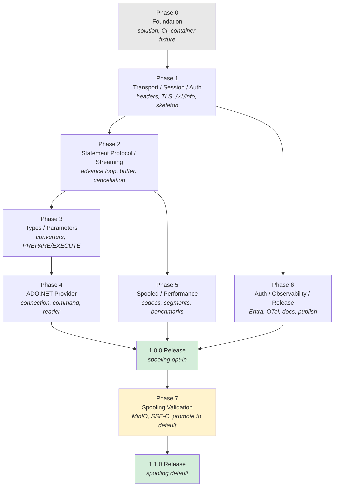

# TriQL — Phased Implementation Plan

## Execution Plan derived from [requirements.md](requirements.md)

| Field | Value |
|---|---|
| Document | Phased Implementation Plan |
| Product | TriQL — .NET Trino Client & ADO.NET Provider |
| Source specification | [requirements.md](requirements.md) v0.1 |
| Version | 0.1 (Draft) |
| Date | 2026-08-25 |
| Status | Draft — pending review |
| Last status audit | 2026-09-22 — see [§2.2](#22-actual-status--2026-09-22-docker-unlock) |

---

## Table of Contents

1. [How to Use This Plan](#1-how-to-use-this-plan)
2. [Phase Overview](#2-phase-overview)
3. [Dependency Graph](#3-dependency-graph)
4. [Decision Gates](#4-decision-gates)
5. [Cross-Cutting Rules](#5-cross-cutting-rules)
6. [Phase 0 — Foundation and Decisions](#phase-0--foundation-and-decisions)
7. [Phase 1 — Transport, Session, Auth Core](#phase-1--transport-session-auth-core)
8. [Phase 2 — Statement Protocol and Streaming](#phase-2--statement-protocol-and-streaming)
9. [Phase 3 — Type System and Parameters](#phase-3--type-system-and-parameters)
10. [Phase 4 — ADO.NET Provider](#phase-4--adonet-provider)
11. [Phase 5 — Spooled Protocol and Performance](#phase-5--spooled-protocol-and-performance)
12. [Phase 6 — Auth Package, Observability, Release](#phase-6--auth-package-observability-release)
13. [Phase 7 — Spooling Validation and Promotion](#phase-7--spooling-validation-and-promotion)
14. [Requirement Coverage Audit](#14-requirement-coverage-audit)
15. [Risk Register and Contingencies](#15-risk-register-and-contingencies)

---

## 1. How to Use This Plan

### 1.1 Structure

Each phase is an independently verifiable increment. A phase is complete only when every item in
its **Exit Criteria** checklist passes — not when its tasks are merely written.

Every task carries a stable id (`P<phase>-T<n>`) for tracking, the concrete deliverable paths it
produces, its intra-phase dependencies, and the requirement ids from
[requirements.md](requirements.md) that it satisfies.

### 1.2 Sizing

Tasks are sized by **complexity**, not duration:

| Size | Meaning |
|---|---|
| **S** | Mechanical or well-understood. One focused sitting. Low risk of surprise. |
| **M** | Requires design thought or has non-trivial edge cases. |
| **L** | Substantial design surface, or high uncertainty, or a large test matrix. Consider splitting on contact. |

### 1.3 Lanes

Within a phase, tasks are grouped into **lanes** that can proceed in parallel. Tasks in different
lanes of the same phase have no dependency on each other unless the `Depends on` column says
otherwise. A single implementer should work lanes in the listed order; a team can run them
concurrently.

### 1.4 The walking-skeleton principle

The requirements' milestone order (M0→M6) does not produce a working query until M2. This plan
deliberately front-loads a **throwaway walking skeleton** (`P1-T18`) that submits a statement and
follows `nextUri` end to end against a real container before any of the production streaming
machinery exists. Its only purpose is to surface protocol surprises while they are still cheap to
absorb. It is deleted in Phase 2.

---

## 2. Phase Overview

| Phase | Name | Milestone | Primary outcome | Blocking decisions |
|---|---|---|---|---|
| **0** | Foundation and Decisions | M0 | Buildable, CI-gated, empty solution. Server version floor fixed at **466**. | ~~Q1~~ closed |
| **1** | Transport, Session, Auth Core | M1 | Authenticated HTTP to a coordinator; session state correct; `/v1/info` works. | — |
| **2** | Statement Protocol and Streaming | M2 | `SELECT` streams to completion with cancellation, timeout, and backpressure. | — |
| **3** | Type System and Parameters | M3 | Every Trino type materializes correctly; parameters are injection-safe. | — |
| **4** | ADO.NET Provider | M4 | Full `System.Data.Common` surface, conformance-tested. | Q7 |
| **5** | Spooled Protocol and Performance | M5 | Spooled reads with fallback; performance targets met. | Q2, Q3, ~~Q6~~, Q9, **Q10** |
| **6** | Auth Package, Observability, Release | M6 | Cloud auth, telemetry, docs, published 1.0.0 **with spooling opt-in**. | — |
| **7** | Spooling Validation and Promotion | M7 | MinIO in CI; spooled path proven against a real coordinator plus object store; spooling promoted to default in 1.1. | — |

### 2.1 Shippability

Phases 0–4 constitute a **usable client**. If scope must be cut, the viable release boundaries are:

- **After Phase 2** — an internal-only preview usable from the SDK surface with `object` values.
- **After Phase 4** — a credible `0.9.0-preview` on NuGet: full ADO.NET, full types, no spooling,
  no cloud auth.
- **After Phase 6** — `1.0.0`, with the spooled protocol implemented but **opt-in and documented
  as experimental**, because it has not yet been exercised against a real object store.
- **After Phase 7** — `1.1.0`, with spooling validated end to end and promoted to the default
  encoding preference.

Phases 5 and 6 are independent of each other and may be reordered or run concurrently. Phase 7 is
deliberately sequenced **after** the 1.0.0 release: it retires risk **X11** rather than delaying
shipping for it.

### 2.2 Actual Status — 2026-09-22 (Docker unlock)

Docker is now installed on the primary dev machine. Every `Testcontainers`-based integration test
in this plan (and all of Phase 7) was previously blocked or silently skipped locally for that
reason. This section is a from-the-repo audit of what is actually built versus what the phase
checklists above assume, so the checklists above should be read alongside it rather than taken at
face value until they are re-verified task by task.

**Execution has not followed strict phase order.** Phases 0–4 and most of Phase 6 are substantially
implemented; Phase 5 (client-side spooling) has **not been started** at the code level, which is a
larger gap than the unchecked Phase 5 exit-criteria boxes alone suggest.

| Phase | Actual state |
|---|---|
| **0** | Solution, build props, CI/security/nightly/Dependabot workflows, and the `TrinoContainerFixture` all exist. **Gap:** the fixture hardcodes `FloorVersion` (466) and ignores the `TRIQL_TEST_TRINO_VERSION` env var nightly.yml sets — the `{466, latest}` matrix currently runs 466 twice. `FixtureSmokeTests.cs` (P0-T12, meant to be throwaway) is still present alongside its replacement. |
| **1** | Transport, TLS, retry/redirect, session/header handling, authenticators, exceptions, logging, and `InfoClient` all implemented. `ClientConnectionTests.cs` covers P1-T21. Walking skeleton (P1-T18) deleted as planned. |
| **2** | Statement client, advance loop, backoff, state machine, cancellation, `PageBuffer`/`ReadAheadPump`, `TrinoResultSet` all implemented. `QueryExecutionTests.cs` covers the P2-T21 streaming/cancellation exit criteria. |
| **3** | Type signatures, scalar/temporal/complex converters, `TrinoRow`, literal encoder, parameter rewriter, `PREPARE`/`EXECUTE` all implemented (`src/TriQL.Client/Types/`, `Internal/`). **Gap:** no integration test round-trips these types against a live container — P3-T17 does not exist. |
| **4** | `TrinoConnection`, `TrinoCommand`, `TrinoDataReader`, provider factory, data source, schema collections, sync bridge all implemented. **Gap:** no integration test exercises `GetSchema`, provider factory registration, or DDL/DML against a live container — P4-T24 does not exist. |
| **5** | **Not implemented.** No `Encoding/` directory in `TriQL.Client`; `TriQL.Client.Compression` is an empty stub project (csproj only, no codec code, empty `PublicAPI.Shipped.txt`). `Internal/StatementResponseMapper.cs` currently **throws `TrinoProtocolException`** on any spooled-shape response rather than decoding it. `QueryDataEncodings` defaults to empty and the `X-Trino-Query-Data-Encoding` header exists, so the client correctly never *requests* spooling today — but none of Lanes A–C (codecs, negotiation/segments, benchmarks) exist yet. P5-T15 (integration fallback proof) does not exist either. |
| **6** | Auth package (`OAuth2ClientCredentialsAuthenticator`, `EntraIdAuthenticator`), metrics (`Diagnostics/Metrics.cs`), tracing (`Diagnostics/Tracing.cs`), samples, and docs (`README.md`, `docs/api-reference.md`, `docs/connection-string-reference.md`, `docs/troubleshooting.md`, `docs/type-mapping-reference.md`) all exist. Public API is frozen for `TriQL.Client`, `TriQL.Client.Auth`, and `TriQL.Data.ADO` (`PublicAPI.Shipped.txt` populated, `PublicAPI.Unshipped.txt` empty); `TriQL.Client.Compression`'s is empty because it has no code yet. `artifacts/` (and a stray duplicate `artifactscls/`) contain locally packed `1.0.0-preview.1` `.nupkg`/`.snupkg` for all four projects. **Gaps:** `tests/TriQL.AotSmoke` exists but is not wired into any CI workflow and is not run against a live container (P6-T9 unmet); `ci.yml` and `nightly.yml` currently have their real triggers (`pull_request`/`push`/`schedule`) commented out in favour of `workflow_dispatch` only, apparently as a pre-Docker workaround; no confirmed publish to nuget.org. |
| **7** | **Zero code or infrastructure.** No MinIO fixture, no spooling-configured Trino container config, no `docs/spooling-validation.md`. Only a TODO comment in `nightly.yml` flags it as future work. Logically blocked on Phase 5 landing first — there is no spooled decoding to validate yet. |

**Other loose ends noticed during the audit (not phase-blocking, flag for cleanup):**
- `tests/TriQL.IntegrationTests/NUL` — an untracked stray file (likely a Windows artifact from a redirected command); safe to remove after confirming it's not intentional.
- `artifactscls/` — a duplicate of `artifacts/`'s packed output; consolidate or `.gitignore`.

### 2.4 Progress — 2026-09-22 (post-audit)

Acting on [§2.3](#23-immediate-next-steps), the following are done and verified against a live
Docker container on this machine:

- **Step 1 (fixture fix).** `TrinoContainerFixture` now honours `TRIQL_TEST_TRINO_VERSION`. Fixing
  this surfaced two real, previously-unverifiable bugs in the fixture's readiness check: `/v1/info`
  reports `starting: false` before the single-node worker has actually registered with cluster
  discovery, so queries submitted right after start failed with *"Trino server is still
  initializing"* and then *"No nodes available to run query"*. The fixture now probes with a real
  table-scan query and requires three consecutive successes before `InitializeAsync` returns. All
  four existing integration tests now pass reliably against both `466` and `latest`.
- **Step 2 (CI triggers).** `ci.yml`'s `pull_request`/`push` triggers and `nightly.yml`'s `schedule`
  trigger are restored (edited locally; **not yet committed or pushed** — validate once more after
  review, since this is the first time either workflow will run for real). A pre-existing,
  unrelated formatting violation in `samples/TriQL.Samples.UserNamePassword/UserNamePasswordSample.cs`
  was fixed via `dotnet format`, since it would otherwise have failed CI immediately on re-enable.
- **Step 3 (G2) and step 9 (G4, G5).** All three gates closed in `requirements.md` §23 and reflected
  in [§4](#4-decision-gates): codecs ship from `TriQL.Client.Compression` (G2); `Prepare()` is a
  documented no-op, matching what `TrinoCommand.Prepare()` already does (G4); the perf gate compares
  against a same-run baseline (G5). All seven decision gates are now closed.
- **Step 6 (AOT smoke in CI).** Added an `aot-smoke` job to `ci.yml`: publishes
  `tests/TriQL.AotSmoke` with `PublishAot=true` on `ubuntu-latest`, starts a real Trino container via
  the Docker CLI, and runs the smoke app against it (retrying through the same node-registration
  warmup window the fixture fix above uncovered). **Not yet verified in CI** — this machine has no
  C++ toolchain, so native AOT compilation itself could only be exercised on `win-x64` here and
  failed for the expected reason (missing MSVC linker); the Linux path needs its first real CI run
  to confirm.
- **Step 5 (P3-T17, P4-T24 done; P5-T15 pending on Phase 5).** `TypeRoundTripTests.cs` (32 tests) and
  `ParametersAndPreparedStatementTests.cs` (9 tests) cover P3-T17: every FR-7.2.1 type round-trips
  correctly, including the `tinyint`→`sbyte` signedness exit criterion, `timestamp(12)` picosecond
  precision, `decimal(38,10)` full precision, and session-time-zone governance of `with time zone`
  conversion. `AdoSchemaCollectionTests.cs` (17), `AdoProviderFactoryTests.cs` (3), and
  `AdoDdlDmlTests.cs` (5) cover P4-T24: all twelve FR-9.5.2 `GetSchema` collections, provider-factory
  registration/resolution end to end, and DDL/DML affected-row counts. One real environment finding
  from P4-T24: the default image's `memory` catalog supports `CREATE`/`INSERT`/`DROP` but **not**
  `UPDATE` or `DELETE` at all (not a TriQL defect — the connector itself rejects row modification);
  the test asserts that real behaviour rather than working around it. All 75 integration tests
  (the original 4 plus these 71) pass together. `PREPARE`/`EXECUTE`/deallocation, connection-string
  injection payloads as inert parameter data, and `CAST(varchar AS JSON)` semantics were also
  clarified along the way (the last one is real Trino behaviour — it wraps text as a JSON *string*
  rather than parsing it; `JSON '...'` literals parse as intended).
- **Step 8.** `FixtureSmokeTests.cs` (P0-T12) deleted — superseded by `ClientConnectionTests.cs`.
- **Step 10 (publish status — corrected).** All four packages **are** published on nuget.org at
  `1.0.0-preview.1` (confirmed directly against the nuget.org flat-container API). However, every
  recorded run of `release.yml` (7 runs, `gh run list --workflow=release.yml`) has **failed or been
  cancelled** — none succeeded. The preview was evidently pushed manually (`dotnet nuget push`
  against the locally-packed `artifacts/`), not via the automated release workflow. **The release
  automation itself remains unproven** and should not be trusted for the real `1.0.0` release
  without a successful dry run (`workflow_dispatch`) first, including the NuGet trusted-publishing
  OIDC exchange, which has never completed successfully.

- **Step 4 (Phase 5 Lanes A+B) done 2026-09-22.** Implemented in an isolated git worktree, reviewed,
  merged, and re-verified against the combined working tree (build clean on both TFMs, `dotnet
  format` clean, `TriQL.Client.Tests` 349/349, `TriQL.Data.ADO.Tests` 90/90, `TriQL.IntegrationTests`
  77/77 including the new `SpoolingFallbackTests.cs` against a real container — the worktree's own
  sandbox couldn't reach Docker, so this was the first real confirmation that path works). Lane C
  (P5-T10–T12: benchmarks, tuning, the CI perf gate) was explicitly deferred, not forgotten — see
  the Phase 5 section for what's still open there. Two real corrections to FR-5.2.1/FR-5.2.2 came
  out of this (see the Phase 5 section and requirements.md) — this is risk **X4** materializing
  exactly as the risk register predicted, caught before it could reach Phase 7.
- **Step 7 (Phase 7 Lanes A+B) done 2026-09-22.** MinIO plus a spooling-configured, real-TLS Trino
  coordinator now run as Testcontainers fixtures, wired into CI, with all ten Lane B verification
  tasks (P7-T5–T10) passing against them: the negative control (raw-probe shape assertion, not just
  row correctness), all three codecs against real segments, SSE-C encryption (a segment is
  unreadable without the correct customer key, extracted from the server-supplied per-segment
  `headers`), ack-driven bucket shrinkage plus cancellation cleanup, the real off-origin/same-origin
  URI topology, and mixed spooled/direct sessions in one client. Built and reviewed in an isolated
  worktree, then merged and re-verified: build clean, `dotnet format` clean,
  `TriQL.IntegrationTests` 91/91 (77 prior + 14 new), `TriQL.Client.Tests` 349/349,
  `TriQL.Data.ADO.Tests` 90/90, `TriQL.Client.Auth.Tests` 16/16. Two more real corrections went into
  `requirements.md` (FR-5.1.3a: a real spooling deployment needs the coordinator itself on HTTPS,
  not just the object store, because of `UriGuard`'s existing unconditional `https` rule; FR-5.1.3b:
  no literal direct-protocol fallback was ever observed per-query on a real coordinator — small
  results still get a spooled envelope with an `inline` segment) — risk **X4** materializing a
  third and fourth time, each time caught and closed the same day. **Lane C (perf rebaseline,
  tuning, promoting the default, and the 1.1.0 release) was deliberately left untouched**, per
  explicit instruction to wait for a separate go-ahead before that public, hard-to-reverse step.

**Incidental cleanup:** a pre-existing, unrelated formatting violation in
`samples/TriQL.Samples.UserNamePassword/UserNamePasswordSample.cs` (see step 2 above) was
independently hit and fixed by both this session's direct work and the Phase 5 worktree agent;
the two fixes were identical and merged without conflict.

### 2.3 Immediate Next Steps

Prioritized so that Docker-dependent work that de-risks the rest of the plan happens first:

1. **Fix `TrinoContainerFixture` to honour `TRIQL_TEST_TRINO_VERSION`.** Without this, the nightly
   `{466, latest}` matrix is silently testing 466 against itself. Low effort, high value — do this
   before trusting any other integration-test result.
2. **Re-enable and validate `ci.yml` and `nightly.yml`.** Their real triggers are currently disabled
   in favour of `workflow_dispatch` only. With Docker now available locally, run each workflow's
   integration and Docker-gated jobs locally (`act`, or by hand) before restoring the real triggers,
   so re-enabling doesn't immediately go red.
3. **Close gate G2 (Q2/Q3 — Zstandard/LZ4 codec sourcing).** This blocks Phase 5 entry and is the
   only open gate standing between "Phase 4 is done" and "Phase 5 can start." Recommended option
   (a separate `TriQL.Client.Compression` package) is already reflected in the project layout; it
   just needs to be ratified in `requirements.md` §23.
4. **Implement Phase 5 Lanes A–B (P5-T1…T9).** This is the largest real gap in the project relative
   to what the plan's checklists implied — spooling is currently a stub that refuses spooled
   responses, not an untested implementation. Do this before anything else in Phase 5 or 7.
5. **Backfill the missing integration-test tasks now that Docker works locally:** P3-T17 (type
   round-trips), P4-T24 (ADO.NET/`GetSchema`/DDL against a live container), then P5-T15 (spooling
   fallback proof) once step 4 lands.
6. **Wire `TriQL.AotSmoke` into CI against the live container fixture (P6-T9).** Currently dormant;
   it already supports a live-container path via `TRINO_TEST_SERVER` but nothing sets it in CI.
7. **Stand up Phase 7 infrastructure (P7-T1…T4: MinIO fixture, spooling-configured Trino container,
   shared network).** Sequence this after step 4 — there is nothing to validate until the client can
   decode a spooled response. Docker being available locally means this can now be built and
   iterated on the dev machine before it ever needs to run in CI.
8. **Delete or fold in `FixtureSmokeTests.cs` (P0-T12)** now that `ClientConnectionTests.cs`
   (P1-T21) supersedes it, per the task's own throwaway intent.
9. **Reconcile decision gates G4 (Q7 — `Prepare()` semantics) and G5 (Q9 — benchmark variance
   strategy)** — both still open in `requirements.md` §23 and both have recommended defaults
   already stated in [§4](#4-decision-gates); closing them in writing is a low-effort unblock for
   the remaining P4-T8 and P5-T12 work.
10. **Confirm actual publish status.** `artifacts/` holds locally packed `1.0.0-preview.1` packages
    for all four projects; verify whether `release.yml` has ever actually run against `nuget.org`
    before treating Phase 6's release exit criteria as met.

---

## 3. Dependency Graph



**Critical path:** `P0 → P1 → P2 → P3 → P4`.

Phase 5 branches from Phase 2 (it needs the page pipeline, not the type system) and Phase 6's auth
lane branches from Phase 1 (it needs `ITrinoAuthenticator`, nothing more). Both rejoin at release.

---

## 4. Decision Gates

Open questions from [requirements.md §23](requirements.md) mapped to the phase that they block.
A gate must be **closed in writing** in §23 of the requirements document before the dependent phase
starts.

| Gate | Question | Blocks | Why it blocks | Status / decision |
|---|---|---|---|---|
| **G1** | Q1 — minimum supported Trino server version | ~~Phase 0 exit~~ | Determines container image tags in every integration test from Phase 1 onward, and the size of the TEST-6 matrix. | **CLOSED 2026-08-25 — floor is 466.** The release that introduced spooling (27 Nov 2024). Latest is 483 (17 Jul 2026); cadence has slowed sharply, so the floor spans only ~17 releases. CI matrix `{466, latest}`. No formal OSS LTS exists. |
| **G2** | Q2/Q3 — Zstandard and LZ4 codec sourcing | ~~Phase 5 entry~~ | Determines whether a fourth project (`TriQL.Client.Compression`) exists. Does **not** block Phases 0–4. | **CLOSED 2026-09-22 — option (b).** Separate `TriQL.Client.Compression` package, keeping `TriQL.Client` dependency-free per REQ-ARCH-4. The empty project stub already exists; Phase 5 (P5-T2, P5-T3) fills it in with the actual codecs. |
| **G3** | Q6 — segment URI origin restriction default | ~~Phase 5, P5-T9~~ | Too strict breaks object-storage spooling; too loose is an SSRF hole (SEC-7). | **CLOSED 2026-08-25.** Segments are written to S3/Azure/GCS and are legitimately off-origin by design; they are SSE-C encrypted and scoped to the initiating client. Restrict `ackUri` to session origin; allow segment `uri` off-origin but require `https` with no scheme downgrade, plus an optional host allowlist. |
| **G4** | Q7 — `Prepare()` semantics | ~~Phase 4, P4-T8~~ | Trivial to implement either way but breaking to change after publication. | **CLOSED 2026-09-22 — documented no-op.** Already implemented this way at `TrinoCommand.Prepare()`; this closure just ratifies it in writing. |
| **G5** | Q9 — benchmark variance strategy | ~~Phase 5, P5-T12~~ | Determines whether the CI perf gate is trustworthy or a source of false failures. | **CLOSED 2026-09-22 — same-run baseline.** No dedicated self-hosted runner exists, so compare against a same-run baseline rather than an absolute threshold when P5-T12 builds the perf gate. |
| **G6** | Q5, Q8 — transactions, complex-type depth | **Deferred to 1.1** | Already resolved as out of scope for 1.0. No action. | Closed — out of scope. |
| **G7** | **Q10 — should spooling be on by default in 1.0?** | ~~Phase 5 exit~~ | CI runs no MinIO, so the spooled path is never verified against a real coordinator plus object store before release. | **CLOSED 2026-08-25 — no.** 1.0.0 ships spooling implemented but **opt-in** (`QueryDataEncodings` defaults to empty) and documented as experimental. **Phase 7** reinstates MinIO, validates the spooled path end to end, and promotes it to default in 1.1. |

> **All seven gates are now closed.** Nothing in [§23 of requirements.md](requirements.md) blocks
> any phase from proceeding; Phase 5 in particular has no remaining decision gate standing between
> it and implementation (see [§2.2](#22-actual-status--2026-09-22-docker-unlock) for why it still
> hasn't started at the code level).

---

## 5. Cross-Cutting Rules

These apply to **every** task in every phase and are not restated per phase.

| Rule | Requirement | Enforcement |
|---|---|---|
| Build is warnings-as-errors, nullable-annotated | NFR-MAINT-1, NFR-COMPAT-4 | CI build |
| All internal `await` uses `ConfigureAwait(false)` | NFR-REL-3 | Analyzer, error severity |
| Invariant culture for all formatting/parsing | NFR-COMPAT-6 | CA1305 as error |
| Public members carry XML docs | NFR-MAINT-3 | Build error on missing |
| Public API changes update `PublicAPI.Unshipped.txt` | NFR-COMPAT-5 | Analyzer, build failure |
| No credential in logs, messages, `ToString()`, or trace tags | SEC-1 | Redaction test in every phase's suite |
| No `Console.Write*` in shipping code | FR-11.1.4 | Analyzer / banned-symbols rule |
| No `throw e`; use bare `throw` or `ExceptionDispatchInfo` | FR-12.1.3 | Analyzer / review |
| Every network call is cancellable and bounded | SEC-12 | Review checklist |
| Coverage gate ≥ 85 % line, ≥ 75 % branch | TEST-3 | CI, from Phase 1 onward |
| Tests are deterministic; no `Thread.Sleep` synchronization | TEST-13 | Review checklist |

### 5.1 Definition of Done (per task)

A task is done when **all** of the following hold:

1. Code implements every requirement id listed against the task.
2. Unit tests exist for the task's success paths, boundary values, and failure modes.
3. `dotnet build` is clean under warnings-as-errors.
4. `dotnet format --verify-no-changes` passes.
5. Public API additions are recorded in `PublicAPI.Unshipped.txt`.
6. XML documentation is present on every new public member.
7. The requirement ids are marked covered in the phase's coverage audit.

---

## Phase 0 — Foundation and Decisions

> **Objective.** Produce a solution that builds clean, gates every quality rule in CI, and can
> start a real Trino container — with zero product code. Fix the server version floor.

**Requirements covered:** REQ-ARCH-1…5, NFR-MAINT-1…5, NFR-COMPAT-1, NFR-COMPAT-3…6,
SEC-8, SEC-9, SEC-10, REL-3, REL-4, REL-5, TEST-11.

**Entry criteria:** None. This is the start.

### Lane A — Decisions

| Id | Task | Deliverable | Depends on | Size |
|---|---|---|---|---|
| P0-T1 | ~~Resolve **G1**~~ **Done 2026-08-25 — floor is 466.** Confirm §23 Q1 records the decision and that `NFR-COMPAT-2` states it. | `docs/requirements.md` §23 Q1, NFR-COMPAT-2 | — | S |
| P0-T2 | Resolve **G2** in shape only: decide whether `TriQL.Client.Compression` exists as a project. Creating the empty project now avoids a Phase 5 solution reshuffle. | §23 Q2/Q3 updated; project stub if applicable | — | S |

### Lane B — Solution and build infrastructure

| Id | Task | Deliverable | Depends on | Size |
|---|---|---|---|---|
| P0-T3 | Create solution and empty projects per [requirements.md §4.1](requirements.md). | `triql/TriQL.sln`, `src/TriQL.Client/`, `src/TriQL.Client.Auth/`, `src/TriQL.Data.ADO/` | P0-T2 | S |
| P0-T4 | Author `Directory.Build.props`: `net8.0;net10.0`, `Nullable=enable`, `TreatWarningsAsErrors`, `IsTrimmable`, `IsAotCompatible`, `EnableTrimAnalyzer`, deterministic build, Source Link, `EmbedUntrackedSources`, `.snupkg`. | `triql/Directory.Build.props` | P0-T3 | M |
| P0-T5 | Author `Directory.Packages.props` (central package management) and enable `RestorePackagesWithLockFile`. | `triql/Directory.Packages.props`, `packages.lock.json` | P0-T3 | S |
| P0-T6 | Author `.editorconfig` with style and analyzer severities. Enable CA1305 as error, `ConfigureAwait` analyzer, banned-symbols for `Console.Write*`. | `triql/.editorconfig`, `BannedSymbols.txt` | P0-T3 | M |
| P0-T7 | Add `PublicAPI.Shipped.txt` / `PublicAPI.Unshipped.txt` to all three shipping projects with the public-API analyzer. | Per-project API baseline files | P0-T3 | S |
| P0-T8 | Author per-project NuGet metadata: id, title, description, authors, license expression, repository URL, README, icon, and the mandatory `trino` tag. | `.csproj` metadata blocks | P0-T3 | S |

> **P0-T8 note.** REQ-ARCH-5 and REL-1a make the `trino` tag a *requirement*, not a nicety — no
> package id contains the substring, so tags are the only route to discoverability. Also apply
> REL-1b: nothing in the metadata may imply Trino Software Foundation endorsement.

### Lane C — Test infrastructure

| Id | Task | Deliverable | Depends on | Size |
|---|---|---|---|---|
| P0-T9 | Create test projects with the chosen test framework, coverage collector, and the ≥ 85 %/75 % gate wired but not yet enforced. | `tests/TriQL.Client.Tests/`, `tests/TriQL.Data.ADO.Tests/`, `tests/TriQL.IntegrationTests/` | P0-T3 | S |
| P0-T10 | Create the benchmark and AOT-smoke project stubs. | `tests/TriQL.Benchmarks/`, `tests/TriQL.AotSmoke/` | P0-T3 | S |
| P0-T11 | Build the Testcontainers Trino fixture: starts `trinodb/trino:466` (floor) and `trinodb/trino:latest`, exposes a base `Uri`, and is shared across the integration collection. **No MinIO** — spooling is covered by the fake coordinator only (see G7/Q10). | `tests/TriQL.IntegrationTests/Fixtures/TrinoContainerFixture.cs` | P0-T1, P0-T9 | M |
| P0-T12 | Write one throwaway integration test that hits `/v1/info` on the container with a raw `HttpClient`, proving the fixture works before any product code exists. | `tests/TriQL.IntegrationTests/FixtureSmokeTests.cs` | P0-T11 | S |

### Lane D — CI/CD

| Id | Task | Deliverable | Depends on | Size |
|---|---|---|---|---|
| P0-T13 | PR workflow: locked restore, build with warnings-as-errors, format verification, unit tests with coverage gate. Matrix over `windows-latest`, `ubuntu-latest`, `macos-latest`. | `.github/workflows/ci.yml` | P0-T4, P0-T9 | M |
| P0-T14 | Security workflow: CodeQL, `dotnet list package --vulnerable --include-transitive` failing on any advisory, secret scanning. | `.github/workflows/security.yml` | P0-T5 | M |
| P0-T15 | Enable Dependabot for NuGet and GitHub Actions. | `.github/dependabot.yml` | — | S |
| P0-T16 | Nightly workflow scaffold for integration tests (wired, no tests yet). | `.github/workflows/nightly.yml` | P0-T11 | S |

### Exit Criteria

- [x] G1 closed: server version floor is **466**, recorded in requirements §23 Q1 and NFR-COMPAT-2.
- [ ] `dotnet build TriQL.sln` succeeds with zero warnings on both TFMs.
- [ ] `dotnet format --verify-no-changes` passes.
- [ ] `dotnet restore --locked-mode` succeeds.
- [ ] CI is green on all three operating systems.
- [ ] CodeQL and the vulnerable-package scan run and report clean.
- [ ] `FixtureSmokeTests` starts a Trino container and receives `200` from `/v1/info`.
- [ ] No product code exists yet — this is deliberate.

### Verification

```bash
dotnet restore --locked-mode
dotnet build TriQL.sln -c Release
dotnet format --verify-no-changes
dotnet test tests/TriQL.IntegrationTests --filter FullyQualifiedName~FixtureSmoke
```

### Risks

| Risk | Mitigation |
|---|---|
| Trimming/AOT properties enabled on empty projects hide warnings that appear later. | P6-T9's AOT smoke test is the real gate; do not treat Phase 0 cleanliness as proof. |
| Docker unavailable on some CI runners. | Integration tests must be skippable by capability detection, never by silent pass. |

---

## Phase 1 — Transport, Session, Auth Core

> **Objective.** Reach a real coordinator over correctly configured TLS with a correctly
> constructed header set, apply server-driven session mutations faithfully, and prove the whole
> request loop end to end with a disposable skeleton.

**Requirements covered:** FR-1.1, FR-1.2, FR-2.1, FR-2.2, FR-3.1, FR-3.2, FR-3.3, FR-10.1,
FR-10.2, FR-10.5, FR-10.6, FR-11.1, FR-12.1, SEC-1, SEC-2, SEC-3, SEC-11, TEST-1.

**Entry criteria:** Phase 0 exit criteria all met.

### Lane A — Configuration and TLS

| Id | Task | Deliverable | Depends on | Size |
|---|---|---|---|---|
| P1-T1 | `TrinoSessionOptions` with every property in the FR-1.1.1 table plus defaults, `FromParts` helper, and first-use validation. | `src/TriQL.Client/TrinoSessionOptions.cs` | — | M |
| P1-T2 | `TrinoTlsOptions` and the certificate validation callback. Each weakening option scoped to exactly one `SslPolicyErrors` value; blanket `return true` forbidden. Custom roots via `X509Chain.CustomTrustStore` with `TrustMode = CustomRootTrust` — **never** via `ClientCertificates`. | `src/TriQL.Client/TrinoTlsOptions.cs`, `Internal/CertificateValidator.cs` | — | L |
| P1-T3 | Plaintext-credential guard: `http` + bearer-transmitting authenticator throws `TrinoConfigurationException` unless explicitly allowed. | Validation in `TrinoSessionOptions` | P1-T1, P1-T2 | S |

> **P1-T2 is the highest-risk security task in the phase.** It corrects two distinct defects in the
> reference implementation (blanket validation bypass, and server roots loaded as client identity).
> Budget review time accordingly.

### Lane B — HTTP pipeline

| Id | Task | Deliverable | Depends on | Size |
|---|---|---|---|---|
| P1-T4 | Handler factory producing a configured `SocketsHttpHandler`: `PooledConnectionLifetime = 5 min`, HTTP/2 multiple connections, automatic decompression unless disabled, minimum TLS 1.2. | `src/TriQL.Client/Internal/HttpHandlerFactory.cs` | P1-T2 | M |
| P1-T5 | Shared `HttpMessageInvoker` owned per `TrinoClient`; constructor overloads accepting an external invoker or `IHttpClientFactory`; ownership-aware disposal. | `src/TriQL.Client/TrinoClient.cs` | P1-T4 | M |
| P1-T6 | Per-request timeout via linked `CancellationTokenSource`, distinguishable from the query deadline in the raised exception. | `Internal/RequestExecutor.cs` | P1-T5 | M |
| P1-T7 | Retry policy: exponential backoff with full jitter (base 50 ms, ×2, cap 10 s, 5 attempts) on `429`/`502`/`503`/`504` and transient socket failures; `Retry-After` honoured in both delay-seconds and HTTP-date forms; any other non-`200` status is terminal; **`POST /v1/statement` retried only on pre-dispatch failures**. | `Internal/RetryPolicy.cs` | P1-T6 | L |
| P1-T8 | Redirect policy: `GET` only, max 5, no `https`→`http` downgrade. | `Internal/RedirectPolicy.cs` | P1-T6 | S |

> **P1-T7's statement-submission carve-out is a correctness requirement, not an optimization.**
> Retrying a `POST` whose response was lost duplicates query execution on the coordinator.

### Lane C — Session and headers

| Id | Task | Deliverable | Depends on | Size |
|---|---|---|---|---|
| P1-T9 | Request header writer covering every row of Appendix A.1. Empty values omitted entirely; `X-Trino-Client-Capabilities` declares `PARAMETRIC_DATETIME`, `PATH`, and `SESSION_AUTHORIZATION` per FR-4.1.3; URL-encoding on `key=value` pairs; repeated headers where values may contain commas. Session headers sent on the initial `POST` only (FR-4.1.5). | `src/TriQL.Client/Internal/ProtocolHeaders.cs` | P1-T1 | L |
| P1-T10 | Response header parser and session mutation applier covering every row of FR-1.2.2, applied **in the specified order** and **atomically** per response. | `Internal/SessionMutationApplier.cs` | P1-T9 | L |
| P1-T11 | `TrinoSession`: live state, thread-safe concurrent reads during execution, `SessionChanged` event. | `src/TriQL.Client/TrinoSession.cs` | P1-T10 | M |

> **Lane C is the single most defect-prone area of the entire project.** Session propagation bugs
> are silent — a dropped `Set-Schema` produces wrong results rather than an error. Test every
> mutation individually *and* in combination (P1-T19).

### Lane D — Authentication and diagnostics

| Id | Task | Deliverable | Depends on | Size |
|---|---|---|---|---|
| P1-T12 | `ITrinoAuthenticator` interface exactly as specified in FR-2.1.1, with the refresh-once-per-request contract and serialized refresh. | `src/TriQL.Client/Auth/ITrinoAuthenticator.cs` | — | M |
| P1-T13 | Core authenticators: `Anonymous`, `Basic`, `Ldap` (TLS-enforced), `Jwt` (static + refresh callback + proactive `exp` skew), `ClientCertificate` (path / PEM / bytes / store thumbprint). | `src/TriQL.Client/Auth/*.cs` | P1-T12 | L |
| P1-T14 | Exception hierarchy per FR-12.1, with `QueryId` and `IsRetryable` on the base, all types sealed except the base. | `src/TriQL.Client/Exceptions/*.cs` | — | M |
| P1-T15 | Logging: `LoggerMessage` source generation, level assignments per FR-11.1.3, `IsEnabled` guards, and the credential redaction helper. | `src/TriQL.Client/Internal/Log.cs`, `Internal/Redactor.cs` | P1-T14 | M |

### Lane E — Server info and proof

| Id | Task | Deliverable | Depends on | Size |
|---|---|---|---|---|
| P1-T16 | `InfoClient` + `TrinoClient.GetServerInfoAsync` + `TestConnectionAsync` (true only on `200` **and** `starting == false`). Log detected version once at `Debug`. | `src/TriQL.Client/Internal/InfoClient.cs` | P1-T5, P1-T9 | M |
| P1-T17 | `FakeTrinoCoordinator` test harness: scripted page sequences, headers, delays, error payloads, and (stubbed for now) spooled segments. Both `HttpMessageHandler` interception and a Kestrel-hosted variant. | `tests/TriQL.Client.Tests/Fakes/FakeTrinoCoordinator.cs` | P1-T14 | L |
| P1-T18 | **Walking skeleton (throwaway).** Submit a hardcoded `SELECT`, follow `nextUri` in a naive loop, print raw rows. Run it against the container. Record every protocol surprise found. | `tests/TriQL.IntegrationTests/WalkingSkeletonTests.cs` | P1-T16 | M |

### Lane F — Verification

| Id | Task | Deliverable | Depends on | Size |
|---|---|---|---|---|
| P1-T19 | Unit tests: header construction for every session property; every FR-1.2.2 mutation individually and combined; TLS callback accepts only permitted error values; retry/backoff sequence and cap; redirect refusal on downgrade. | `tests/TriQL.Client.Tests/` | Lanes A–D | L |
| P1-T20 | **Secret redaction test (SEC-1).** Seed known secret values into every credential-bearing option, run a fully authenticated request against the fake, capture logs at `Trace`, assert no seeded value appears. | `tests/TriQL.Client.Tests/Security/RedactionTests.cs` | P1-T15, P1-T17 | M |
| P1-T21 | Integration: `/v1/info` and `TestConnectionAsync` against the container at both pinned versions. | `tests/TriQL.IntegrationTests/` | P1-T16 | S |
| P1-T22 | Enable the coverage gate in CI now that product code exists. | `.github/workflows/ci.yml` | P1-T19 | S |

### Exit Criteria

- [ ] `TestConnectionAsync` returns `true` against a live container and `false` against a starting one.
- [ ] Every FR-1.2.2 session mutation is unit-tested individually and in combination.
- [ ] The TLS validation callback rejects every `SslPolicyErrors` value not explicitly permitted; a test asserts blanket acceptance is impossible.
- [ ] Custom trusted roots flow through `CustomTrustStore`, and a test asserts `ClientCertificates` is untouched by server-trust configuration.
- [ ] The redaction test passes with zero seeded secrets in captured `Trace` logs.
- [ ] `POST /v1/statement` retry is proven to occur only on pre-dispatch failures.
- [ ] The walking skeleton returns rows from the container, and its findings are recorded.
- [ ] Coverage gate active and passing.

### Verification

```bash
dotnet test tests/TriQL.Client.Tests
dotnet test tests/TriQL.IntegrationTests --filter Category=Phase1
```

### Risks

| Risk | Mitigation |
|---|---|
| Appendix A header table drifts from the pinned server version. | FR-10.5 mandates verifying the table during M1; update Appendix A as part of P1-T9 and note deviations. |
| Session mutation bugs are silent and produce wrong results. | Combination testing in P1-T19; the `SessionChanged` event gives the ADO layer an observable hook in Phase 4. |
| Walking skeleton code leaks into production. | It lives in the test project and is deleted by `P2-T4`. Make deletion an explicit task, not an intention. |

---

## Phase 2 — Statement Protocol and Streaming

> **Objective.** Replace the skeleton with the production paging pipeline: correct advance loop,
> adaptive backoff, bounded read-ahead with backpressure, and cancellation that reliably terminates
> queries server-side.

**Requirements covered:** FR-4.1…FR-4.6, FR-6.1…FR-6.12, FR-11.3, FR-12.2, SEC-5, SEC-12,
NFR-REL-1, NFR-REL-4, NFR-REL-5.

**Entry criteria:** Phase 1 exit criteria all met; walking-skeleton findings reviewed.

### Lane A — Wire model

| Id | Task | Deliverable | Depends on | Size |
|---|---|---|---|---|
| P2-T1 | Response DTOs for every member in the FR-4.2.1 table, tolerating unknown members. | `src/TriQL.Client/Model/*.cs` | — | M |
| P2-T2 | Source-generated `JsonSerializerContext`; `MaxDepth = 64`, bounded response size, no polymorphic resolution from the wire (SEC-5). | `Model/TrinoJsonContext.cs` | P2-T1 | M |
| P2-T3 | `TrinoQueryStats` and `TrinoQueryError` public projections with every field in FR-11.3.3 and FR-12.1.2. | `src/TriQL.Client/TrinoQueryStats.cs`, `TrinoQueryError.cs` | P2-T1 | S |

### Lane B — Statement client

| Id | Task | Deliverable | Depends on | Size |
|---|---|---|---|---|
| P2-T4 | `StatementClient.SubmitAsync`: raw UTF-8 body, full header set, `200`-only acceptance, diagnostic body truncated to 8 KB on failure. **Delete the walking skeleton.** | `Internal/StatementClient.cs` | P2-T2 | M |
| P2-T5 | Advance loop. `targetResultSize` appended **on a copy** of `nextUri`, never mutated in place. Empty-page skipping **iterative**, never recursive. | `Internal/StatementClient.cs` | P2-T4 | L |
| P2-T6 | Adaptive backoff: immediate on data, 50 ms → ×1.2 → 5 s cap on empty, reset on data, cancellable, configurable. | `Internal/PollingBackoff.cs` | P2-T5 | M |
| P2-T7 | Query state machine per FR-4.5.1 with compare-and-swap transitions so cancellation and completion cannot both win. | `Internal/QueryStateMachine.cs` | P2-T5 | L |
| P2-T8 | Cancellation and timeout: `DELETE nextUri` accepting `200`/`204`, never with the cancelled token, own 10 s bound, idempotent, failure logged at `Warning` without masking the original exception. `TrinoTimeoutException` distinct from `OperationCanceledException`. | `Internal/StatementClient.cs` | P2-T7 | L |

> **P2-T5 corrects two specific reference-implementation defects.** In-place `nextUri` mutation
> causes `targetResultSize` to accumulate across every poll; recursive empty-page skipping grows the
> stack without bound on long queue times. Write a test for each before writing the fix.

### Lane C — Streaming pipeline

| Id | Task | Deliverable | Depends on | Size |
|---|---|---|---|---|
| P2-T9 | `PageReader` producing `TrinoPage` values from the statement client. | `Internal/PageReader.cs` | P2-T5 | M |
| P2-T10 | `PageBuffer`: byte-budget bound (**not** page count), accounting on **decoded payload size**, backpressure by awaiting a signal rather than spinning, minimum budget ≥ `TargetResultSizeBytes`, zero budget rejected. | `Internal/PageBuffer.cs` | P2-T9 | L |
| P2-T11 | Background read-ahead task with exception capture and rethrow on the consumer thread via `ExceptionDispatchInfo`; multiple failures aggregated, never discarded. | `Internal/ReadAheadPump.cs` | P2-T10 | L |
| P2-T12 | `TrinoResultSet`: `ReadRowsAsync` as `IAsyncEnumerable<TrinoRow>` with `[EnumeratorCancellation]`, plus the page-level `IAsyncEnumerable<TrinoPage>` surface. | `src/TriQL.Client/TrinoResultSet.cs` | P2-T11 | M |
| P2-T13 | `WaitForSchemaAsync` — columns available from the first schema-bearing page without reading a row. | `TrinoResultSet.cs` | P2-T12 | S |
| P2-T14 | Disposal semantics: `IAsyncDisposable` on every query-owning type; abandoning a reader cancels server-side; sync dispose bounded by the P2-T8 timeout. | Across pipeline types | P2-T8, P2-T12 | M |
| P2-T15 | Non-query drain path for DDL/DML: no row buffering, exposes `updateType` and processed-row count. | `TrinoResultSet.cs` | P2-T12 | M |

### Lane D — Errors and progress

| Id | Task | Deliverable | Depends on | Size |
|---|---|---|---|---|
| P2-T16 | Failure classification for every row of the FR-12.2.1 table; retryable vs terminal drives P1-T7. | `Internal/FailureClassifier.cs` | P2-T1 | M |
| P2-T17 | Page-level `error` handling: transition to `Failed`, stop read-ahead, raise `TrinoQueryException` on the consumer's next `MoveNextAsync`. | `ReadAheadPump.cs` | P2-T16 | M |
| P2-T18 | Progress notifications: `Progress` event and `IProgress<TrinoQueryStats>`, invoked outside all internal locks, callback exceptions caught and logged at `Warning` without failing the query. | `TrinoResultSet.cs` | P2-T12 | M |

### Lane E — Verification

| Id | Task | Deliverable | Depends on | Size |
|---|---|---|---|---|
| P2-T19 | Unit tests: backoff sequence/cap/reset; buffer accounting and backpressure suspend-resume; `targetResultSize` appended exactly once across many polls; iterative empty-page skipping over a long empty run; cancellation at every state including mid-page; every FR-12.2.1 classification row. | `tests/TriQL.Client.Tests/` | Lanes A–D | L |
| P2-T20 | Memory-ceiling test: stream a large result under a constrained budget and assert peak working set stays within `ReadAheadBufferBytes × 1.5`. | `tests/TriQL.Client.Tests/Streaming/` | P2-T10 | M |
| P2-T21 | Integration: ≥ 1 M-row scan, long-queued query, failing query, mid-query cancellation, and confirmation via `/v1/query/{id}` that a cancelled query actually terminated server-side. | `tests/TriQL.IntegrationTests/` | Lane C | L |

> **P2-T21's server-side confirmation matters.** A client that raises `OperationCanceledException`
> while leaving the query running on the coordinator passes a naive test and fails in production.

### Exit Criteria

- [ ] A `SELECT` streams to completion against the container with correct row counts.
- [ ] Cancellation is confirmed to terminate the query **server-side** via `/v1/query/{id}`.
- [ ] `TrinoTimeoutException` is raised distinctly from `OperationCanceledException`.
- [ ] Backpressure demonstrably suspends and resumes under a constrained budget.
- [ ] Peak working set stays within `ReadAheadBufferBytes × 1.5`.
- [ ] `targetResultSize` appears exactly once on every poll URI across a long query.
- [ ] A 10 000-empty-page sequence completes without stack growth.
- [ ] Background exceptions surface on the consumer thread with the original stack intact.
- [ ] Walking skeleton deleted.

### Verification

```bash
dotnet test tests/TriQL.Client.Tests --filter Category=Streaming
dotnet test tests/TriQL.IntegrationTests --filter Category=Phase2
```

### Risks

| Risk | Mitigation |
|---|---|
| Read-ahead concurrency bugs are intermittent and hard to reproduce. | Deterministic tests with a controllable fake and injected schedulers (TEST-13); no sleep-based synchronization. |
| Abandoned readers leave queries running and consume cluster resources. | P2-T14 plus explicit server-side confirmation in P2-T21. |
| Memory ceiling missed because accounting uses response string length. | FR-6.5 forbids it; P2-T20 measures actual working set, not the accounting figure. |

---

## Phase 3 — Type System and Parameters

> **Objective.** Materialize every Trino type into the correct CLR type at full precision, and make
> parameterized queries structurally injection-proof.

**Requirements covered:** FR-7.1, FR-7.2, FR-8.1…FR-8.10, FR-6.11, SEC-4, NFR-PERF-3.

**Entry criteria:** Phase 2 exit criteria all met.

### Lane A — Type signatures and scalars

| Id | Task | Deliverable | Depends on | Size |
|---|---|---|---|---|
| P3-T1 | `TrinoTypeSignature` recursive parser: parameters, arbitrary nesting, quoted identifiers, `row` field names. Per-type-string cache. | `src/TriQL.Client/Types/TrinoTypeSignature.cs` | — | L |
| P3-T2 | Scalar converters for every non-temporal row of the FR-7.2.1 table. **`tinyint` → `sbyte`**, not `byte`. | `Types/ScalarConverters.cs` | P3-T1 | L |
| P3-T3 | Custom precision types: `TrinoBigDecimal`, `TrinoTimestamp`, `TrinoTime`, `TrinoTimeWithTimeZone`, `TrinoTimestampWithTimeZone`, `TrinoIntervalYearToMonth` — each implementing `IEquatable<T>`, `IComparable<T>`, `IFormattable`, `ISpanFormattable`, `IParsable<T>`, with explicit narrowing conversions that throw `OverflowException` on loss. | `src/TriQL.Client/Types/*.cs` | — | L |
| P3-T4 | Temporal converters honouring the **session** time zone for `with time zone` types; host local zone never applied implicitly. Precision routing at `p ≤ 7` vs `p > 7`. | `Types/TemporalConverters.cs` | P3-T3 | L |
| P3-T5 | Complex types: `array(T)` → `T[]`, `map(K,V)` → `IReadOnlyDictionary<K,V>`, `row(...)` → `ITrinoRowValue` with named and positional access. Lazy materialization. | `Types/ComplexConverters.cs` | P3-T2 | L |

### Lane B — Row access and allocation

| Id | Task | Deliverable | Depends on | Size |
|---|---|---|---|---|
| P3-T6 | **`Utf8JsonReader` row decoder prototype.** Decode row data without intermediate `string` allocation for primitives. Measure against the naive path before committing. | `Internal/Utf8RowDecoder.cs` | P3-T2 | L |
| P3-T7 | `TrinoRow` accessors, documented validity window (until the next `MoveNextAsync`), plus `ToArray()`/`Clone()` for retention. | `src/TriQL.Client/TrinoRow.cs` | P3-T6 | M |
| P3-T8 | Numeric widening on typed accessors; narrowing throws `InvalidCastException`/`OverflowException` and never truncates silently. | `Types/ScalarConverters.cs` | P3-T2 | M |

> **P3-T6 is R2's mitigation and should be attempted first in this phase.** If the allocation-free
> decoder cannot hit NFR-PERF-3, that is a finding worth having before Phases 4–5 are built on top
> of it — renegotiate the target rather than discovering the gap at the Phase 5 benchmark gate.

### Lane C — Parameters

| Id | Task | Deliverable | Depends on | Size |
|---|---|---|---|---|
| P3-T9 | **Literal encoder.** Doubling escape for strings; explicit type prefixes for temporals; `X'…'` for varbinary; bare `NULL`; invariant numeric formatting; **rejects** any value it cannot render rather than falling back to `ToString()`. | `Internal/SqlLiteralEncoder.cs` | P3-T3 | L |
| P3-T10 | Parameter placeholder rewriter: named (`:name`, `@name`) → positional, **literal- and comment-aware** so placeholders inside `'…'`, `--`, and `/* */` are not rewritten. | `Internal/ParameterRewriter.cs` | — | L |
| P3-T11 | `PREPARE`/`EXECUTE` flow: `triql_` + 32 hex name, registered via `X-Trino-Prepared-Statement`, `EXECUTE … USING`. Deallocation on command disposal unless retention is opted into. | `Internal/PreparedStatementManager.cs` | P3-T9, P3-T10 | L |
| P3-T12 | `TrinoParameter` and `TrinoParameterCollection`: `DbType`, `TrinoType` override, `Precision`, `Scale`, `Size`, `IsNullable`; non-`Input` `Direction` throws. Full collection contract including case-insensitive name indexer. | `src/TriQL.Client/TrinoParameter*.cs` | P3-T9 | M |
| P3-T13 | `DbType` → Trino type mapping as the documented inverse of FR-7.2; ambiguous cases require explicit `TrinoType`. Placeholder/parameter count mismatch raises before any network call. | `Types/DbTypeMapping.cs` | P3-T12 | M |

### Lane D — Verification

| Id | Task | Deliverable | Depends on | Size |
|---|---|---|---|---|
| P3-T14 | Unit tests for **every row** of the FR-7.2.1 table: boundary values, nulls, overflow, and precision limits at `p = 7`, `p = 8`, `p = 12`. | `tests/TriQL.Client.Tests/Types/` | Lane A | L |
| P3-T15 | Type-signature parser tests for deeply nested types including the FR-7.1.1 example. | `tests/TriQL.Client.Tests/Types/` | P3-T1 | M |
| P3-T16 | **Injection suite (SEC-4).** Classic payloads through parameter values; assert statement structure is unaltered. Rewriter tests for placeholders inside literals and comments. | `tests/TriQL.Client.Tests/Security/InjectionTests.cs` | Lane C | L |
| P3-T17 | Integration: round-trip every supported Trino type through `SELECT` against the container; parameterized query via `EXECUTE … USING`; prepared statement lifecycle including deallocation. | `tests/TriQL.IntegrationTests/` | Lanes A–C | L |

### Exit Criteria

- [ ] Every FR-7.2.1 row round-trips correctly in integration tests.
- [ ] `tinyint` yields `sbyte`, and a test asserts negative values survive.
- [ ] `timestamp(12)` retains picosecond precision through `TrinoTimestamp`.
- [ ] `decimal(38,10)` retains full precision through `TrinoBigDecimal`.
- [ ] Session time zone governs `with time zone` conversion; a test with a non-local session zone proves it.
- [ ] Injection suite passes; no payload alters statement structure.
- [ ] Placeholders inside literals and comments are provably not rewritten.
- [ ] Prepared statements are deallocated on command disposal.
- [ ] NFR-PERF-3 allocation target met, or a documented renegotiation is recorded.

### Verification

```bash
dotnet test tests/TriQL.Client.Tests --filter Category=Types
dotnet test tests/TriQL.Client.Tests --filter Category=Security
dotnet test tests/TriQL.IntegrationTests --filter Category=Phase3
```

### Risks

| Risk | Mitigation |
|---|---|
| Temporal precision and time-zone semantics are subtle and easy to get subtly wrong. | Exhaustive boundary tests at every precision transition; integration round-trip is the arbiter. |
| The literal encoder becomes an injection vector. | Prefer bound `USING` values; the encoder is a narrow fallback, is fail-closed, and has a dedicated adversarial suite. |
| Allocation-free decoding conflicts with correct complex-type materialization. | Lazy materialization (FR-7.2.7) keeps the scalar hot path clean; measure both separately. |

---

## Phase 4 — ADO.NET Provider

> **Objective.** Deliver a complete, contract-correct `System.Data.Common` provider that existing
> ADO.NET tooling can consume without special-casing.

**Requirements covered:** FR-1.3, FR-9.1…FR-9.5, FR-10.3, FR-10.4, NFR-REL-2, TEST-9, SEC-4.

**Entry criteria:** Phase 3 exit criteria all met; **G4** closed.

### Lane A — Connection and connection string

| Id | Task | Deliverable | Depends on | Size |
|---|---|---|---|---|
| P4-T1 | `TrinoConnectionStringBuilder` with a strongly typed property per Appendix B key. Case-insensitive keys, quoting support, **unknown key throws**, `ToString()` round-trips. | `src/TriQL.Data.ADO/TrinoConnectionStringBuilder.cs` | — | L |
| P4-T2 | Authenticator resolution by short name through a **static registry**, never reflective type loading (NFR-COMPAT-3, R3). Missing-package failure names the package. | `Internal/AuthenticatorRegistry.cs` | P4-T1 | M |
| P4-T3 | `TrinoConnection` : every member in the FR-9.1 table. `OpenAsync` primary; `Database` reflects `Set-Schema` via the P1-T11 `SessionChanged` event; `ServerVersion` cached per connection; `BeginDbTransaction` throws. | `src/TriQL.Data.ADO/TrinoConnection.cs` | P4-T2 | L |
| P4-T4 | Single-command-at-a-time enforcement throwing `InvalidOperationException` rather than corrupting session state; DI constructors for `TrinoSessionOptions` and `IHttpClientFactory`. | `TrinoConnection.cs` | P4-T3 | M |

### Lane B — Command

| Id | Task | Deliverable | Depends on | Size |
|---|---|---|---|---|
| P4-T5 | **Sync bridge**: one documented blocking helper that cannot deadlock in a UI or ASP.NET synchronization context. Ad-hoc `.Result`/`.Wait()` banned by analyzer. | `Internal/SyncBridge.cs` | — | L |
| P4-T6 | `TrinoCommand`: every member in the FR-9.2 table. `CommandTimeout` **per command**, never written through to shared connection state. `CreateDbParameter` does **not** add to the collection. | `src/TriQL.Data.ADO/TrinoCommand.cs` | P4-T3, P4-T5 | L |
| P4-T7 | `CommandBehavior` handling for all seven values per the FR-9.2.13 table, including `SingleRow` cancelling afterwards and `KeyInfo` not throwing. | `TrinoCommand.cs` | P4-T6 | M |
| P4-T8 | `Prepare`/`PrepareAsync` per the **G4** decision. | `TrinoCommand.cs` | P4-T6 | S |

> **P4-T5 is the phase's highest-risk task.** NFR-REL-2 forbids deadlock from any public API, and
> the reference implementation's pervasive `SafeResult()` sync-over-async is exactly the defect being
> corrected. Build and test the bridge in isolation before anything depends on it.

### Lane C — Data reader

| Id | Task | Deliverable | Depends on | Size |
|---|---|---|---|---|
| P4-T9 | `TrinoDataReader` typed accessors — the full FR-9.3.1 list including `GetStream` and `GetTextReader`. | `src/TriQL.Data.ADO/TrinoDataReader.cs` | P4-T6 | L |
| P4-T10 | **`GetBytes`/`GetChars` to contract:** `null` buffer returns total length; offsets range-checked; return value is elements *actually copied*, clamped to what remains. | `TrinoDataReader.cs` | P4-T9 | M |
| P4-T11 | `GetOrdinal` case-insensitive via a **cached** lookup, not a per-call linear scan; `IndexOutOfRangeException` on unknown name. | `TrinoDataReader.cs` | P4-T9 | S |
| P4-T12 | `GetSchemaTable` with every FR-9.3.10 column, plus `GetColumnSchema()` via `IDbColumnSchemaGenerator`. | `TrinoDataReader.cs` | P4-T9 | M |
| P4-T13 | Reader lifecycle: `RecordsAffected` (`-1` for `SELECT`), `FieldCount` (`0` when closed), accessor-before-`Read` throws, idempotent close/dispose cancelling a running query. | `TrinoDataReader.cs` | P4-T9 | M |

### Lane D — Factory and metadata

| Id | Task | Deliverable | Depends on | Size |
|---|---|---|---|---|
| P4-T14 | `TrinoProviderFactory` with static `Instance`, all `Create*` overrides, and correct `CanCreate*` reporting. Invariant name `TriQL.Data.Trino`. | `src/TriQL.Data.ADO/TrinoProviderFactory.cs` | P4-T6 | M |
| P4-T15 | `TrinoDataSource : DbDataSource` for pooled, DI-friendly connection creation. | `src/TriQL.Data.ADO/TrinoDataSource.cs` | P4-T14 | M |
| P4-T16 | `GetSchema` collections — all twelve in the FR-9.5.2 table. Restriction values as **bound parameters**; identifiers validated and `"`-doubled; `null` restriction means unrestricted; over-long restriction array throws. | `Internal/SchemaCollections.cs` | P4-T6 | L |
| P4-T17 | `GetSchemaAsync` overloads; sync overloads route through the P4-T5 bridge. | `TrinoConnection.cs` | P4-T16 | S |
| P4-T18 | `GetQueryInfoAsync` (`/v1/query/{id}`) and `infoUri` surfaced on the result set for UI deep-linking. | `src/TriQL.Client/TrinoClient.cs` | — | S |

### Lane E — Verification

| Id | Task | Deliverable | Depends on | Size |
|---|---|---|---|---|
| P4-T19 | **ADO.NET conformance suite (TEST-9):** assert documented behaviour of every `DbConnection`, `DbCommand`, and `DbDataReader` member, **including** every member in the `NotSupported` set. | `tests/TriQL.Data.ADO.Tests/Conformance/` | Lanes A–D | L |
| P4-T20 | Connection-string tests: parse/serialize round-trip, quoting with `;` and `=` in values, unknown-key rejection, secret redaction behaviour under both `RedactSecrets` settings. | `tests/TriQL.Data.ADO.Tests/` | P4-T1 | M |
| P4-T21 | `GetBytes`/`GetChars` contract tests including partial reads, `null` buffer, and offset boundaries. | `tests/TriQL.Data.ADO.Tests/` | P4-T10 | M |
| P4-T22 | Deadlock tests: invoke every sync API from a captured synchronization context and assert completion. | `tests/TriQL.Data.ADO.Tests/Threading/` | P4-T5 | M |
| P4-T23 | **`GetSchema` injection tests (SEC-4):** injection payloads as restriction values must not alter query structure. | `tests/TriQL.Data.ADO.Tests/Security/` | P4-T16 | M |
| P4-T24 | Integration: all `GetSchema` collections against a live container; provider factory registration and resolution; DDL/DML update counts. | `tests/TriQL.IntegrationTests/` | Lanes A–D | L |

### Exit Criteria

- [ ] Conformance suite green, including every `NotSupported` member.
- [ ] All twelve `GetSchema` collections return data from a live container.
- [ ] `DbProviderFactories.RegisterFactory("TriQL.Data.Trino", …)` resolves and creates working connections.
- [ ] Every sync API completes without deadlock under a captured synchronization context.
- [ ] `GetBytes`/`GetChars` pass the documented ADO.NET contract including partial reads.
- [ ] `GetSchema` restriction injection tests pass.
- [ ] `CommandTimeout` on one command provably does not affect another on the same connection.
- [ ] Connection string round-trips, and unknown keys throw.

### Verification

```bash
dotnet test tests/TriQL.Data.ADO.Tests
dotnet test tests/TriQL.IntegrationTests --filter Category=Phase4
```

### Risks

| Risk | Mitigation |
|---|---|
| Sync-over-async deadlocks appear only under specific synchronization contexts. | P4-T22 tests explicitly under a captured context, which unit tests do not exercise by default. |
| Tooling calls members in unexpected orders and combinations. | Conformance suite covers the documented contract rather than only the paths TriQL itself uses. |
| `GetSchema` restrictions are a second, easily overlooked injection surface. | FR-9.5.3 mandates bound parameters; P4-T23 tests it as a first-class security concern. |

---

## Phase 5 — Spooled Protocol and Performance

> **Objective.** Add spooled result reading with transparent fallback, and prove the performance
> targets. *Independent of Phase 6; branches from Phase 2.*

**Requirements covered:** FR-5.1, FR-5.2, FR-5.3, NFR-PERF-1…5, SEC-6, SEC-7, TEST-6, TEST-10.

**Entry criteria:** Phase 2 exit criteria met; **G2** closed. **G3 is closed.** **G5** closed
before P5-T12; **G7** (Q10 — spooling on by default?) closed before phase exit.

> **Status as of 2026-09-22: Lanes A and B done and verified; Lane C (performance) deliberately
> deferred.** Codecs (`json`, `json+lz4` via K4os.Compression.LZ4, `json+zstd` via ZstdSharp.Port),
> encoding negotiation, segment fetching (inline + spooled, concurrent up to
> `SegmentFetchParallelism`, `rowOffset`-ordered), the acknowledgement pipeline, and SSRF guards are
> all implemented and covered by unit tests (`tests/TriQL.Client.Tests/Codecs/`, `Security/`,
> `Spooling/`) plus a real-container fallback-proof integration test
> (`tests/TriQL.IntegrationTests/SpoolingFallbackTests.cs`). `QueryDataEncodings` still defaults to
> empty (P5-T17/G7), so this is all inert until a caller opts in. **Two real divergences from this
> document's original FR-5.2.1/FR-5.2.2 wording were found by cross-checking the official Python and
> Go reference clients** (more authoritative than the prose docs — this is exactly risk **X4**) and
> have been corrected in [requirements.md](requirements.md): `uncompressedSize`/`rowsCount` are
> conditionally present, not always; and the session credential is attached to a segment/ack fetch
> only when it shares the coordinator's origin, never to off-origin object storage (which instead
> relies on the segment's own `headers`). P5-T10/T11/T12 (benchmarks, tuning, the CI perf gate) were
> explicitly deferred to a later pass, not forgotten.

> **Verification constraint.** CI runs no MinIO container, so the spooled path is exercised only
> against the `FakeTrinoCoordinator`. No test in this plan proves spooling against a real
> coordinator plus object store. This is the single largest unverified surface in the project and
> drives risk **X11** and gate **G7**.

### Lane A — Codecs ✅ done 2026-09-22

| Id | Task | Deliverable | Depends on | Size |
|---|---|---|---|---|
| P5-T1 | Codec registry designed for extension so Arrow can be added in 1.1 without a breaking change. `json` codec. | `src/TriQL.Client/Codecs/CodecRegistry.cs` (actual path — `Encoding` was renamed `Codecs`, see note below) | — | M |
| P5-T2 | `json+lz4` codec, uncompressed length taken from segment metadata. | `src/TriQL.Client.Compression/Lz4Codec.cs` (K4os.Compression.LZ4 1.3.8) | P5-T1, G2 | M |
| P5-T3 | `json+zstd` codec per the G2 packaging decision. | `src/TriQL.Client.Compression/ZstdCodec.cs` (ZstdSharp.Port 0.8.8) | P5-T1, G2 | M |
| P5-T4 | **Decompression bounds (SEC-6):** decoded size exceeding `max(uncompressedSize, ceiling)` raises `TrinoProtocolException`. Pooled `ArrayPool<byte>` buffers returned on **all** paths including exceptional ones. | `src/TriQL.Client/Codecs/BoundedDecoder.cs` | P5-T1 | M |

> **Implementation notes.** The planned `Encoding/` folder was renamed `Codecs/` — `TriQL.Client.Encoding`
> as a namespace shadows `System.Text.Encoding` for every file in the assembly, silently breaking
> `Encoding.UTF8` elsewhere. `BoundedDecoder`'s bound is enforced literally per FR-5.3.4
> (`max(uncompressedSize, ceiling)`, so an honest declaration above the ceiling is not itself
> rejected), plus a defense-in-depth `Array.MaxLength` guard in each codec so an absurdly large
> declared size fails cleanly rather than throwing an unhandled `OverflowException` from the
> `ArrayPool` rent — a real bug hit and fixed during implementation.

### Lane B — Negotiation and segments ✅ done 2026-09-22

| Id | Task | Deliverable | Depends on | Size |
|---|---|---|---|---|
| P5-T5 | Encoding negotiation: `X-Trino-Query-Data-Encoding` in preference order; `data` **shape detection** (array-of-arrays vs `encoding`+`segments`); transparent fallback with no error; empty list forces direct protocol; undecodable encoding raises naming the encoding. | `Internal/EncodingNegotiator.cs` | P5-T1 | L |
| P5-T6 | `SegmentClient`: `inline` base64 decode in place; `spooled` fetch by `uri` carrying the session credential **only when the URI shares the coordinator's origin** (corrected FR-5.2.2, see below); metadata validation — decoded length vs `segmentSize` and row count vs `rowsCount` (when present) mismatch raises. | `Internal/SegmentClient.cs` | P5-T5 | L |
| P5-T7 | Acknowledgement pipeline: `ackUri` after consumer hand-off, fire-and-forget w.r.t. consumer latency, retried per FR-3.3, failure logged at `Warning` **without failing the query**. Best-effort ack sweep on cancellation, bounded by the P2-T8 timeout. | `Internal/SegmentAcknowledger.cs` | P5-T6 | L |
| P5-T8 | Ordering by `rowOffset` with concurrent fetch up to a configurable degree (default 4, `TrinoSessionOptions.SegmentFetchParallelism`). | `SegmentClient.cs` | P5-T6 | L |
| P5-T9 | **SSRF guards (SEC-7)** per the closed **G3** decision: `https` required unconditionally (stricter than a downgrade-only check) on `uri`/`ackUri`; `ackUri` restricted to the session origin; segment `uri` permitted off-origin (object storage) with an optional host allowlist (`TrinoSessionOptions.SegmentHostAllowlist`) and a `Debug` log of the segment host on first use. | `Internal/UriGuard.cs` | P5-T6 | M |

> **P5-T7's failure semantics are deliberate.** A failed acknowledgement leaks server-side storage
> but must never fail a query that has already returned correct rows to the consumer.
>
> **Real protocol divergences found (risk X4 in practice).** Cross-checking the official Python and
> Go reference Trino clients (more authoritative on actual wire behavior than prose documentation)
> surfaced two corrections, now folded into [requirements.md](requirements.md) FR-5.2.1/FR-5.2.2:
> (1) `uncompressedSize` is present only when a segment was actually compressed — its absence means
> plain JSON regardless of the negotiated encoding — and `rowsCount` isn't reliably present before
> server release 475 (below this client's 466 floor), so both are optional, validated only when
> present; (2) the session credential is attached to a segment/ack fetch only when same-origin with
> the coordinator, never to off-origin object storage, which instead relies solely on the
> server-supplied per-segment `headers`. Sending a Trino bearer token to S3/Azure/GCS would do
> nothing useful and would leak it.
>
> **Architecture note.** Segment resolution happens inside `StatementClient.ReadEnvelopeAsync`
> (already async, runs for every page) rather than being deferred into `PageReader`, so
> `PageReader`/`PageBuffer`/`TrinoResultSet` needed zero changes. Trade-off: FR-5.2.5's "subject to
> the buffer byte budget" is satisfied only indirectly — parallelism *within* one page is bounded by
> `SegmentFetchParallelism`, and cross-page overlap is bounded by the existing page-level
> `PageBuffer` backpressure (at most one page's segments are ever in flight). True byte-budget-aware
> segment prefetch across pages would need deeper `PageBuffer` restructuring; a reasonable scope
> call for Lanes A/B, not an oversight — revisit if profiling in a later pass shows it matters.

### Lane C — Performance — deliberately deferred, not started

| Id | Task | Deliverable | Depends on | Size |
|---|---|---|---|---|
| P5-T10 | Benchmarks for NFR-PERF-1 (time-to-first-row), NFR-PERF-2 (throughput vs JDBC), NFR-PERF-3 (allocation per row), NFR-PERF-4 (peak working set). | `tests/TriQL.Benchmarks/` | — | L |
| P5-T11 | Tuning pass driven by P5-T10 findings: buffer sizing, backoff constants, decoder hot path, segment parallelism. | Across the pipeline | P5-T10 | L |
| P5-T12 | CI perf gate per the **G5** decision, failing beyond 10 % regression. | `.github/workflows/perf.yml` | P5-T10, G5 | M |

### Lane D — Verification (correctness tests done; P5-T16 doc not yet written)

| Id | Task | Deliverable | Depends on | Size |
|---|---|---|---|---|
| P5-T13 | Unit tests: each codec round-trip; decompression-bomb rejection; segment metadata mismatch; ordering under concurrent fetch; ack retry and failure tolerance; URI guard rejections. | `tests/TriQL.Client.Tests/Codecs/`, `Security/UriGuardTests.cs` | Lanes A–B | L — **done** |
| P5-T14 | **Fake-coordinator spooling suite.** `FakeTrinoCoordinator` extended with URI-keyed routing to serve inline/spooled segments, out-of-order concurrent delivery, metadata mismatches, unknown encodings, and origin-gated credential attachment. | `tests/TriQL.Client.Tests/Spooling/` | Lanes A–B | L — **done** |
| P5-T15 | **Integration fallback proof (TEST-6).** Against the real container (spooling unconfigured), assert the client requests the full `QueryDataEncodings` preference list and transparently receives correct direct-protocol data with no error. | `tests/TriQL.IntegrationTests/SpoolingFallbackTests.cs` | P5-T5 | M — **done, passing (2/2)** |
| P5-T16 | **Manual validation checklist** for a real spooling deployment (documented, not automated). | `docs/spooling-validation.md` | Lanes A–B | S — **not started** |
| P5-T17 | Set the `QueryDataEncodings` default to **empty** for 1.0 per the closed **G7** decision, so spooling is opt-in. | `TrinoSessionOptions.cs` | P5-T5 | S — **already true**, unchanged by this work |

### Exit Criteria

- [ ] Spooled reads verified against the fake coordinator across all three encodings, inline and spooled segments, and off-origin segment hosts. *(codecs + negotiation + segments done; off-origin-host coverage present in `UriGuardTests`/`SpoolingTests`, not yet re-confirmed against Phase 7's real object storage — that's Phase 7's job.)*
- [x] Fallback to the direct protocol verified against a **real** container with no error and no configuration change (P5-T15, `SpoolingFallbackTests.cs`, 2/2 passing). *Only one server version tested so far — extend to the `{466, latest}` matrix when convenient.*
- [ ] Per-query fallback handled: a session mixing spooled and direct responses works (FR-5.1.3b). *Not explicitly tested — every negotiation test so far is single-query. Worth a dedicated test before relying on this.*
- [x] All three codecs round-trip; decompression bombs are rejected.
- [x] Segments are delivered in `rowOffset` order under concurrent fetch.
- [x] Segment acknowledgement failure logs a warning and does not fail the query.
- [x] SSRF guards reject scheme downgrade and off-origin `ackUri`, while permitting off-origin segment URIs.
- [ ] NFR-PERF-1…4 targets met, or a documented renegotiation recorded. — **deliberately deferred (Lane C).**
- [ ] Perf gate active in CI with acceptable variance. — **deliberately deferred (Lane C).**
- [x] **G7 closed:** spooling ships **opt-in**; `QueryDataEncodings` defaults to empty (P5-T17, unchanged).
- [ ] Manual validation checklist written (P5-T16), ready to drive Phase 7. — **not started**, do this before or during Phase 7.

### Verification

```bash
dotnet test tests/TriQL.Client.Tests --filter Category=Encoding
dotnet test tests/TriQL.Client.Tests --filter Category=Spooling
dotnet test tests/TriQL.IntegrationTests --filter Category=SpoolingFallback
dotnet run -c Release --project tests/TriQL.Benchmarks
```

### Risks

| Risk | Mitigation |
|---|---|
| Codec dependency conflicts with the zero-dependency goal (REQ-ARCH-4). | G2 resolved before the phase starts; the recommended split keeps `TriQL.Client` clean. |
| **Spooling is never proven against a real coordinator plus object store.** | Risk X11. Extensive fake-coordinator coverage (P5-T14), real-server fallback proof (P5-T15), manual validation checklist (P5-T16), and G7's recommendation to ship spooling opt-in in 1.0. |
| SSE-C segment encryption and client-scoped access behave differently than modelled. | Cannot be caught by the fake coordinator; explicitly listed in the P5-T16 manual checklist. |
| Benchmark variance causes false CI failures. | G5's same-run baseline comparison rather than absolute thresholds. |
| Throughput parity with JDBC proves unreachable. | R2 already prototyped in P3-T6; renegotiate the target with data rather than at the gate. |

---

## Phase 6 — Auth Package, Observability, Release

> **Objective.** Ship cloud authentication, production telemetry, documentation, and the 1.0.0
> packages. *Auth lane branches from Phase 1 and may start early.*

**Requirements covered:** FR-2.3, FR-11.2, NFR-COMPAT-3, NFR-COMPAT-5, REL-1…REL-8, TEST-8,
TEST-12.

**Entry criteria:** Phase 4 exit criteria met. Auth lane needs only Phase 1.

### Lane A — Auth package *(can start after Phase 1)*

| Id | Task | Deliverable | Depends on | Size |
|---|---|---|---|---|
| P6-T1 | `OAuth2ClientCredentialsAuthenticator`: RFC 6749 §4.4, configurable endpoint/id/secret/scopes/audience, token cached until `expires_in` minus skew (default 60 s), refresh on 401. | `src/TriQL.Client.Auth/OAuth2ClientCredentialsAuthenticator.cs` | P1-T12 | M |
| P6-T2 | `EntraIdAuthenticator` wrapping `Azure.Core.TokenCredential`, defaulting to `DefaultAzureCredential`, accepting an explicit credential for testability and managed/workload identity. | `src/TriQL.Client.Auth/EntraIdAuthenticator.cs` | P1-T12 | M |
| P6-T3 | Register both in the P4-T2 static registry; absent-package failure names the package. | `AuthenticatorRegistry.cs` | P4-T2 | S |
| P6-T4 | Contract tests against a stub token endpoint: acquisition, caching, skew-driven proactive refresh, 401-driven refresh, single-flight refresh under concurrency. | `tests/TriQL.Client.Auth.Tests/` | P6-T1, P6-T2 | L |

### Lane B — Observability

| Id | Task | Deliverable | Depends on | Size |
|---|---|---|---|---|
| P6-T5 | `Meter` `TriQL.Client` publishing all ten instruments in FR-11.2.1. | `src/TriQL.Client/Diagnostics/Metrics.cs` | — | M |
| P6-T6 | `ActivitySource` `TriQL.Client`: `trino.query` and `trino.request` spans with OpenTelemetry-conventional tags; `db.statement` redactable. | `Diagnostics/Tracing.cs` | P6-T5 | M |
| P6-T7 | `traceparent` propagation on outbound requests; verify zero cost when no listener is attached. | `Internal/RequestExecutor.cs` | P6-T6 | M |
| P6-T8 | Telemetry tests: assert instrument emission and span shape; assert no allocation when unlistened. | `tests/TriQL.Client.Tests/Diagnostics/` | P6-T5, P6-T6 | M |

### Lane C — Compatibility and samples

| Id | Task | Deliverable | Depends on | Size |
|---|---|---|---|---|
| P6-T9 | **AOT/trim smoke app (TEST-12):** publish with `PublishAot=true`, run against the containerized coordinator in CI, require zero trim/AOT warnings. | `tests/TriQL.AotSmoke/`, CI job | P4 complete | L |
| P6-T10 | Samples: ADO.NET quick start, SDK streaming quick start, Entra ID auth, `IAsyncEnumerable` consumption. | `samples/TriQL.Samples.Console/` | P4 complete | M |
| P6-T11 | Freeze the public API: move `PublicAPI.Unshipped.txt` to `Shipped`, review the whole surface for naming and nullability consistency. | API baseline files | P4, P5 complete | M |

### Lane D — Documentation and release

| Id | Task | Deliverable | Depends on | Size |
|---|---|---|---|---|
| P6-T12 | README with quick starts for both surfaces; state the minimum supported Trino version (466) per NFR-COMPAT-2, and document the spooled protocol as **experimental and opt-in** in 1.0 with a pointer to the Phase 7 promotion plan. | `README.md` | P6-T10 | M |
| P6-T13 | Reference docs: API reference from XML docs, connection-string reference, type-mapping reference, troubleshooting guide. | `docs/` | P6-T11 | L |
| P6-T14 | Migration guide from the reference C# client, using the Appendix C defect table to explain behavioural differences callers will observe. | `docs/migration.md` | P6-T13 | M |
| P6-T15 | Finalize package metadata: `trino` tags, descriptions, release notes, icon, license expression; verify REL-1b (no implied endorsement). | `.csproj` metadata | P6-T12 | S |
| P6-T16 | Release workflow on `v*` tag: pack, sign, push via trusted publishing / OIDC, GitHub Release with generated notes. | `.github/workflows/release.yml` | P6-T15 | M |
| P6-T17 | Publish `1.0.0`. Verify all three packages install cleanly into a fresh project on both TFMs and that `trino` search surfaces them. | Published packages | All | M |

> **P6-T14 is more valuable than it looks.** The Appendix C defect table means TriQL *intentionally*
> behaves differently from the reference client in at least fourteen places — `tinyint` sign,
> `GetBytes` return values, `CreateDbParameter` collection behaviour, `CommandTimeout` scope. Callers
> migrating will hit these, and undocumented differences read as bugs.

### Exit Criteria

- [ ] Entra ID and OAuth2 providers pass contract tests including single-flight refresh.
- [ ] All ten metric instruments emit; spans carry the specified tags.
- [ ] Telemetry is provably zero-cost with no listener attached.
- [ ] AOT smoke app publishes with zero warnings and queries a live container.
- [ ] Public API frozen in `PublicAPI.Shipped.txt`.
- [ ] All REL-8 documentation deliverables complete.
- [ ] Package metadata carries `trino` tags and implies no endorsement.
- [ ] `1.0.0` published; packages install cleanly on `net8.0` and `net10.0`; a `trino` search surfaces them.

### Verification

```bash
dotnet test tests/TriQL.Client.Auth.Tests
dotnet test tests/TriQL.Client.Tests --filter Category=Diagnostics
dotnet publish tests/TriQL.AotSmoke -c Release -r win-x64 /p:PublishAot=true
dotnet pack -c Release
```

### Risks

| Risk | Mitigation |
|---|---|
| `Azure.Identity` transitive dependencies conflict in consumer projects. | REQ-ARCH-3 isolates them in `TriQL.Client.Auth`; verify with a consumer-project install test. |
| AOT warnings surface late, after four phases of accumulated code. | P0-T4 enables analyzers from the start; treat any new warning as a build break, not a Phase 6 cleanup item. |
| Package discoverability fails because no id contains `trino`. | REQ-ARCH-5 and REL-1a; P6-T17 verifies by actually searching after publication. |

---

## Phase 7 — Spooling Validation and Promotion

> **Objective.** Retire risk **X11**. Stand up a real spooling deployment in CI — MinIO plus a
> spooling-configured Trino coordinator — prove the spooled path end to end, then promote spooling
> from opt-in to default and release 1.1.0.

**Requirements covered:** FR-5.1, FR-5.2, FR-5.3 (real-server verification), SEC-6, SEC-7,
NFR-PERF-2, TEST-5, TEST-6, Q10/G7 closure.

**Entry criteria:** 1.0.0 published (Phase 6 complete) with spooling shipped opt-in.

> **Status as of 2026-09-22: Lanes A and B done and verified; Lane C (promotion/release) intentionally
> not started, pending a separate explicit go-ahead.** MinIO plus a spooling-configured Trino
> coordinator now run as Testcontainers fixtures (`Fixtures/{MinioFixture,SpoolingTrinoFixture,
> SpoolingClusterFixture}.cs`), wired into CI (`ci.yml`'s `spooling-integration-tests` job, Linux-only
> per PR; `nightly.yml`'s existing matrix step picks it up automatically since
> `SpoolingTrinoFixture` honours `TRIQL_TEST_TRINO_VERSION` too). All ten Lane B verification tasks
> (P7-T5 through P7-T10) pass against real infrastructure — see the exit criteria below and
> [§2.4](#24-progress--2026-09-22-post-audit) for full detail. Two real spec-vs-reality corrections
> came out of this and are folded into [requirements.md](requirements.md) FR-5.1.3a/FR-5.1.3b: the
> unconditional `https` requirement in `UriGuard` means a real spooling deployment needs the
> **coordinator** on HTTPS too, not just the object store; and Trino does not appear to fall back to
> a literal direct-protocol shape per query the way FR-5.1.3b originally described — small results
> still get a spooled envelope, just with an `inline`-kind segment.

> **Why this phase is sequenced after release.** Spooling is the one subsystem specified entirely
> from documentation and verified entirely against a test double built from that same
> documentation — so a specification misreading reproduces itself in the fake and passes (risk
> **X4**). Rather than block 1.0.0 on standing up object storage, 1.0.0 ships spooling **off by
> default** and this phase earns the right to turn it on. Nothing here is throwaway: the
> infrastructure becomes permanent CI.

### Lane A — Test infrastructure ✅ done 2026-09-22

| Id | Task | Deliverable | Depends on | Size |
|---|---|---|---|---|
| P7-T1 | MinIO Testcontainer fixture with an SSE-C-capable bucket. | `tests/TriQL.IntegrationTests/Fixtures/MinioFixture.cs` | — | M |
| P7-T2 | Spooling-configured Trino container: `protocol.spooling.enabled=true`, a generated 256-bit base64 `protocol.spooling.shared-secret-key`, and `spooling-manager.properties` with `spooling-manager.name=filesystem`, `fs.s3.enabled=true`, `fs.location`, path-style access, and MinIO credentials. **Real TLS on both MinIO and the coordinator, not the "likely simplest" plain-HTTP setup this task originally assumed** — see the note below. | `Fixtures/SpoolingTrinoFixture.cs`, `Fixtures/TestCertificateAuthority.cs` | P7-T1 | L |
| P7-T3 | Compose the two fixtures on a shared network so the coordinator, MinIO, and the **bare-host test process** can all reach each other — trickier than "shared container network" implied, since the test client isn't itself containerized. See `Fixtures/HostAddress.cs`'s remarks for the networking solution. | `Fixtures/SpoolingClusterFixture.cs` | P7-T2 | M |
| P7-T4 | Wire the spooling suite into CI: Linux-only per PR (`ci.yml`'s `spooling-integration-tests` job), full matrix nightly (folded into `nightly.yml`'s existing step, since `SpoolingTrinoFixture` already honours `TRIQL_TEST_TRINO_VERSION` — no separate nightly job needed), skipped by capability detection when Docker is unavailable. | `.github/workflows/ci.yml`, `nightly.yml` | P7-T3 | M |

> **P7-T2 did consume unexpected effort, exactly as predicted — but not the effort predicted.**
> The actual surprise wasn't Trino's two-file spooling config (that matched the official docs
> closely); it was that `UriGuard`'s existing, already-shipped unconditional `https` requirement on
> segment/ack URIs (SEC-7/G3) makes a plain-HTTP MinIO-and-coordinator setup a non-starter — the
> first real segment fetch is rejected client-side before any spooling-specific logic is even
> reached. Both services needed real TLS listeners, solved with one self-signed test CA
> (`TestCertificateAuthority.cs`) that Trino's own outbound S3 client also had to be told to trust
> (`-Djavax.net.ssl.trustStore` via `JAVA_TOOL_OPTIONS`). This is now folded into
> [requirements.md](requirements.md) FR-5.1.3a as a real cluster-configuration prerequisite, not
> just a test-fixture detail — a plain-HTTP coordinator with spooling enabled will fail every ack.
>
> **P7-T3's networking problem was real, not hypothetical.** Trino's own documented example
> (`s3.endpoint=http://minio:9080/`) only works when the test client is itself a container on the
> same Docker network, resolving the alias `minio` via Docker DNS. Ours is a bare-host xUnit
> process. The fix: resolve the host machine's own routable IPv4 (`HostAddress.cs`) and use that —
> not `localhost` (means the container itself, from inside a container) and not
> `host.docker.internal` (a Docker Desktop container→host convenience name, not guaranteed to
> resolve the other direction, from the bare host) — for `s3.endpoint`, since a real IP address is
> valid from both inside the Trino container (reaching out through Docker's bridge) and from the
> host test process (as one of its own addresses). Confirmed working on Docker Desktop/Windows/WSL2;
> the same reasoning is expected to hold on GitHub-hosted Linux runners but hadn't been separately
> confirmed in CI as of this writing.

### Lane B — Real-server verification ✅ done 2026-09-22

| Id | Task | Deliverable | Depends on | Size |
|---|---|---|---|---|
| P7-T5 | **Negative control.** Assert the spooled path is genuinely exercised via a raw HTTP probe (bypassing `TriQL.Client` entirely) confirming the literal `{encoding, segments}` shape — row-count correctness alone was deliberately rejected as insufficient, since a misconfigured cluster silently serving direct-protocol data would still return correct rows through the transparent-fallback design. | `tests/TriQL.IntegrationTests/Spooling/SpoolingNegativeControlTests.cs` | P7-T3 | M — **done, 2/2 passing** |
| P7-T6 | All three encodings, inline and spooled segments, a large multi-segment result (`tpch.sf1.orders`, 1.5M rows), row-order correctness across segment boundaries. | `Spooling/SegmentTests.cs` | P7-T5 | L — **done, 4/4 passing** |
| P7-T7 | **SSE-C verification.** Fetches a real spooled segment's object key + SSE-C headers via a raw probe, then hits MinIO directly (bypassing TriQL) with no key (rejected), the wrong key (rejected), and the correct key extracted from the segment's `headers` (succeeds). | `Spooling/EncryptionTests.cs` | P7-T5 | L — **done, 1/1 passing** |
| P7-T8 | **Acknowledgement verification.** Bucket object count returns to baseline after full consumption; cancelling mid-stream still triggers cleanup within a bounded wait (tolerating exactly one straggler object for a segment that was mid-fetch, never decoded, and therefore never ack-eligible per FR-5.2.7's own "where an ack can still be issued cheaply" qualifier). The third sub-requirement (a *failed* ack degrading to a warning) stays covered only at the unit level (`SegmentAcknowledgerTests.cs`) — forcing a real ack failure without also breaking the query's own connectivity wasn't practically constructible black-box against a real server. | `Spooling/AcknowledgementTests.cs` | P7-T5 | L — **done, 2/2 passing** |
| P7-T9 | **Off-origin URI verification** against the closed G3 policy. | `Spooling/UriGuardTests.cs` | P7-T5 | M — **done, 2/2 passing** |
| P7-T10 | Mixed-protocol verification (FR-5.1.3b, corrected — see below): one session toggling `QueryDataEncodings` empty→full→empty across three queries, proving no cached per-session assumption. | `Spooling/MixedProtocolTests.cs` | P7-T5 | M — **done, 1/1 passing** |

### Lane C — Performance and promotion — deliberately not started, needs explicit go-ahead

| Id | Task | Deliverable | Depends on | Size |
|---|---|---|---|---|
| P7-T11 | Re-baseline NFR-PERF-2 over the spooled path. Spooling exists to raise throughput, so this is the first honest measurement of whether TriQL realises that gain. | `tests/TriQL.Benchmarks/Spooling/` | P7-T6 | L |
| P7-T12 | Tuning pass on segment parallelism and buffer interaction, now informed by real object-storage latency rather than an in-process fake. | `Internal/SegmentClient.cs`, `PageBuffer.cs` | P7-T11 | M |
| P7-T13 | **Promote spooling to default:** change the `QueryDataEncodings` default from empty to `["json+zstd","json+lz4","json"]`, restoring the FR-1.1.1 specified default. Remove the experimental designation. | `TrinoSessionOptions.cs`, docs | P7-T6…P7-T10 | S |
| P7-T14 | Update documentation: remove the experimental caveat, document the cluster-side configuration prerequisites (FR-5.1.3a — including the now-confirmed **coordinator-must-be-HTTPS** requirement), and explain the opt-out path for callers who need the direct protocol. | `README.md`, `docs/` | P7-T13 | M |
| P7-T15 | Release `1.1.0`. Record in the release notes that spooling is now on by default and state the behavioural change explicitly for 1.0 upgraders. | Published packages | P7-T13, P7-T14 | M |

> **P7-T13 is a behavioural change, not a bug fix.** Callers upgrading from 1.0.0 will silently
> switch protocol. It warrants a minor-version bump under SemVer (REL-2), prominent release notes,
> and a documented way to opt back out. **This lane is intentionally untouched** — Lanes A/B were
> scoped deliberately to stop short of it, since flipping a shipped default and cutting a release
> are public, hard-to-reverse actions that call for a separate, explicit go-ahead rather than
> following on automatically from infrastructure work.

### Exit Criteria

- [x] MinIO plus a spooling-configured Trino coordinator run in CI (`ci.yml`'s `spooling-integration-tests` job; `nightly.yml`'s existing step covers the full version matrix).
- [x] **Negative control passes:** the suite provably fails if the cluster silently falls back to the direct protocol (raw-probe assertion on the literal `data` shape, not just row correctness).
- [x] All three encodings verified against real spooled segments.
- [x] SSE-C encryption verified; a segment is not readable without the correct customer key.
- [x] `ackUri` verified to actually release object-storage space; bucket contents shrink after consumption.
- [x] Cancellation ack sweep verified against real storage (FR-5.2.7).
- [x] Off-origin segment URIs work under the G3 policy while `ackUri` stays origin-restricted.
- [x] Mixed spooled/direct sessions handled correctly — **finding corrected FR-5.1.3b's wording**, see below.
- [ ] NFR-PERF-2 re-baselined over the spooled path; the throughput gain is quantified. — **Lane C, not started.**
- [x] Divergences between real behaviour and the FR-5 specification written back into [requirements.md](requirements.md): FR-5.1.3a (coordinator-HTTPS prerequisite) and FR-5.1.3b (no literal per-query direct-protocol fallback observed — see the Phase 7 status note above).
- [ ] `QueryDataEncodings` default restored to the FR-1.1.1 value; experimental designation removed. — **Lane C, not started; needs explicit go-ahead.**
- [x] Risk **X11** retired for the infrastructure/verification surface it covers; ~~risk **X4** downgraded~~ — see the updated X4/X11 risk-register entries below. Full X11 retirement (the "verified end to end" claim) is contingent on Lane C's real-S3/real-Azure manual check per the Risks table, which hasn't happened yet.
- [ ] `1.1.0` published with the behavioural change documented. — **Lane C, not started.**

### Verification

```bash
dotnet test tests/TriQL.IntegrationTests --filter Category=Spooling
dotnet run -c Release --project tests/TriQL.Benchmarks --filter *Spooling*
dotnet pack -c Release
```

### Risks

| Risk | Mitigation |
|---|---|
| Spooling misconfiguration silently falls back to the direct protocol, so the suite passes while testing nothing. | P7-T5's negative control is a hard gate every other test in the lane depends on. **Confirmed effective**: built and verified as a raw-probe shape assertion, not row-count correctness alone. |
| MinIO's SSE-C behaviour diverges from AWS S3, so tests pass locally but the client fails against real S3. | Treat MinIO as necessary but not sufficient; record a one-off manual validation against real S3 or Azure Storage before P7-T13 promotes the default (**still outstanding — Lane C**). **Refinement found in Phase 7:** MinIO's SSE-C does *not* require TLS to function correctly (verified directly) — the "bucket must allow SSE-C operations" framing conflated a storage-side capability with AWS S3's separate, real requirement that SSE-C requests specifically ride over HTTPS (the customer key travels in a request header). This client ended up needing TLS anyway, for an unrelated reason: `UriGuard`'s own unconditional `https` requirement (see Lane A notes above), not an SSE-C requirement. |
| Real behaviour contradicts the FR-5 specification written from documentation. | Expected and valuable — this is the phase's purpose. Exit criteria require writing divergences back into the requirements rather than patching around them. **Materialized twice** in Phase 7 (FR-5.1.3a, FR-5.1.3b), on top of the two already found during Phase 5. |
| Container startup time makes the spooling suite slow enough that it gets disabled. | Linux-only per PR, full matrix nightly (P7-T4); fixtures shared across the collection, never per test. **Confirmed manageable**: the spooling suite runs in addition to, not instead of, the rest of `TriQL.IntegrationTests` (which now excludes `Category=Spooling` in the main CI job to avoid slowing all three OS legs for a suite only Linux runners can execute), at roughly 4-5x the per-test cost of the plain-Trino suite — acceptable as a separate ubuntu-only job. |

---

## 14. Requirement Coverage Audit

Every requirement group in [requirements.md](requirements.md) maps to at least one phase. Run this
audit at each phase exit to confirm nothing was silently dropped.

| Requirement group | Phase(s) | Owning tasks |
|---|---|---|
| REQ-SCOPE-1 | All | Review checklist |
| REQ-ARCH-1…5 | 0 | P0-T3, P0-T4, P0-T8 |
| FR-1.1 Session options | 1 | P1-T1, P1-T3 |
| FR-1.2 Session mutation | 1 | P1-T9, P1-T10, P1-T11 |
| FR-1.3 Connection string | 4 | P4-T1, P4-T2 |
| FR-2.1, FR-2.2 Auth core | 1 | P1-T12, P1-T13 |
| FR-2.3 Cloud auth | 6 | P6-T1, P6-T2, P6-T3 |
| FR-3.1 HTTP lifetime | 1 | P1-T4, P1-T5, P1-T6 |
| FR-3.2 TLS | 1 | P1-T2 |
| FR-3.3 Retry / redirect | 1 | P1-T7, P1-T8 |
| FR-4.1…4.3 Statement | 2 | P2-T4, P2-T5 |
| FR-4.4 Backoff | 2 | P2-T6 |
| FR-4.5 State machine | 2 | P2-T7 |
| FR-4.6 Cancellation | 2 | P2-T8, P2-T14 |
| FR-5 Spooled | 5, **7** | P5-T1…P5-T9 (implementation), P7-T5…P7-T10 (real-server verification) |
| FR-6 Streaming | 2 | P2-T9…P2-T15 |
| FR-7 Types | 3 | P3-T1…P3-T8 |
| FR-8 Parameters | 3 | P3-T9…P3-T13 |
| FR-9.1 Connection | 4 | P4-T3, P4-T4 |
| FR-9.2 Command | 4 | P4-T5…P4-T8 |
| FR-9.3 Reader | 4 | P4-T9…P4-T13 |
| FR-9.4 Factory | 4 | P4-T14, P4-T15 |
| FR-9.5 Schema collections | 4 | P4-T16, P4-T17 |
| FR-10 Server metadata | 1, 4 | P1-T16, P4-T18 |
| FR-11.1 Logging | 1 | P1-T15 |
| FR-11.2 Metrics / tracing | 6 | P6-T5…P6-T7 |
| FR-11.3 Progress | 2 | P2-T18 |
| FR-12.1 Exceptions | 1 | P1-T14 |
| FR-12.2 Classification | 2 | P2-T16, P2-T17 |
| NFR-PERF-* | 3, 5, **7** | P3-T6, P5-T10…P5-T12, P7-T11 |
| NFR-REL-* | 2, 4 | P2-T11, P4-T5, P4-T22 |
| NFR-COMPAT-* | 0, 6 | P0-T4, P0-T7, P6-T9, P6-T11 |
| NFR-MAINT-* | 0 | P0-T4…P0-T8 |
| SEC-1 Redaction | 1 | P1-T15, P1-T20 |
| SEC-2, SEC-3, SEC-11 TLS / certs | 1 | P1-T2, P1-T3 |
| SEC-4 Injection | 3, 4 | P3-T9, P3-T16, P4-T23 |
| SEC-5 Deserialization | 2 | P2-T2 |
| SEC-6 Decompression | 5 | P5-T4 |
| SEC-7 SSRF | 5, **7** | P5-T9, P7-T9 |
| SEC-8, SEC-9, SEC-10 Supply chain | 0 | P0-T14, P0-T15 |
| SEC-12 Resource bounds | 2 | P2-T10, P2-T14 |
| TEST-1 Fake coordinator | 1, 5 | P1-T17, P5-T14 |
| TEST-3 Coverage gate | 1 | P1-T22 |
| TEST-5…TEST-8 Integration | 0, 5, 6, **7** | P0-T11, P5-T15, P6-T4, P7-T5…P7-T10 |
| TEST-9 Conformance | 4 | P4-T19 |
| TEST-10 Benchmarks | 5 | P5-T10 |
| TEST-11 OS matrix | 0 | P0-T13 |
| TEST-12 AOT smoke | 6 | P6-T9 |
| REL-1…REL-8 | 0, 6 | P0-T8, P0-T13, P6-T15…P6-T17 |

---

## 15. Risk Register and Contingencies

| Id | Risk | Phase | Likelihood | Impact | Contingency |
|---|---|---|---|---|---|
| **X1** | Session propagation defects produce silently wrong results rather than errors. | 1 | Medium | High | Combination testing in P1-T19; `SessionChanged` gives an observable hook; integration tests assert `USE` and `SET SESSION` take effect. |
| **X2** | Throughput parity with the JDBC driver (NFR-PERF-2) proves unreachable on the JSON hot path. | 3, 5 | Medium | Medium | P3-T6 prototypes the decoder early. If the gap is structural, renegotiate NFR-PERF-2 with measurements before Phase 5 rather than failing at the gate. |
| **X3** | Sync-over-async deadlocks in consumer synchronization contexts. | 4 | Medium | High | Single audited bridge (P4-T5); analyzer bans ad-hoc `.Result`; P4-T22 tests under a captured context. |
| **X4** | Spooled protocol details differ from the specification written from documentation. | 5, 7 | ~~**High**~~ **Retired 2026-09-22 — confirmed and corrected, not merely mitigated.** | Medium | Materialized **twice**: during Phase 5 (FR-5.2.1/FR-5.2.2, caught by cross-checking the official Python/Go reference clients) and again during Phase 7's real-coordinator testing (FR-5.1.3a/FR-5.1.3b, caught against an actual spooling-configured Trino 466). All four corrections are folded into requirements.md the same day they were found. This is the risk register working as designed — each phase since Phase 5 has found real gaps and closed them before they could reach a caller. |
| **X5** | Protocol drift between Trino releases breaks the client silently. | All | Medium | High | Nightly integration run against `trinodb/trino:latest` with alerting (P0-T16); Appendix A verified in P1-T9. |
| **X6** | Codec dependencies violate the zero-dependency goal. | 5 | High | Low | G2 resolved at Phase 0; recommended split into `TriQL.Client.Compression`. |
| **X7** | Abandoned readers leave queries running, exhausting cluster resources. | 2 | Medium | High | P2-T14 disposal semantics; P2-T21 confirms termination server-side via `/v1/query/{id}`, not merely client-side. |
| **X8** | Test matrix growth (two server versions × three operating systems × two TFMs) makes CI slow. | 0, 5 | High | Medium | Unit tests on the full matrix; integration on Linux only per PR, full matrix nightly. |
| **X9** | AOT/trim warnings accumulate unnoticed until Phase 6. | 0–6 | Medium | Medium | Analyzers on from P0-T4; any new warning is a build break, never deferred cleanup. |
| **X10** | Migration friction from the reference client, since fourteen behaviours intentionally differ. | 6 | High | Medium | P6-T14's migration guide derived directly from the Appendix C defect table. |
| **X11** | The spooled protocol is never exercised against a real coordinator plus object store. SSE-C segment encryption, ack semantics, and off-origin URI handling were modelled from documentation only. | 5–7 | ~~**High**~~ **Retired for MinIO 2026-09-22; residual risk narrowed to non-MinIO object stores.** | ~~**High**~~ **Low** | MinIO plus a spooling-configured Trino coordinator now run in CI (Phase 7 Lanes A/B), and SSE-C encryption, ack-driven bucket shrinkage, cancellation ack sweep, off-origin URI handling, and mixed spooled/direct sessions are all verified against them — see the Phase 7 exit criteria. **Not yet done**: the Risks table above still calls for a one-off manual check against real AWS S3 or Azure Blob Storage before Lane C promotes spooling to the default, since MinIO's SSE-C behaviour is confirmed compatible but not proven identical to AWS's. Treat X11 as retired for the "does this work at all against real object storage" question and open only for the "works on MinIO, unconfirmed on the exact backends 1.1 callers will actually use" question. |
| **X12** | Phase 7 never happens, because it sits after the 1.0.0 release and post-release momentum fades — leaving spooling permanently experimental and the code path permanently unverified. | 7 | **Medium** | Medium | Phase 7 is scoped in this plan with concrete tasks rather than left as a vague intention. If it is deprioritised, the honest action is to **remove** the spooled protocol from the shipping surface rather than leave dead unverified code behind a flag. Treat that as the explicit alternative, not as failure. |

---

*End of document.*
