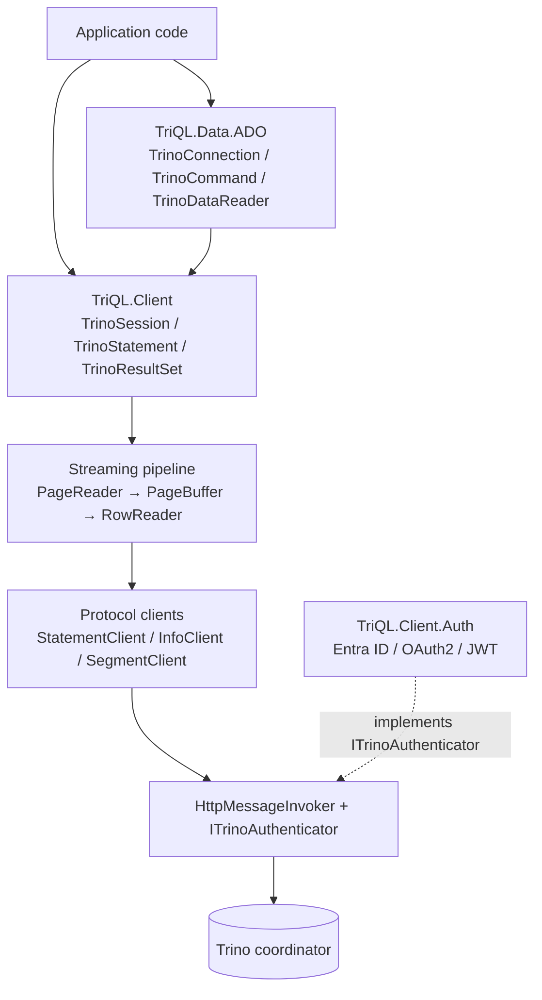
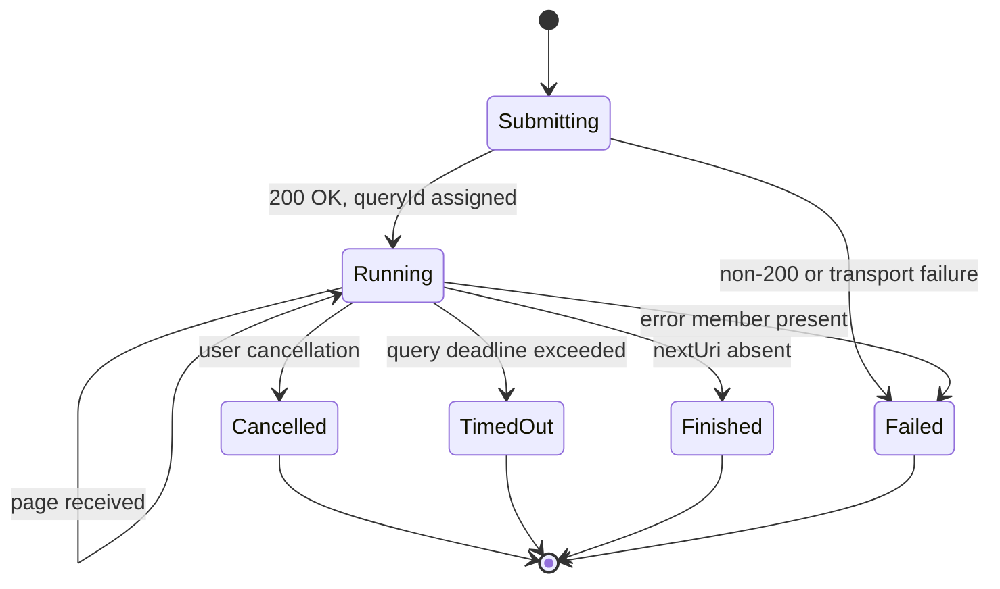

# TriQL — .NET Client for Trino

## Requirements Specification

| Field | Value |
|---|---|
| Document | Requirements Specification |
| Product | TriQL — .NET Trino Client & ADO.NET Provider |
| Version | 0.1 (Draft) |
| Date | 2026-08-25 |
| Status | Draft — pending review |
| Target release | 1.0.0 |

---

## Table of Contents

1. [Purpose and Scope](#1-purpose-and-scope)
2. [Glossary](#2-glossary)
3. [Stakeholders and Personas](#3-stakeholders-and-personas)
4. [Architecture Overview](#4-architecture-overview)
5. [FR-1 — Connection and Session Management](#fr-1--connection-and-session-management)
6. [FR-2 — Authentication](#fr-2--authentication)
7. [FR-3 — Transport and TLS](#fr-3--transport-and-tls)
8. [FR-4 — Statement Protocol](#fr-4--statement-protocol)
9. [FR-5 — Spooled Protocol](#fr-5--spooled-protocol)
10. [FR-6 — Streaming and Buffering](#fr-6--streaming-and-buffering)
11. [FR-7 — Type System](#fr-7--type-system)
12. [FR-8 — Parameterized Queries](#fr-8--parameterized-queries)
13. [FR-9 — ADO.NET Provider Surface](#fr-9--adonet-provider-surface)
14. [FR-10 — Server Metadata and Introspection](#fr-10--server-metadata-and-introspection)
15. [FR-11 — Observability](#fr-11--observability)
16. [FR-12 — Error Handling](#fr-12--error-handling)
17. [Non-Functional Requirements](#17-non-functional-requirements)
18. [Security Requirements](#18-security-requirements)
19. [Testing Strategy](#19-testing-strategy)
20. [Packaging, Versioning, and CI/CD](#20-packaging-versioning-and-cicd)
21. [Delivery Milestones](#21-delivery-milestones)
22. [Traceability Matrix](#22-traceability-matrix)
23. [Open Questions and Risks](#23-open-questions-and-risks)
24. [Appendix A — Trino Protocol Headers](#appendix-a--trino-protocol-headers)
25. [Appendix B — Connection String Keys](#appendix-b--connection-string-keys)
26. [Appendix C — Reference Implementation Notes](#appendix-c--reference-implementation-notes)

---

## 1. Purpose and Scope

### 1.1 Purpose

TriQL is a new, from-scratch .NET client library for [Trino](https://trino.io). It provides two
complementary programming surfaces over the same core engine:

1. **TriQL SDK** — a low-level, async-first client that maps directly onto the Trino client
   protocol (sessions, statements, pages, rows). Intended for high-throughput data movement,
   custom tooling, and callers who want explicit control over paging and buffering.
2. **TriQL ADO.NET Provider** — a complete `System.Data.Common` provider (`DbConnection`,
   `DbCommand`, `DbDataReader`, `DbParameter`, `DbProviderFactory`) so that Trino can be used
   from existing ADO.NET-based applications, ORMs, reporting tools, and BI connectors.

### 1.2 Design priorities

In priority order:

1. **Correctness of the protocol** — faithful implementation of the Trino client protocol,
   including session propagation, prepared-statement round-tripping, and error semantics.
2. **Time-to-first-row and sustained throughput** — asynchronous read-ahead so the consumer is
   never blocked on network latency for a page that could have been prefetched.
3. **Fidelity of the type system** — full-precision Trino types surfaced as idiomatic CLR types,
   with lossless fallbacks where the CLR has no equivalent.
4. **Async-first API** — no sync-over-async in the SDK; blocking bridges exist only where the
   ADO.NET contract mandates a synchronous member.
5. **Minimal dependency footprint** — the core package depends only on the BCL and
   `Microsoft.Extensions.Logging.Abstractions`.
6. **Pluggable authentication** — an open extension point, with cloud/enterprise providers
   isolated in a separate package so their dependencies never leak into the core.

### 1.3 In scope for 1.0

| Area | Included |
|---|---|
| Target frameworks | `net8.0`, `net10.0` |
| Serialization | `System.Text.Json` with source-generated contexts |
| Protocol | `POST /v1/statement` direct protocol; `nextUri` paging |
| Protocol | Spooled protocol (`json`, `json+lz4`, `json+zstd`) with fallback — **opt-in and experimental in 1.0** (FR-5.1.6) |
| Protocol | `GET /v1/info` — server version and readiness |
| Protocol | `GET /v1/query/{queryId}` — query info |
| Protocol | `DELETE` on `nextUri` — query cancellation |
| Protocol | Session and prepared-statement header round-tripping |
| Protocol | Roles, extra credentials, resource estimates, client tags, client info |
| Auth | Anonymous (`X-Trino-User` only) |
| Auth | HTTP Basic |
| Auth | LDAP (Basic over enforced TLS) |
| Auth | JWT bearer token (static and refresh-callback) |
| Auth | OAuth 2.0 client credentials |
| Auth | Microsoft Entra ID via `DefaultAzureCredential` |
| Auth | Mutual TLS client certificates |
| ADO.NET | `DbConnection`, `DbCommand`, `DbDataReader`, `DbParameter`, `DbParameterCollection` |
| ADO.NET | `DbProviderFactory` and `DbConnectionStringBuilder` |
| ADO.NET | Full async surface, including `IAsyncEnumerable<T>` streaming |
| ADO.NET | `GetSchema()` metadata collections |
| Observability | `ILogger` integration, progress events, `Metrics`, `ActivitySource` |

### 1.4 Out of scope for 1.0

| Area | Excluded | Rationale |
|---|---|---|
| Transactions | `BeginTransaction` throws `NotSupportedException` | Trino's transaction model does not map to the ADO.NET contract; deferred. |
| Auth | OAuth 2.0 external browser / device code flow | Requires interactive UX; deferred to 1.1. |
| Auth | Kerberos / SPNEGO | Platform-specific; deferred to 1.1. |
| ADO.NET | `DbDataAdapter` / `DataSet` fill | Legacy surface; deferred. |
| ORM | Entity Framework Core provider | Separate deliverable with its own lifecycle. |
| Protocol | Arrow-encoded spooled segments | Not yet stable in Trino; revisit for 1.1. |
| Protocol | Client-side result caching | Application concern. |

> **REQ-SCOPE-1** — Every member of a public type that is deliberately unimplemented MUST throw
> `NotSupportedException` with a message naming the Trino limitation, and MUST be listed in the
> API reference documentation. Silent no-ops are prohibited.

---

## 2. Glossary

| Term | Definition |
|---|---|
| **Coordinator** | The Trino node that accepts client requests and orchestrates query execution. |
| **Statement** | A single SQL text submitted to `/v1/statement`. |
| **Query** | The server-side execution of a statement, identified by a `queryId`. |
| **Page** | One HTTP response from the coordinator containing zero or more rows, statistics, and an optional `nextUri`. |
| **`nextUri`** | The URI the client must poll to advance the query and retrieve the next page. |
| **Direct protocol** | The classic protocol where row data is embedded inline in the page JSON as a `data` array. |
| **Spooled protocol** | The protocol where the coordinator writes result segments to an object store and the page references them by URI. |
| **Segment** | A unit of spooled result data — either `inline` (base64 in the response) or `spooled` (fetched from a URI). |
| **Session property** | A key/value setting scoped to the client session, sent via `X-Trino-Session` and mutated by the server via `X-Trino-Set-Session`. |
| **Read-ahead** | Background prefetching of pages into a bounded buffer while the consumer processes earlier pages. |
| **Backpressure** | Suspension of read-ahead when the buffer's byte budget is exhausted. |
| **TFM** | Target Framework Moniker (`net8.0`, `net10.0`). |

---

## 3. Stakeholders and Personas

| Persona | Needs | Primary surface |
|---|---|---|
| **Application developer** | Run queries from an ASP.NET/worker service; familiar `DbConnection` semantics; DI-friendly; async. | ADO.NET provider |
| **Data engineer** | Move millions of rows with minimal allocation and predictable memory; stream to Parquet/Arrow/blob. | TriQL SDK |
| **BI / tooling integrator** | Discover catalogs, schemas, tables, and columns; register a provider factory; use a connection string. | ADO.NET provider + `GetSchema` |
| **Platform / security engineer** | Enterprise auth (Entra ID, mTLS), TLS policy control, no credential leakage in logs, dependency hygiene. | Auth package + transport config |
| **Library maintainer** | Clear layering, high test coverage, protocol conformance suite, low dependency churn. | All |

---

## 4. Architecture Overview

### 4.1 Package layout

```text
triql/
  TriQL.sln
  Directory.Build.props
  Directory.Packages.props            # central package management
  src/
    TriQL.Client/                     # Core SDK — protocol, session, streaming, types
    TriQL.Client.Auth/                # Cloud/enterprise auth providers
    TriQL.Data.ADO/                   # ADO.NET provider
  samples/
    TriQL.Samples.Console/
  tests/
    TriQL.Client.Tests/               # Unit tests + in-process fake coordinator
    TriQL.Data.ADO.Tests/
    TriQL.IntegrationTests/           # Testcontainers against trinodb/trino
    TriQL.Benchmarks/                 # BenchmarkDotNet
  docs/
    requirements.md                   # this document
```

> **REQ-ARCH-1** — The root namespace is `TriQL`, cased exactly that way in every project file,
> namespace declaration, assembly name, and package id. Assembly names match project names.
> **REQ-ARCH-2** — `TriQL.Client` MUST NOT reference `TriQL.Data.ADO` or `TriQL.Client.Auth`.
> **REQ-ARCH-3** — `TriQL.Data.ADO` MUST NOT reference `TriQL.Client.Auth`. Authentication
> providers are supplied to the ADO layer through the `ITrinoAuthenticator` abstraction defined
> in `TriQL.Client`.
> **REQ-ARCH-4** — `TriQL.Client` package dependencies are limited to
> `Microsoft.Extensions.Logging.Abstractions`. Compression codecs required by FR-5 (LZ4, Zstandard)
> MUST be satisfied by the BCL where possible; any codec package MUST be justified in review and
> recorded in [§23](#23-open-questions-and-risks).
> **REQ-ARCH-5** — Because the package ids do not contain the string `trino`, every package MUST
> carry `trino` in its NuGet tags, title, and description so that it remains discoverable by
> search. See [§20](#20-packaging-versioning-and-cicd).

### 4.2 Layering



### 4.3 Core type inventory (`TriQL.Client`)

| Type | Responsibility |
|---|---|
| `TrinoSessionOptions` | Mutable configuration input: server, credentials, catalog, schema, session properties, TLS, buffering. |
| `TrinoSession` | Live session state; applies server-sent session mutations; thread-safe. |
| `TrinoClient` | Entry point. Submits statements, exposes `/v1/info` and `/v1/query/{id}`. |
| `ITrinoAuthenticator` | Authentication extension point. |
| `StatementClient` | `POST /v1/statement`, `nextUri` advance loop, `DELETE` cancellation, header processing. |
| `InfoClient` | `GET /v1/info`. |
| `SegmentClient` | Spooled segment fetch, decode, and acknowledgement. |
| `PageReader` | Produces `TrinoPage` values from the protocol client. |
| `PageBuffer` | Bounded byte-budget read-ahead buffer with backpressure. |
| `TrinoResultSet` | `IAsyncEnumerable<TrinoRow>` over buffered pages; exposes columns and live stats. |
| `TrinoRow` | Zero-copy-ish accessor over one row's decoded values. |
| `TrinoColumn` | Column name, raw Trino type string, parsed `TrinoTypeSignature`, CLR type. |
| `TrinoTypeSignature` | Parsed representation of a Trino type, including nested type arguments. |
| `TrinoValueConverter` | Trino wire value → CLR value conversion. |
| `TrinoQueryStats` | Live query statistics snapshot. |
| `TrinoQueryError` | Structured server error. |

---

## FR-1 — Connection and Session Management

### FR-1.1 Session options

> **FR-1.1.1** — `TrinoSessionOptions` MUST expose the following properties. Defaults apply when
> the property is unset.

| Property | Type | Default | Protocol mapping |
|---|---|---|---|
| `Server` | `Uri` | *required* | Base URI, e.g. `https://trino.example.com:443/` |
| `User` | `string?` | `Environment.UserName` | `X-Trino-User` |
| `AuthorizationUser` | `string?` | `null` | `X-Trino-Authorization-User` |
| `Principal` | `string?` | `null` | Informational |
| `Source` | `string` | `"triql-dotnet"` | `X-Trino-Source` |
| `Catalog` | `string?` | `null` | `X-Trino-Catalog` |
| `Schema` | `string?` | `null` | `X-Trino-Schema` |
| `Path` | `string?` | `null` | `X-Trino-Path` |
| `TimeZone` | `string?` | host IANA zone | `X-Trino-Time-Zone` |
| `Locale` | `string?` | `CultureInfo.CurrentCulture` | `X-Trino-Language` |
| `TraceToken` | `string?` | `null` | `X-Trino-Trace-Token` |
| `ClientInfo` | `string?` | `null` | `X-Trino-Client-Info` |
| `ClientTags` | `ISet<string>` | empty | `X-Trino-Client-Tags` |
| `SessionProperties` | `IDictionary<string,string>` | empty | `X-Trino-Session` |
| `PreparedStatements` | `IDictionary<string,string>` | empty | `X-Trino-Prepared-Statement` |
| `ResourceEstimates` | `IDictionary<string,string>` | empty | `X-Trino-Resource-Estimate` |
| `ExtraCredentials` | `IDictionary<string,string>` | empty | `X-Trino-Extra-Credential` |
| `Roles` | `IDictionary<string,TrinoSelectedRole>` | empty | `X-Trino-Role` |
| `AdditionalHeaders` | `IDictionary<string,string>` | empty | Verbatim request headers |
| `Authenticator` | `ITrinoAuthenticator?` | `null` (anonymous) | See FR-2 |
| `QueryTimeout` | `TimeSpan?` | `null` (unbounded) | Client-side deadline |
| `RequestTimeout` | `TimeSpan` | `100 s` | Per-HTTP-request timeout |
| `ReadAheadBufferBytes` | `long` | `52 428 800` (50 MB) | See FR-6 |
| `TargetResultSizeBytes` | `long` | `5 242 880` (5 MB) | `targetResultSize` query parameter |
| `CompressionDisabled` | `bool` | `false` | `Accept-Encoding` |
| `QueryDataEncodings` | `IReadOnlyList<string>` | **1.0:** empty (opt-in) → **1.1:** `["json+zstd","json+lz4","json"]` | `X-Trino-Query-Data-Encoding` (see FR-5.1.6) |
| `TestConnectionOnOpen` | `bool` | `false` | Issue `/v1/info` on `Open()` |
| `Tls` | `TrinoTlsOptions` | see FR-3 | TLS policy |

> **FR-1.1.2** — `TrinoSessionOptions` MUST be validated on first use. `Server` MUST be an
> absolute URI with scheme `http` or `https`; otherwise throw `ArgumentException`.
> **FR-1.1.3** — When `Server` has scheme `http` and an authenticator that transmits a bearer
> credential is configured, the client MUST throw `TrinoConfigurationException` unless
> `Tls.AllowPlaintextCredentials` is explicitly `true`. (See [§18](#18-security-requirements).)
> **FR-1.1.4** — A helper `TrinoSessionOptions.FromParts(string host, int port, bool useTls, string? path)`
> MUST be provided to construct `Server` from components, mirroring the connection-string model.

### FR-1.2 Session state and server-driven mutation

> **FR-1.2.1** — `TrinoSession` MUST hold the live session state derived from the initial options
> plus every mutation the server has sent. It MUST be safe for concurrent reads while a statement
> is executing.
> **FR-1.2.2** — After each response, the client MUST apply the following header-driven mutations
> **in the order listed**, and the resulting state MUST be used for all subsequent requests on the
> same session:

| Response header | Effect on session |
|---|---|
| `X-Trino-Set-Catalog` | Replace `Catalog` |
| `X-Trino-Set-Schema` | Replace `Schema` |
| `X-Trino-Set-Path` | Replace `Path` |
| `X-Trino-Set-Session` | Upsert one session property per header occurrence (`key=urlencoded(value)`) |
| `X-Trino-Clear-Session` | Remove the named session property |
| `X-Trino-Set-Role` | Upsert one role per header occurrence |
| `X-Trino-Set-Original-Roles` | Replace the original-user roles echoed in `X-Trino-Original-Roles` |
| `X-Trino-Added-Prepare` | Add the named prepared statement |
| `X-Trino-Deallocated-Prepare` | Remove the named prepared statement |
| `X-Trino-Set-Authorization-User` | Replace `AuthorizationUser` |
| `X-Trino-Reset-Authorization-User` | Clear `AuthorizationUser` |
| `X-Trino-Started-Transaction-Id` | Record transaction id (informational in 1.0) |
| `X-Trino-Clear-Transaction-Id` | Clear transaction id |

> **FR-1.2.3** — Session mutation MUST be applied atomically per response. A partially applied
> mutation set is a defect.
> **FR-1.2.4** — Session mutations MUST be applied on **every** page response, not only the final
> one, because `SET SESSION` takes effect as soon as the coordinator emits the header.
> **FR-1.2.5** — Header values MUST be URL-decoded on read and URL-encoded on write for the
> value portion of `key=value` header pairs. Multi-valued headers MUST be emitted either as
> repeated headers or as a single comma-joined header; the implementation MUST choose repeated
> headers where a value may itself contain a comma.
> **FR-1.2.6** — `TrinoSession` MUST raise a `SessionChanged` event carrying the applied
> mutation set, so the ADO layer can surface catalog/schema changes through
> `DbConnection.Database`.

### FR-1.3 Connection string

> **FR-1.3.1** — `TrinoConnectionStringBuilder : DbConnectionStringBuilder` MUST be provided in
> `TriQL.Data.ADO`, with strongly typed properties for every key in
> [Appendix B](#appendix-b--connection-string-keys).
> **FR-1.3.2** — Parsing MUST be case-insensitive for keys, MUST accept `;`-delimited
> `key=value` pairs, and MUST support quoting per the `DbConnectionStringBuilder` rules so values
> can contain `;` and `=`.
> **FR-1.3.3** — An unrecognized key MUST cause `ArgumentException` naming the key. Silently
> ignoring unknown keys is prohibited.
> **FR-1.3.4** — `ToString()` MUST round-trip: parsing the output MUST yield an equivalent
> builder. Secret-bearing keys (`Password`, `AccessToken`, `ClientSecret`) MUST be redacted in
> `ToString()` **only** when `RedactSecrets` is `true`; the default `false` preserves round-trip
> fidelity, and callers are warned in documentation not to log the raw string.
> **FR-1.3.5** — The `Auth` key selects an authenticator by short name (`none`, `basic`, `ldap`,
> `jwt`, `oauth2-client-credentials`, `entra-id`, `certificate`). Resolution MUST use a registry
> of known names, **not** reflective type loading from an arbitrary assembly-qualified name.
> **FR-1.3.6** — `TrinoConnection.ConnectionString` MUST be settable only while the connection
> is `Closed`; otherwise throw `InvalidOperationException`.

---

## FR-2 — Authentication

### FR-2.1 Extension point

> **FR-2.1.1** — `TriQL.Client` MUST define:

```csharp
public interface ITrinoAuthenticator
{
    /// Validates configuration and acquires an initial credential if required.
    ValueTask InitializeAsync(CancellationToken cancellationToken);

    /// Applies the credential to an outgoing request. Called for every request.
    ValueTask ApplyAsync(HttpRequestMessage request, CancellationToken cancellationToken);

    /// Invoked after a 401/403. Return true if the credential was refreshed and the
    /// request should be retried exactly once.
    ValueTask<bool> TryRefreshAsync(HttpResponseMessage response, CancellationToken cancellationToken);

    /// Optional mutation of the HTTP handler, e.g. attaching client certificates.
    void ConfigureHandler(SocketsHttpHandler handler);
}
```

> **FR-2.1.2** — `ApplyAsync` MUST be invoked for every request including `nextUri` polls,
> segment fetches, segment acknowledgements, and cancellation requests.
> **FR-2.1.3** — On `401 Unauthorized` or `403 Forbidden`, the client MUST call `TryRefreshAsync`
> at most once per request; if it returns `true`, the request MUST be retried exactly once.
> Repeated failure MUST surface `TrinoAuthenticationException`.
> **FR-2.1.4** — Authenticators MUST be safe for concurrent use. Token refresh MUST be
> serialized so that concurrent requests trigger at most one refresh operation.
> **FR-2.1.5** — Credential material MUST NOT be written to logs, exception messages, or
> `ToString()` output at any log level. See [§18](#18-security-requirements).

### FR-2.2 Providers in `TriQL.Client` (no external dependencies)

| Provider | Requirement |
|---|---|
| `AnonymousAuthenticator` | **FR-2.2.1** — Default. Sends no credential; relies on `X-Trino-User`. |
| `BasicAuthenticator` | **FR-2.2.2** — `Authorization: Basic base64(user:password)`. MUST set `X-Trino-User` to the Basic username unless `User` is explicitly set. MUST reject plaintext HTTP per FR-1.1.3. |
| `LdapAuthenticator` | **FR-2.2.3** — Behaves as Basic but MUST refuse to operate over a non-TLS connection with no override, since Trino requires LDAP auth over HTTPS. |
| `JwtAuthenticator` | **FR-2.2.4** — `Authorization: Bearer <token>`. MUST support a static token and a `Func<CancellationToken, ValueTask<string>>` refresh callback. When a callback is supplied, the token MUST be refreshed on 401 and proactively when a known `exp` is within a configurable skew (default 60 s). |
| `ClientCertificateAuthenticator` | **FR-2.2.5** — Attaches one or more `X509Certificate2` instances to the handler for mutual TLS. MUST accept a certificate from a file path, a PEM string, a byte array, or an `X509Store` lookup by thumbprint. |

### FR-2.3 Providers in `TriQL.Client.Auth` (external dependencies permitted)

| Provider | Requirement |
|---|---|
| `OAuth2ClientCredentialsAuthenticator` | **FR-2.3.1** — RFC 6749 §4.4 client credentials grant. Configurable token endpoint, client id, client secret, scopes, and optional audience. MUST cache the token until `expires_in` minus a configurable skew (default 60 s). MUST refresh on 401. |
| `EntraIdAuthenticator` | **FR-2.3.2** — Wraps `Azure.Core.TokenCredential`, defaulting to `DefaultAzureCredential`. MUST accept an explicit `TokenCredential` for testability and for managed identity / workload identity scenarios. MUST honour the `TokenRequestContext` scopes supplied by the caller. |

> **FR-2.3.3** — `TriQL.Client.Auth` MUST declare its own dependencies (`Azure.Identity`,
> `Azure.Core`) and MUST NOT be a dependency of `TriQL.Client` or `TriQL.Data.ADO`.
> **FR-2.3.4** — Every provider in this package MUST also be usable via the connection-string
> `Auth` key, which requires the consuming application to reference the package. When the package
> is absent, resolution MUST fail with a message naming the missing package.

---

## FR-3 — Transport and TLS

### FR-3.1 HTTP client lifetime

> **FR-3.1.1** — The client MUST NOT construct a new `HttpClient` per statement. A single
> `HttpMessageInvoker` MUST be shared for the lifetime of a `TrinoClient`.
> *(This is an explicit correction of a defect in the reference implementation, where
> `StatementClientV1` creates an `HttpClient` in its constructor.)*
> **FR-3.1.2** — `TrinoClient` MUST accept an externally supplied `HttpMessageInvoker` or
> `IHttpClientFactory` so that applications can control pooling, resilience policies, and
> `PooledConnectionLifetime` for DNS rotation.
> **FR-3.1.3** — When the client owns the handler it creates, it MUST dispose it; when the
> handler is supplied externally, it MUST NOT dispose it.
> **FR-3.1.4** — Default `SocketsHttpHandler` configuration MUST set
> `PooledConnectionLifetime = 5 minutes`, `EnableMultipleHttp2Connections = true`, and
> `AutomaticDecompression = GZip | Deflate | Brotli` unless `CompressionDisabled` is `true`.
> **FR-3.1.5** — `HttpMessageInvoker.Timeout` semantics MUST NOT be used for the query deadline.
> Per-request timeouts MUST be implemented with a linked `CancellationTokenSource` so that the
> query deadline (FR-4.6) and the per-request timeout are distinguishable in the raised exception.

### FR-3.2 TLS policy

> **FR-3.2.1** — `TrinoTlsOptions` MUST expose:

| Property | Default | Behaviour |
|---|---|---|
| `AllowSelfSignedCertificate` | `false` | Accept an untrusted root, and only that chain status. |
| `AllowHostNameMismatch` | `false` | Accept `RemoteCertificateNameMismatch`, and only that error. |
| `UseSystemTrustStore` | `true` | Validate against the OS trust store. |
| `TrustedRootCertificates` | empty | Additional roots for custom chain validation. |
| `TrustedRootCertificatePath` | `null` | Load an additional root from a PEM/DER file. |
| `ClientCertificates` | empty | Certificates for mutual TLS. |
| `CertificatePinning` | `null` | Optional set of accepted leaf SPKI SHA-256 pins. |
| `AllowPlaintextCredentials` | `false` | Permit credential transmission over `http`. |
| `MinimumTlsVersion` | `TLS 1.2` | Lower bound enforced on the handler. |

> **FR-3.2.2** — The certificate validation callback MUST reject any `SslPolicyErrors` value not
> explicitly permitted by the options. Blanket `return true` is prohibited.
> **FR-3.2.3** — Enabling `AllowSelfSignedCertificate` or `AllowHostNameMismatch` MUST emit a
> single `LogLevel.Warning` per client instance naming the weakened check.
> **FR-3.2.4** — When `TrustedRootCertificates` is non-empty, validation MUST build a custom
> `X509Chain` with those roots as `CustomTrustStore` and `TrustMode = CustomRootTrust`. Adding
> a server root to `ClientCertificates` is a defect and MUST NOT occur.
> *(The reference implementation adds trusted server certificates to `handler.ClientCertificates`,
> which conflates client identity with server trust; TriQL MUST NOT replicate this.)*

### FR-3.3 Retry and redirect

> **FR-3.3.1** — The client MUST retry idempotent requests on `429`, `502`, `503`, `504`, and on
> transient `HttpRequestException`/`IOException`, using exponential backoff with full jitter:
> base 50 ms, factor 2.0, cap 10 s, default maximum 5 attempts. The 50 ms base matches the
> 50–100 ms retry interval the Trino client protocol documentation prescribes for `502`/`503`/`504`.
> **FR-3.3.2** — `429` and `503` responses carrying a `Retry-After` header MUST honour that value
> in preference to the computed backoff. `Retry-After` MUST be parsed in both its delay-seconds
> and HTTP-date forms.
> **FR-3.3.2a** — Any status other than `200`, `429`, `502`, `503`, or `504` means query
> processing has failed and MUST NOT be retried.
> **FR-3.3.3** — `POST /v1/statement` MUST be retried **only** when the failure is known not to
> have reached the coordinator (connection-establishment failures). A response received after
> submission MUST NOT be retried, to avoid duplicate query execution.
> **FR-3.3.4** — Total retry duration MUST be bounded by the query deadline when one is set.
> **FR-3.3.5** — HTTP redirects MUST be followed for `GET` only, to a configurable maximum of 5,
> and MUST NOT be followed across a scheme downgrade from `https` to `http`.
> **FR-3.3.6** — Proxy configuration MUST default to the system proxy and MUST be overridable
> through the supplied handler.

---

## FR-4 — Statement Protocol

### FR-4.1 Submission

> **FR-4.1.1** — A statement MUST be submitted as `POST {server}/v1/statement` with the SQL text
> as the raw request body (`text/plain`, UTF-8, no wrapping).
> **FR-4.1.2** — All applicable session headers from [Appendix A](#appendix-a--trino-protocol-headers)
> MUST be attached. Headers with empty values MUST be omitted entirely, never sent as empty
> strings.
> **FR-4.1.3** — `X-Trino-Client-Capabilities` MUST be sent as a comma-separated list. The
> server only emits the corresponding protocol behaviour for capabilities the client declares,
> so an omitted capability silently disables the feature that depends on it. The supported set is
> `PATH`, `PARAMETRIC_DATETIME`, `NUMBER`, `VARIANT`, `VARIANT_BINARY`, `SESSION_AUTHORIZATION`.
> TriQL MUST declare at minimum:
>
> | Capability | Required because |
> |---|---|
> | `PARAMETRIC_DATETIME` | Variable-precision temporal types (FR-7.2) |
> | `PATH` | `X-Trino-Path` / `X-Trino-Set-Path` support (FR-1.1.1, FR-1.2.2) |
> | `SESSION_AUTHORIZATION` | `AuthorizationUser` and the `Set`/`Reset-Authorization-User` headers (FR-1.2.2) |
>
> `NUMBER`, `VARIANT`, and `VARIANT_BINARY` are out of scope for 1.0 and MUST NOT be declared
> until the corresponding materialization is implemented — declaring a capability the client
> cannot decode is a defect.
> **FR-4.1.5** — The full session header set is required only on the initial `POST`. Subsequent
> `GET` requests to `nextUri` MUST NOT resend the session headers; the coordinator carries the
> session on the query. Session mutation headers in responses are still processed per FR-1.2.
> **FR-4.1.4** — Only `200 OK` is an acceptable status for submission. Any other status MUST
> raise a `TrinoQueryException` carrying the status code and the response body (truncated to a
> configurable limit, default 8 KB) as diagnostic context.

### FR-4.2 Response model

> **FR-4.2.1** — The client MUST deserialize the following response shape, tolerating unknown
> members for forward compatibility:

| Member | Meaning |
|---|---|
| `id` | Query id |
| `infoUri` | Human-facing UI URI for the query |
| `partialCancelUri` | Optional URI for partial cancellation |
| `nextUri` | Poll target; absence means the query is complete |
| `columns` | Column metadata; present from the first page that has a schema |
| `data` | Direct-protocol row data, or the encoded-data envelope under the spooled protocol |
| `stats` | Query statistics |
| `error` | Structured failure; presence means the query failed |
| `warnings` | Server warnings |
| `updateType` / `updateCount` | Present for DDL/DML |

> **FR-4.2.2** — Deserialization MUST use `System.Text.Json` with a source-generated
> `JsonSerializerContext` to remain trimming- and AOT-compatible.
> **FR-4.2.3** — Column metadata MUST be captured from the first page that provides it and MUST
> be treated as immutable thereafter.
> **FR-4.2.4** — The `status` member is documented as human-readable only. The client MUST NOT
> use it to determine completion, failure, or any control-flow decision. Completion is determined
> solely by the absence of `nextUri`, and failure solely by the presence of `error`.

### FR-4.3 Advance loop

> **FR-4.3.1** — While `nextUri` is present, the client MUST `GET` it and process the response as
> a page.
> **FR-4.3.2** — When the `nextUri` path contains `/executing`, the client MUST append
> `targetResultSize={TargetResultSizeBytes}` as a query parameter, preserving any existing query
> string. The value MUST be formatted in the units Trino accepts (e.g. `5MB`).
> *(Measured at roughly +30 % read throughput in the reference implementation.)*
> **FR-4.3.3** — URI mutation MUST be performed on a copy. Mutating and re-mutating the stored
> `nextUri` in place — which appends the parameter repeatedly across iterations — is a defect.
> *(This bug is present in the reference implementation's `Advance()`.)*
> **FR-4.3.4** — A page with no rows is legal and MUST NOT terminate enumeration. The client MUST
> continue polling until `nextUri` is absent.
> **FR-4.3.5** — Empty-page skipping MUST be implemented iteratively, not by recursive
> self-invocation, to avoid unbounded stack growth on long queue times.
> **FR-4.3.6** — Only `200 OK` is acceptable for an advance response.

### FR-4.4 Adaptive polling backoff

> **FR-4.4.1** — When a response contains rows, the next poll MUST be issued immediately with no
> delay.
> **FR-4.4.2** — When a response contains no rows and the query is not finished, the client MUST
> delay before the next poll using an adaptive backoff: initial 50 ms, multiplier 1.2, cap 5 s.
> **FR-4.4.3** — The backoff MUST reset to its initial value whenever a page containing rows is
> received.
> **FR-4.4.4** — Backoff delays MUST be cancellable through the operation's `CancellationToken`.
> **FR-4.4.5** — Backoff parameters MUST be configurable on `TrinoSessionOptions` for tuning.

### FR-4.5 Query state machine

> **FR-4.5.1** — The client MUST maintain the following states with the transitions shown. All
> transitions MUST be performed with a compare-and-swap so that concurrent cancellation and
> completion cannot both take effect.



> **FR-4.5.2** — The public surface MUST expose the current state and the server-reported query
> state string (`QUEUED`, `PLANNING`, `STARTING`, `RUNNING`, `FINISHING`, `FINISHED`, `FAILED`).

### FR-4.6 Cancellation and timeout

> **FR-4.6.1** — Cancelling the `CancellationToken` passed to any execution API MUST trigger
> server-side cancellation via `DELETE {nextUri}` and then raise `OperationCanceledException`.
> **FR-4.6.2** — The cancellation `DELETE` MUST accept `200 OK` or `204 No Content`, MUST NOT be
> issued with the already-cancelled token, and MUST be bounded by its own short timeout
> (default 10 s) so that disposal cannot hang.
> **FR-4.6.3** — Cancellation MUST be idempotent; a second request MUST be a no-op.
> **FR-4.6.4** — Failure of the cancellation request MUST be logged at `Warning` and MUST NOT
> mask the original `OperationCanceledException`.
> **FR-4.6.5** — When `QueryTimeout` elapses, the client MUST cancel server-side and raise
> `TrinoTimeoutException` (a distinct type from `OperationCanceledException`) naming the elapsed
> and configured durations.
> **FR-4.6.6** — Disposing a `TrinoResultSet` or `TrinoDataReader` before enumeration completes
> MUST cancel the query server-side, so that abandoned readers do not leave queries running.
> **FR-4.6.7** — `IAsyncDisposable` MUST be implemented on every type that owns a query, and the
> synchronous `IDisposable` path MUST NOT block on network I/O for longer than FR-4.6.2's bound.

---

## FR-5 — Spooled Protocol

### FR-5.1 Negotiation

> **FR-5.1.1** — When `QueryDataEncodings` is non-empty, the submission request MUST include
> `X-Trino-Query-Data-Encoding` with the encodings in client preference order, comma-separated.
> **FR-5.1.2** — The client MUST inspect the shape of the `data` member to determine which
> protocol the server selected. An array-of-arrays indicates the direct protocol; an object with
> `encoding` and `segments` indicates the spooled protocol.
> **FR-5.1.3** — Servers that do not support or have not enabled the spooled protocol ignore the
> header and return direct-protocol data. The client MUST fall back transparently with no error
> and no configuration change.
> **FR-5.1.3a** — Spooling is **cluster-configuration dependent, not merely version dependent**.
> It requires `protocol.spooling.enabled=true`, a configured object-storage spooling manager
> (S3/Azure/GCS), and a 256-bit shared secret key on the coordinator. A fully current server with
> spooling unconfigured returns direct-protocol data. Fallback is therefore a permanent runtime
> path, not a legacy-server accommodation, and MUST NOT be treated as a deprecated branch.
> **FR-5.1.3b** — Trino also falls back to the direct protocol on a per-query basis for queries
> that would not benefit from spooling. The client MUST therefore handle a session in which some
> queries return spooled data and others return direct data, and MUST NOT cache a per-session
> conclusion about which protocol is in use.
> **FR-5.1.4** — If the server returns an encoding the client cannot decode, the client MUST
> raise `TrinoProtocolException` naming the encoding, and the documentation MUST direct the user
> to narrow `QueryDataEncodings`.
> **FR-5.1.5** — `QueryDataEncodings` MUST be settable to empty to force the direct protocol.
> **FR-5.1.6** — **Staged rollout.** In 1.0 the default value of `QueryDataEncodings` MUST be
> empty, making the spooled protocol opt-in, and the documentation MUST describe it as
> experimental. This is a deliberate consequence of the spooled path being verified only against
> a test double before 1.0 (see §23 Q10). Once the path has been validated against a real
> coordinator plus object store, the default MUST be restored to
> `["json+zstd","json+lz4","json"]` in 1.1. That change alters runtime behaviour for existing
> callers and therefore requires a minor-version bump, prominent release notes, and a documented
> opt-out.

### FR-5.2 Segment handling

> **FR-5.2.1** — The client MUST support both segment kinds:

| Kind | Handling |
|---|---|
| `inline` | Base64 payload embedded in the page; decode in place, no additional request. |
| `spooled` | `uri` to `GET` for the payload; `ackUri` to signal consumption; `metadata` carries `segmentSize`, `rowOffset`, `rowsCount`, and optionally `uncompressedSize`. |

> **FR-5.2.2** — Spooled segment fetches MUST carry the session's authentication credential
> (FR-2.1.2), because the segment URI may point at a coordinator-proxied endpoint.
> **FR-5.2.3** — After a spooled segment's rows have been handed to the consumer, the client MUST
> acknowledge it via its `ackUri` so the server can release storage. Acknowledgement MUST be
> fire-and-forget with respect to consumer latency, MUST be retried per FR-3.3, and MUST NOT fail
> the query if it ultimately fails — a `Warning` MUST be logged instead.
> **FR-5.2.4** — Segments MUST be delivered to the consumer in `rowOffset` order.
> **FR-5.2.5** — Segment fetches MAY be issued concurrently up to a configurable degree of
> parallelism (default 4), subject to the buffer byte budget in FR-6.
> **FR-5.2.6** — When the decoded segment length disagrees with `metadata.segmentSize`, or the
> decoded row count disagrees with `metadata.rowsCount`, the client MUST raise
> `TrinoProtocolException`.
> **FR-5.2.7** — Abandoning a query MUST NOT leave segments unacknowledged where an ack can still
> be issued cheaply; a best-effort ack sweep MUST run during cancellation, bounded by FR-4.6.2.

### FR-5.3 Codecs

> **FR-5.3.1** — `json` (uncompressed) MUST be supported.
> **FR-5.3.2** — `json+lz4` MUST be supported. The payload is LZ4 block-compressed; the
> uncompressed length is taken from segment metadata.
> **FR-5.3.3** — `json+zstd` MUST be supported. On `net8.0` and `net10.0` the implementation MUST
> prefer a BCL or built-in Zstandard facility where available and otherwise use a vetted,
> actively maintained package recorded in [§23](#23-open-questions-and-risks).
> **FR-5.3.4** — Decompression MUST be bounded: a decoded segment exceeding
> `max(uncompressedSize, configured ceiling)` MUST raise `TrinoProtocolException` rather than
> allocating unbounded memory. This is an explicit decompression-bomb mitigation.
> **FR-5.3.5** — Decoding MUST use pooled buffers (`ArrayPool<byte>`) and MUST return them on all
> paths including exceptional ones.
> **FR-5.3.6** — The codec set MUST be extensible through an internal registry so that Arrow
> encodings can be added in 1.1 without a breaking change.

---

## FR-6 — Streaming and Buffering

> **FR-6.1** — The client MUST prefetch pages on a background task while the consumer processes
> already-buffered rows, so that consumer latency and network latency overlap.
> **FR-6.2** — The read-ahead buffer MUST be bounded by a **byte budget**
> (`ReadAheadBufferBytes`), not a page count, because page sizes vary by orders of magnitude.
> **FR-6.3** — A byte budget of zero MUST be rejected with `ArgumentOutOfRangeException`. The
> minimum permitted budget MUST be at least `TargetResultSizeBytes`, so that at least one maximal
> page always fits.
> **FR-6.4** — When the budget is exhausted, read-ahead MUST suspend (backpressure) and MUST
> resume when the consumer drains enough bytes. Suspension MUST NOT spin; it MUST await a signal.
> **FR-6.5** — Buffer accounting MUST use the actual decoded payload size. Estimating from the
> raw response string length is insufficient and MUST NOT be used.
> *(The reference implementation estimates from `responseStr.Length`, which understates managed
> memory for wide rows.)*
> **FR-6.6** — The primary consumer surface MUST be
> `IAsyncEnumerable<TrinoRow> TrinoResultSet.ReadRowsAsync(CancellationToken)`, with
> `[EnumeratorCancellation]` applied.
> **FR-6.7** — A page-level surface `IAsyncEnumerable<TrinoPage>` MUST also be exposed for callers
> that want batch-oriented processing.
> **FR-6.8** — Exceptions raised on the background read-ahead task MUST be captured and rethrown
> on the consumer's thread at the point of the next `MoveNextAsync`, preserving the original stack
> via `ExceptionDispatchInfo`. Swallowed or re-wrapped-without-inner exceptions are defects.
> **FR-6.9** — Column metadata MUST become available as soon as the first schema-bearing page
> arrives, without requiring the consumer to read a row. `TrinoResultSet.WaitForSchemaAsync` MUST
> expose this.
> **FR-6.10** — Cancelling enumeration MUST stop read-ahead promptly and trigger FR-4.6.1.
> **FR-6.11** — `TrinoRow` instances MUST be documented as valid only until the next
> `MoveNextAsync`. A `TrinoRow.ToArray()` / `Clone()` MUST be provided for callers that need to
> retain a row.
> **FR-6.12** — For non-query statements (DDL/DML), the pipeline MUST drain pages without
> buffering row data, and MUST expose `updateType` and the processed-row count.

---

## FR-7 — Type System

### FR-7.1 Type signature parsing

> **FR-7.1.1** — The client MUST parse the Trino type string into a `TrinoTypeSignature` tree
> supporting parameters and arbitrary nesting, e.g.
> `map(varchar, array(row(a bigint, b timestamp(6) with time zone)))`.
> **FR-7.1.2** — The parser MUST handle quoted identifiers, nested parentheses, and field names
> in `row` types.
> **FR-7.1.3** — Parsed signatures MUST be cached per distinct type string to avoid re-parsing
> per column per query.

### FR-7.2 Trino → CLR mapping

> **FR-7.2.1** — The following mapping MUST be implemented. `GetFieldType(i)` MUST return the
> "Default CLR type" column.

| Trino type | Default CLR type | Notes |
|---|---|---|
| `boolean` | `bool` | |
| `tinyint` | `sbyte` | Trino `tinyint` is **signed**; mapping to `byte` is a defect. |
| `smallint` | `short` | |
| `integer` | `int` | |
| `bigint` | `long` | |
| `real` | `float` | |
| `double` | `double` | |
| `decimal(p,s)` where `p ≤ 28` | `decimal` | |
| `decimal(p,s)` where `p > 28` | `TrinoBigDecimal` | `decimal` cannot represent `p` up to 38 without loss. |
| `varchar`, `varchar(n)`, `char(n)` | `string` | `char(n)` is space-padded by the server; padding MUST be preserved. |
| `varbinary` | `byte[]` | Wire form is base64. |
| `json` | `string` | `GetFieldValue<JsonDocument>` MUST also be supported. |
| `date` | `DateOnly` | |
| `time(p)` where `p ≤ 7` | `TimeOnly` | |
| `time(p)` where `p > 7` | `TrinoTime` | Sub-100 ns precision exceeds `TimeOnly`. |
| `time(p) with time zone` | `TrinoTimeWithTimeZone` | No CLR equivalent for a zoned time-of-day. |
| `timestamp(p)` where `p ≤ 7` | `DateTime` | `Kind = Unspecified`. |
| `timestamp(p)` where `p > 7` | `TrinoTimestamp` | Trino supports up to `p = 12` (picoseconds). |
| `timestamp(p) with time zone`, `p ≤ 7` | `DateTimeOffset` | |
| `timestamp(p) with time zone`, `p > 7` | `TrinoTimestampWithTimeZone` | |
| `interval year to month` | `TrinoIntervalYearToMonth` | Not representable as `TimeSpan`. |
| `interval day to second` | `TimeSpan` | |
| `uuid` | `Guid` | |
| `ipaddress` | `IPAddress` | |
| `array(T)` | `T[]`, else `object?[]` | Element type resolved recursively. |
| `map(K,V)` | `IReadOnlyDictionary<K,V>`, else `IReadOnlyDictionary<object,object?>` | |
| `row(...)` | `ITrinoRowValue` | Named field access plus positional access. |
| unknown / `null` column type | `object` | Value is always `null`. |

> **FR-7.2.2** — `NULL` MUST map to `null` for reference types and to `DBNull.Value` at the
> ADO.NET boundary via `IsDBNull`. `GetFieldValue<T>` on a null MUST throw
> `InvalidCastException` unless `T` is nullable.
> **FR-7.2.3** — Custom Trino types (`TrinoBigDecimal`, `TrinoTimestamp`, `TrinoTime`,
> `TrinoTimeWithTimeZone`, `TrinoTimestampWithTimeZone`, `TrinoIntervalYearToMonth`) MUST
> implement `IEquatable<T>`, `IComparable<T>`, `IFormattable`, `ISpanFormattable`, and
> `IParsable<T>`, and MUST provide explicit narrowing conversions to the nearest BCL type that
> throw `OverflowException` on loss.
> **FR-7.2.4** — Numeric widening MUST be permitted on typed accessors: `GetInt64` MUST succeed
> on `integer` and `smallint`. Narrowing that would lose data MUST throw `InvalidCastException`
> or `OverflowException`, never silently truncate.
> **FR-7.2.5** — Temporal parsing MUST honour the session time zone for `with time zone` types
> and MUST NOT apply the host machine's local zone implicitly.
> **FR-7.2.6** — Conversion MUST be allocation-conscious: parsing MUST use
> `Utf8JsonReader`/`ReadOnlySpan<char>` paths and MUST avoid intermediate `string` allocation for
> primitive types.
> **FR-7.2.7** — Nested-type materialization MUST be lazy where practical, so that a caller
> reading only scalar columns does not pay to materialize a large `array`/`map`/`row` column.

---

## FR-8 — Parameterized Queries

> **FR-8.1** — Parameterized statements MUST be executed server-side using Trino's
> `PREPARE`/`EXECUTE` mechanism. Client-side string interpolation of values into the SQL text is
> prohibited.
> **FR-8.2** — The client MUST generate a collision-resistant prepared-statement name
> (`triql_` + 32 hex characters) and register it via the `X-Trino-Prepared-Statement` header, then
> submit `EXECUTE <name> USING ?, ?, …`.
> **FR-8.3** — Parameter values MUST be transmitted through the `USING` clause as bound values.
> Where a value must be rendered as a literal, rendering MUST be performed by a dedicated,
> unit-tested encoder that:
>
> - escapes single quotes by doubling for string types;
> - never concatenates unescaped caller input;
> - renders temporal values with explicit type prefixes (`TIMESTAMP '…'`, `DATE '…'`);
> - renders `varbinary` as `X'…'`;
> - renders `NULL` as the bare keyword;
> - uses invariant culture for all numeric formatting;
> - rejects any value it cannot render, rather than falling back to `ToString()`.
>
> **FR-8.4** — Positional parameters (`?`) MUST be supported and bound in collection order.
> **FR-8.5** — Named parameters (`:name` or `@name`) MUST be supported by rewriting to positional
> form before submission. The rewriter MUST be string-literal- and comment-aware so that a `?` or
> `:name` occurring inside a quoted literal or a `--`/`/* */` comment is not treated as a
> placeholder.
> **FR-8.6** — A mismatch between the number of placeholders and the number of supplied
> parameters MUST raise `TrinoParameterException` before any network call.
> **FR-8.7** — `TrinoParameter` MUST support `DbType`, an explicit `TrinoType` override,
> `Precision`, `Scale`, `Size`, `IsNullable`, and `Direction`. `Direction` values other than
> `Input` MUST throw `NotSupportedException`.
> **FR-8.8** — `DbType` → Trino type mapping MUST be the documented inverse of FR-7.2 where a
> unique inverse exists; ambiguous cases MUST require an explicit `TrinoType`.
> **FR-8.9** — Prepared statements added during execution MUST be deallocated when the owning
> command is disposed, unless the caller opts into retaining them on the session.
> **FR-8.10** — Parameter values MUST NOT be written to logs above `Trace` level, and MUST be
> redactable per [§18](#18-security-requirements).

---

## FR-9 — ADO.NET Provider Surface

### FR-9.1 `TrinoConnection : DbConnection`

| Member | Requirement |
|---|---|
| `ConnectionString` | **FR-9.1.1** — Get/set; parses to `TrinoSessionOptions`. Settable only while `Closed`. |
| `Database` | **FR-9.1.2** — Returns the current schema; MUST reflect server-driven `Set-Schema` mutations. |
| `DataSource` | **FR-9.1.3** — Returns the server URI. |
| `ServerVersion` | **FR-9.1.4** — Returns the node version from `/v1/info`; result MUST be cached per connection. |
| `State` | **FR-9.1.5** — Standard `ConnectionState` transitions; `StateChange` MUST be raised. |
| `ConnectionTimeout` | **FR-9.1.6** — Returns `RequestTimeout` in seconds. |
| `Open` / `OpenAsync` | **FR-9.1.7** — `OpenAsync` is the primary implementation. When `TestConnectionOnOpen` is set, MUST call `/v1/info` and fail with `TrinoConnectionException` if the server reports `starting = true`. |
| `Close` / `CloseAsync` | **FR-9.1.8** — MUST cancel any outstanding queries owned by the connection. |
| `ChangeDatabase` / `ChangeDatabaseAsync` | **FR-9.1.9** — Sets the session schema. |
| `CreateDbCommand` | **FR-9.1.10** — Returns a `TrinoCommand` bound to this connection. |
| `BeginDbTransaction` | **FR-9.1.11** — Throws `NotSupportedException`. |
| `GetSchema` overloads | **FR-9.1.12** — See FR-9.5. |
| `DbProviderFactory` | **FR-9.1.13** — Protected `DbProviderFactory` MUST return `TrinoProviderFactory.Instance`. |
| `InfoMessage` | **FR-9.1.14** — An event carrying `TrinoQueryStats` and `TrinoQueryError` progress notifications. |

> **FR-9.1.15** — A `TrinoConnection` MUST be usable concurrently only to the extent that
> `DbConnection` permits; the documentation MUST state that one command may execute at a time per
> connection, and violations MUST throw `InvalidOperationException` rather than corrupting session
> state.
> **FR-9.1.16** — A constructor accepting `TrinoSessionOptions` and one accepting an
> `IHttpClientFactory` MUST be provided for DI scenarios.

### FR-9.2 `TrinoCommand : DbCommand`

| Member | Requirement |
|---|---|
| `CommandText` | **FR-9.2.1** — The SQL statement. |
| `CommandType` | **FR-9.2.2** — `Text` supported; `StoredProcedure` and `TableDirect` throw `NotSupportedException`. |
| `CommandTimeout` | **FR-9.2.3** — Seconds; `0` means unbounded. Maps to `QueryTimeout`. MUST NOT mutate shared connection state — the timeout is per command. |
| `ExecuteNonQuery` / `Async` | **FR-9.2.4** — Drains without buffering rows; returns processed-row count, saturating at `int.MaxValue`. |
| `ExecuteScalar` / `Async` | **FR-9.2.5** — Returns the first column of the first row, or `null`. MUST cancel the query after retrieving the value. |
| `ExecuteReader` / `Async` | **FR-9.2.6** — Returns `TrinoDataReader`. |
| `Cancel` | **FR-9.2.7** — Triggers FR-4.6.1. |
| `Prepare` / `PrepareAsync` | **FR-9.2.8** — MAY issue a server-side `PREPARE`; if not implemented, MUST be a documented no-op rather than throwing, since some tooling calls it unconditionally. |
| `CreateDbParameter` | **FR-9.2.9** — Returns a new `TrinoParameter`. MUST NOT add it to the collection implicitly. *(The reference implementation adds it, which surprises callers.)* |
| `UpdatedRowSource` | **FR-9.2.10** — Get returns `None`; set accepts `None` only. |
| `DesignTimeVisible` | **FR-9.2.11** — Standard auto-property. |
| `DbTransaction` | **FR-9.2.12** — Get returns `null`; set to non-null throws `NotSupportedException`. |

> **FR-9.2.13** — `CommandBehavior` MUST be honoured as follows:

| Behavior | Requirement |
|---|---|
| `Default` | Full result streaming. |
| `SingleResult` | Same as `Default` — Trino returns one result set. |
| `SingleRow` | Reader MUST return at most one row and MUST cancel the query afterwards. |
| `SchemaOnly` | MUST resolve columns without buffering row data. |
| `KeyInfo` | MUST NOT throw; key information is unavailable and MUST be reported as such in `GetSchemaTable`. |
| `CloseConnection` | Closing the reader MUST close the connection. |
| `SequentialAccess` | MUST be accepted; the implementation MAY treat it as `Default` but MUST document that. |

> **FR-9.2.14** — The synchronous execute members MUST be implemented over the async core using a
> single documented blocking bridge that does not deadlock in a synchronization context. Ad-hoc
> `.Result`/`.Wait()` calls are prohibited.

### FR-9.3 `TrinoDataReader : DbDataReader`

> **FR-9.3.1** — All typed accessors from FR-7.2 MUST be implemented:
> `GetBoolean`, `GetByte`, `GetBytes`, `GetChar`, `GetChars`, `GetDateTime`, `GetDecimal`,
> `GetDouble`, `GetFloat`, `GetGuid`, `GetInt16`, `GetInt32`, `GetInt64`, `GetString`,
> `GetValue`, `GetValues`, `GetFieldValue<T>`, `GetFieldValueAsync<T>`, `IsDBNull`,
> `IsDBNullAsync`, `GetStream`, `GetTextReader`.
> **FR-9.3.2** — `GetBytes` and `GetChars` MUST implement the documented ADO.NET contract: a
> `null` buffer returns the total length; `bufferOffset`/`dataOffset` MUST be range-checked; the
> return value is the number of elements actually copied, clamped to what remains. *(The
> reference implementation returns the full value length regardless of how much was copied and can
> read past the source array — this MUST be corrected.)*
> **FR-9.3.3** — `Read` / `ReadAsync` MUST advance one row and return `false` at end of results.
> **FR-9.3.4** — `NextResult` / `NextResultAsync` MUST return `false` — Trino produces one result
> set.
> **FR-9.3.5** — `HasRows` MUST be answerable without consuming a row, and MUST NOT block on
> network I/O in the synchronous path beyond the already-buffered state.
> **FR-9.3.6** — `RecordsAffected` MUST return `-1` for `SELECT` and the processed-row count for
> DML, saturating at `int.MaxValue`.
> **FR-9.3.7** — `FieldCount` MUST return `0` when the reader is closed and the column count
> otherwise.
> **FR-9.3.8** — `GetOrdinal` MUST be case-insensitive, MUST use a cached lookup rather than a
> linear scan per call, and MUST throw `IndexOutOfRangeException` for an unknown name.
> **FR-9.3.9** — `GetDataTypeName` MUST return the raw Trino type string.
> **FR-9.3.10** — `GetSchemaTable` MUST populate at minimum `ColumnName`, `ColumnOrdinal`,
> `ColumnSize`, `NumericPrecision`, `NumericScale`, `DataType`, `DataTypeName`, `ProviderType`,
> `AllowDBNull` (`true`), `IsKey` (`false`), `IsUnique` (`false`), `IsReadOnly` (`true`),
> `BaseCatalogName`, `BaseSchemaName`, `BaseTableName`, `BaseColumnName`.
> **FR-9.3.11** — `GetColumnSchema()` (`IDbColumnSchemaGenerator`) MUST be implemented.
> **FR-9.3.12** — `Close`/`Dispose`/`DisposeAsync` MUST cancel the underlying query if it is
> still running (FR-4.6.6) and MUST be idempotent.
> **FR-9.3.13** — Any accessor called before the first `Read` or after the last MUST throw
> `InvalidOperationException`.
> **FR-9.3.14** — `GetEnumerator()` MUST return a `DbEnumerator`, and an
> `IAsyncEnumerable<TrinoRow>` extension MUST be provided for async iteration.

### FR-9.4 Factory, parameters, and registration

> **FR-9.4.1** — `TrinoProviderFactory : DbProviderFactory` MUST expose a public static
> `Instance` field, MUST override `CreateConnection`, `CreateCommand`, `CreateParameter`,
> `CreateConnectionStringBuilder`, `CreateDataSource`, and MUST report
> `CanCreateDataSource = true`, `CanCreateBatch = false`, `CanCreateCommandBuilder = false`,
> `CanCreateDataAdapter = false`.
> **FR-9.4.2** — The invariant name MUST be `TriQL.Data.Trino`, and documentation MUST show
> `DbProviderFactories.RegisterFactory("TriQL.Data.Trino", TrinoProviderFactory.Instance)`.
> **FR-9.4.3** — `TrinoDataSource : DbDataSource` MUST be implemented so callers get pooled,
> DI-friendly connection creation.
> **FR-9.4.4** — `TrinoParameterCollection : DbParameterCollection` MUST implement the full
> contract including indexer-by-name (case-insensitive), `IndexOf`, `Contains`, `Insert`,
> `RemoveAt`, `AddRange`, and `CopyTo`.

### FR-9.5 Schema metadata collections

> **FR-9.5.1** — `GetSchema()` with no arguments MUST return a `MetaDataCollections` table
> listing every supported collection with its restriction count.
> **FR-9.5.2** — The following collections MUST be supported, sourced as shown:

| Collection | Source | Restrictions (ordered) |
|---|---|---|
| `MetaDataCollections` | Static | — |
| `DataSourceInformation` | Static + `/v1/info` | — |
| `DataTypes` | Static (FR-7.2 table) | — |
| `ReservedWords` | Static | — |
| `Restrictions` | Static | — |
| `Catalogs` | `SHOW CATALOGS` | `catalog` |
| `Schemas` | `information_schema.schemata` | `catalog`, `schema` |
| `Tables` | `information_schema.tables` | `catalog`, `schema`, `table`, `table_type` |
| `Views` | `information_schema.views` | `catalog`, `schema`, `table` |
| `Columns` | `information_schema.columns` | `catalog`, `schema`, `table`, `column` |
| `Functions` | `SHOW FUNCTIONS` | `function` |
| `SessionProperties` | `SHOW SESSION` | `name` |

> **FR-9.5.3** — Restriction values MUST be applied as **bound parameters** on the generated
> `information_schema` query. String-concatenating restriction values into the WHERE clause is
> prohibited (SQL injection).
> **FR-9.5.4** — A `null` restriction element means "unrestricted" and MUST be omitted from the
> predicate. A restriction array longer than the collection's restriction count MUST throw
> `ArgumentException`.
> **FR-9.5.5** — An unsupported collection name MUST throw `ArgumentException` naming the
> collection and listing the supported set.
> **FR-9.5.6** — `GetSchemaAsync` overloads MUST be provided, and the synchronous overloads MUST
> route through the FR-9.2.14 bridge.
> **FR-9.5.7** — Identifiers used to build catalog-qualified `information_schema` references MUST
> be validated and quoted; an identifier containing a `"` MUST have it doubled.

---

## FR-10 — Server Metadata and Introspection

> **FR-10.1** — `GET /v1/info` MUST be exposed as `TrinoClient.GetServerInfoAsync`, returning
> node version, environment, coordinator flag, `starting`, and uptime.
> **FR-10.2** — `TrinoClient.TestConnectionAsync` MUST return `true` only when `/v1/info`
> responds `200 OK` **and** `starting` is `false`.
> **FR-10.3** — `GET /v1/query/{queryId}` MUST be exposed as `TrinoClient.GetQueryInfoAsync`,
> returning at minimum `queryId`, `state`, `query`, `session`, `queryStats`, and `failureInfo`.
> **FR-10.4** — `infoUri` from the statement response MUST be surfaced on the result set so that
> applications can deep-link to the Trino UI.
> **FR-10.5** — Server-version detection MUST be used to gate optional protocol behaviour, and
> the detected version MUST be logged once per client at `Debug`.
> **FR-10.6** — All introspection endpoints MUST be subject to the same auth, TLS, retry, and
> cancellation rules as the statement endpoint.

---

## FR-11 — Observability

### FR-11.1 Logging

> **FR-11.1.1** — The client MUST accept an `ILoggerFactory` or `ILogger` and MUST function with
> none supplied.
> **FR-11.1.2** — Logging MUST use `LoggerMessage` source generation, and every call site MUST be
> guarded by `IsEnabled` where argument construction is non-trivial.
> **FR-11.1.3** — Log levels MUST follow:

| Level | Content |
|---|---|
| `Trace` | Request/response bodies (redacted), header sets, per-row diagnostics. |
| `Debug` | Page boundaries, backoff decisions, segment fetch/ack, session mutations, buffer occupancy. |
| `Information` | Query submitted (with `queryId`), query completed with elapsed time and row count, cancellation. |
| `Warning` | Retries, weakened TLS checks, failed segment acks, failed cancellation. |
| `Error` | Query failure, protocol violation, auth failure. |

> **FR-11.1.4** — `Console.Write*` MUST NOT appear anywhere in shipping code.
> *(The reference implementation has a stray `Console.WriteLine` in `StatementClientV1`.)*
> **FR-11.1.5** — Every log scope for a query MUST include the `queryId` once it is known.

### FR-11.2 Metrics and tracing

> **FR-11.2.1** — A `Meter` named `TriQL.Client` MUST publish at minimum:
> `triql.queries.submitted` (counter), `triql.queries.failed` (counter),
> `triql.queries.cancelled` (counter), `triql.query.duration` (histogram, ms),
> `triql.query.time_to_first_row` (histogram, ms), `triql.rows.read` (counter),
> `triql.bytes.received` (counter), `triql.pages.received` (counter),
> `triql.buffer.occupancy` (observable gauge, bytes), `triql.http.retries` (counter).
> **FR-11.2.2** — An `ActivitySource` named `TriQL.Client` MUST emit a span per query
> (`trino.query`) and per HTTP request (`trino.request`), with tags `trino.query_id`,
> `trino.catalog`, `trino.schema`, `db.system=trino`, `db.statement` (redactable),
> `server.address`, `http.response.status_code`, following OpenTelemetry semantic conventions.
> **FR-11.2.3** — Trace context (`traceparent`) MUST be propagated on outbound requests.
> **FR-11.2.4** — Metrics and tracing MUST be zero-cost when no listener is attached.

### FR-11.3 Progress notifications

> **FR-11.3.1** — `TrinoResultSet` MUST expose a `Progress` event and accept an
> `IProgress<TrinoQueryStats>`, invoked on each page with the latest statistics.
> **FR-11.3.2** — Notification callbacks MUST be invoked outside any internal lock, and an
> exception thrown by a callback MUST be caught, logged at `Warning`, and MUST NOT fail the query.
> **FR-11.3.3** — `TrinoQueryStats` MUST expose `State`, `Queued`, `Scheduled`, `Nodes`,
> `TotalSplits`, `QueuedSplits`, `RunningSplits`, `CompletedSplits`, `CpuTime`, `WallTime`,
> `QueuedTime`, `ElapsedTime`, `ProcessedRows`, `ProcessedBytes`, `PhysicalInputBytes`,
> `PeakMemoryBytes`, `SpilledBytes`, `ProgressPercentage`, and `RootStage`.

---

## FR-12 — Error Handling

### FR-12.1 Exception hierarchy

```text
TrinoException                      (abstract base : Exception)
├── TrinoConfigurationException     invalid options / connection string
├── TrinoConnectionException        cannot reach or open the coordinator
├── TrinoAuthenticationException    401/403, credential acquisition failure
├── TrinoProtocolException          malformed / unsupported / inconsistent response
├── TrinoQueryException             server-reported query failure
├── TrinoParameterException         parameter binding / count / type failure
├── TrinoTimeoutException           client-side query deadline exceeded
└── TrinoTypeConversionException    value could not be converted to the requested CLR type
```

> **FR-12.1.1** — `TrinoException` MUST expose `QueryId` (nullable) and `IsRetryable`.
> **FR-12.1.2** — `TrinoQueryException` MUST expose `ErrorCode` (int), `ErrorName` (string),
> `ErrorType` (`USER_ERROR`, `INTERNAL_ERROR`, `INSUFFICIENT_RESOURCES`, `EXTERNAL`),
> `FailureInfo` (type, message, suppressed, stack), and `ErrorLocation` (line, column) when
> present.
> **FR-12.1.3** — All exception types MUST be constructible with an inner exception, and every
> wrap MUST preserve the inner exception. `throw e` inside a `catch (Exception e)` block is
> prohibited — use bare `throw` or `ExceptionDispatchInfo.Throw`.
> *(The reference implementation uses `throw e`, destroying the original stack trace.)*
> **FR-12.1.4** — All exception types MUST be `public` and `sealed` except the abstract base.

### FR-12.2 Classification and mapping

> **FR-12.2.1** — The client MUST classify failures as retryable or terminal:

| Condition | Classification |
|---|---|
| `502`, `503`, `504`, transient socket/IO failure | Retryable |
| `429` with `Retry-After` | Retryable |
| `401`, `403` after one refresh attempt | Terminal |
| `400`, `404`, `405` | Terminal |
| `error.errorType = USER_ERROR` | Terminal |
| `error.errorType = INSUFFICIENT_RESOURCES` | Terminal (surfaced with remediation guidance) |
| `error.errorType = INTERNAL_ERROR` | Terminal |
| JSON deserialization failure | Terminal (`TrinoProtocolException`) |

> **FR-12.2.2** — When a page carries a non-null `error`, the client MUST transition to `Failed`,
> stop read-ahead, and raise `TrinoQueryException` on the consumer's next `MoveNextAsync`.
> **FR-12.2.3** — Multiple background failures MUST be surfaced as an `AggregateException` inner
> to the primary exception, never silently discarded.
> **FR-12.2.4** — Exception messages MUST include the `queryId` where known and MUST NOT include
> credential material or full row data.
> **FR-12.2.5** — Response bodies included as diagnostic context MUST be truncated to a
> configurable limit (default 8 KB).

---

## 17. Non-Functional Requirements

### 17.1 Performance

> **NFR-PERF-1** — Time-to-first-row MUST NOT exceed the coordinator's own latency by more than
> 50 ms at the 95th percentile for a query returning a single row.
> **NFR-PERF-2** — For a 10-million-row `tpch.sf1` scan, sustained throughput MUST be within
> 15 % of the Trino JDBC driver measured on the same host and network.
> **NFR-PERF-3** — Steady-state managed allocation MUST be bounded: allocation per row MUST NOT
> exceed the size of the materialized values plus a fixed constant. `ArrayPool` and
> `Utf8JsonReader` MUST be used on the hot path.
> **NFR-PERF-4** — Peak working set attributable to buffering MUST NOT exceed
> `ReadAheadBufferBytes × 1.5`.
> **NFR-PERF-5** — Benchmarks covering NFR-PERF-1 through NFR-PERF-4 MUST exist in
> `TriQL.Benchmarks` and MUST run in CI on a fixed runner class, with regressions beyond 10 %
> failing the build.

### 17.2 Reliability and concurrency

> **NFR-REL-1** — Thread-safety contract MUST be documented per type. `TrinoClient` and
> `TrinoSession` MUST be thread-safe. `TrinoResultSet`, `TrinoDataReader`, and `TrinoCommand` are
> single-consumer; concurrent use MUST throw `InvalidOperationException` rather than corrupt
> state.
> **NFR-REL-2** — No public API may deadlock when called from a UI or ASP.NET synchronization
> context.
> **NFR-REL-3** — All internal `await` calls MUST use `ConfigureAwait(false)`, enforced by an
> analyzer.
> **NFR-REL-4** — No `async void` outside event handlers. No unobserved `Task` exceptions.
> **NFR-REL-5** — All `IDisposable`/`IAsyncDisposable` implementations MUST be idempotent and
> MUST NOT throw from `Dispose`.

### 17.3 Compatibility and portability

> **NFR-COMPAT-1** — Supported TFMs are `net8.0` and `net10.0`. `netstandard2.0` and .NET
> Framework are explicitly unsupported.
> **NFR-COMPAT-2** — The minimum supported Trino server version is **466** (27 Nov 2024), the
> release in which the spooling protocol was introduced. It MUST be stated in the README and
> verified by the conformance suite. The CI matrix is `{466, latest}`. Spooled-protocol features
> MUST degrade gracefully (FR-5.1.3) — note that this fallback is required even on current
> servers, because spooling depends on cluster configuration and not on version alone.
> **NFR-COMPAT-3** — Assemblies MUST be trimming-safe and Native-AOT-compatible:
> `IsTrimmable`, `IsAotCompatible`, and `EnableTrimAnalyzer` MUST be enabled, and the build MUST
> produce zero trim/AOT warnings.
> **NFR-COMPAT-4** — Public API MUST be nullable-annotated, and the build MUST treat nullable
> warnings as errors.
> **NFR-COMPAT-5** — Public API surface MUST be tracked with `PublicAPI.Shipped.txt` /
> `PublicAPI.Unshipped.txt` so that unintended breaking changes fail the build.
> **NFR-COMPAT-6** — All formatting and parsing MUST use `CultureInfo.InvariantCulture`, enforced
> by analyzer rule CA1305 as an error.

### 17.4 Maintainability

> **NFR-MAINT-1** — `TreatWarningsAsErrors` MUST be enabled for all projects.
> **NFR-MAINT-2** — An `.editorconfig` MUST define style and analyzer severities; the repository
> MUST be `dotnet format --verify-no-changes` clean.
> **NFR-MAINT-3** — All public types and members MUST carry XML documentation; missing
> documentation MUST be a build error.
> **NFR-MAINT-4** — Central package management (`Directory.Packages.props`) MUST be used.
> **NFR-MAINT-5** — Deterministic builds and Source Link MUST be enabled; symbol packages
> (`.snupkg`) MUST be published.

---

## 18. Security Requirements

> **SEC-1 — No credential leakage.** Passwords, tokens, client secrets, certificate private keys,
> and extra credentials MUST NOT appear in log output at any level, in exception messages, in
> `ToString()` overrides, or in trace tags. A dedicated redaction helper MUST be applied to header
> dumps, and a unit test MUST assert that a log capture from a full authenticated query contains
> none of the seeded secret values.
> **SEC-2 — Secure by default.** TLS validation is fully enabled by default. Every option that
> weakens validation MUST be explicit, individually scoped to a single failure mode, and MUST emit
> a warning when enabled (FR-3.2.3).
> **SEC-3 — No plaintext credential transmission.** Sending a credential over `http` MUST be
> blocked unless `Tls.AllowPlaintextCredentials` is explicitly `true` (FR-1.1.3).
> **SEC-4 — Injection prevention (OWASP A03).** All user-supplied values MUST reach the server as
> bound parameters or through the audited literal encoder of FR-8.3. This applies equally to
> `GetSchema` restriction values (FR-9.5.3). A dedicated test suite MUST assert that classic
> injection payloads in parameter values and schema restrictions cannot alter statement structure.
> **SEC-5 — Deserialization safety (OWASP A08).** `System.Text.Json` MUST be configured with
> `MaxDepth` (default 64), a maximum response size, and no polymorphic type resolution from the
> wire. Unknown members are ignored, never bound dynamically.
> **SEC-6 — Decompression bomb mitigation.** Decoded segment size MUST be bounded per FR-5.3.4.
> **SEC-7 — SSRF containment (OWASP A10).** `nextUri`, segment `uri`, and `ackUri` are
> server-supplied. Before issuing a request the client MUST verify the URI scheme is
> `http`/`https` and MUST reject a downgrade from the session's `https` scheme. When
> `Tls.RestrictServerSuppliedUrisToOrigin` is enabled (default `true` for `ackUri`; configurable
> for segment URIs, which may legitimately point at object storage), the host MUST match the
> session origin.
> **SEC-8 — Supply chain (OWASP A06).** Dependencies MUST be pinned via central package
> management, restore MUST be locked (`packages.lock.json`), CI MUST run
> `dotnet list package --vulnerable --include-transitive` and fail on any advisory, and Dependabot
> MUST be enabled.
> **SEC-9 — Static analysis.** CodeQL and the .NET security analyzers MUST run on every pull
> request. Findings at `Error` severity block merge.
> **SEC-10 — Least privilege in samples and tests.** No credential may be committed. Integration
> tests MUST source credentials from environment variables or a secret store, and the repository
> MUST run secret scanning.
> **SEC-11 — Certificate handling.** Private keys MUST NOT be written to disk by the library.
> `X509Certificate2` instances created by the library MUST be disposed.
> **SEC-12 — Resource exhaustion.** Every network operation MUST be cancellable and bounded by a
> timeout; every buffer MUST be bounded; no unbounded queue may exist on the data path.

---

## 19. Testing Strategy

### 19.1 Unit tests

> **TEST-1** — A configurable in-process fake coordinator (`FakeTrinoCoordinator`, built on
> `HttpMessageHandler` interception plus a Kestrel-hosted variant) MUST allow scripting of page
> sequences, headers, delays, error payloads, and spooled segments without a real server.
> **TEST-2** — Recorded real-server JSON fixtures MUST be checked in and used for
> deserialization and type-conversion tests.
> **TEST-3** — Minimum unit coverage: 85 % line and 75 % branch across `TriQL.Client` and
> `TriQL.Data.ADO`, enforced in CI.
> **TEST-4** — Required unit test areas:
>
> - Header construction and encoding for every session property.
> - Every server-driven session mutation in FR-1.2.2, individually and in combination.
> - Connection-string parse/serialize round-trip, including quoting and unknown-key rejection.
> - Type-signature parsing for deeply nested types.
> - Every row in the FR-7.2 mapping table, including boundary values, nulls, and overflow.
> - Named/positional parameter rewriting, including placeholders inside literals and comments.
> - Literal encoder escaping, including injection payloads.
> - Backoff sequence, cap, and reset behaviour.
> - Buffer accounting, backpressure suspension and resumption.
> - Cancellation at every state, including mid-page and during segment fetch.
> - Error classification for every row in FR-12.2.1.
> - `GetBytes`/`GetChars` contract conformance including partial reads.
> - Secret redaction (SEC-1).

### 19.2 Integration tests

> **TEST-5** — Integration tests MUST run against a real Trino coordinator provisioned with
> Testcontainers (`trinodb/trino`), using the `tpch` and `memory` connectors.
> **TEST-6** — The suite MUST be parameterized over the minimum supported server version and
> `latest`, to prove FR-5.1.3 fallback.
> **TEST-7** — Required integration scenarios: large result scan (≥ 1 M rows), long-queued query,
> query failure, mid-query cancellation, `SET SESSION` propagation, `USE catalog.schema`
> propagation, prepared statement lifecycle, all `GetSchema` collections, DDL/DML update counts,
> and every supported Trino type round-tripped through `SELECT`.
> **TEST-8** — Auth integration tests MUST cover Basic and JWT against a configured coordinator;
> Entra ID and OAuth2 MUST be covered by contract tests against a stub token endpoint.

### 19.3 Conformance and quality gates

> **TEST-9** — An ADO.NET conformance suite MUST assert the documented behaviour of every
> `DbConnection`, `DbCommand`, and `DbDataReader` member, including the `NotSupported` set.
> **TEST-10** — Benchmarks per NFR-PERF-5.
> **TEST-11** — CI MUST run on `windows-latest`, `ubuntu-latest`, and `macos-latest`.
> **TEST-12** — A trimming/AOT smoke application MUST be published with
> `PublishAot=true` and executed against the containerized coordinator in CI.
> **TEST-13** — Tests MUST be deterministic. No `Thread.Sleep`-based synchronization; use test
> schedulers or fake time.

---

## 20. Packaging, Versioning, and CI/CD

> **REL-1** — Three NuGet packages ship: `TriQL.Client`, `TriQL.Client.Auth`, `TriQL.Data.ADO`.
> All four ids (`TriQL`, `TriQL.Client`, `TriQL.Client.Auth`, `TriQL.Data.ADO`) were verified
> unregistered on nuget.org on 2026-08-25 via the flat-container registration API.
> **REL-1a** — Because no package id contains the string `trino`, each package MUST declare
> `trino` among its NuGet tags and MUST carry a title and description naming Trino explicitly
> (for example, "A .NET client and ADO.NET provider for Trino"). This is the sole discoverability
> mechanism for `trino` searches.
> **REL-1b** — Package metadata MUST NOT imply official status or endorsement by the Trino
> Software Foundation. Trino is used descriptively only.
> **REL-2** — Semantic Versioning 2.0.0. Any breaking public API change requires a major bump and
> a documented migration note.
> **REL-3** — Package metadata MUST include description, authors, license expression, repository
> URL, tags, release notes, README, and icon.
> **REL-4** — Deterministic builds, Source Link, embedded untracked sources, and `.snupkg` symbol
> packages MUST be enabled.
> **REL-5** — CI (GitHub Actions) on every pull request: restore with locked mode, build with
> warnings as errors, format verification, unit tests with coverage gate, CodeQL, vulnerable
> package scan, trimming/AOT smoke test.
> **REL-6** — Integration tests run on pull request when Docker is available and nightly on
> `main`.
> **REL-7** — Release workflow triggers on a `v*` tag: pack, sign, push to NuGet.org via a
> trusted-publishing or OIDC flow, and publish a GitHub Release with generated notes.
> **REL-8** — Documentation deliverables: README with quick starts for both surfaces, an API
> reference generated from XML docs, a connection-string reference, a type-mapping reference, a
> troubleshooting guide, and a migration guide from the reference C# client.

---

## 21. Delivery Milestones

| Milestone | Scope | Acceptance criteria |
|---|---|---|
| **M0 — Scaffold** | Solution, projects, `Directory.Build.props`, central package management, analyzers, `.editorconfig`, CI skeleton. | CI green on an empty test suite; warnings-as-errors active; format check passes. |
| **M1 — Core transport & session** | FR-1, FR-2 (core providers), FR-3, FR-10. | `/v1/info` reachable against a containerized Trino; session options validated; TLS options unit-tested; connection string round-trips. |
| **M2 — Statement protocol & streaming** | FR-4, FR-6, FR-12. | `SELECT` streams to completion against a container; cancellation and timeout verified; backpressure demonstrated under a memory cap. |
| **M3 — Type system & parameters** | FR-7, FR-8. | Every FR-7.2 row round-trips in integration tests; injection suite passes; named/positional rewriting proven. |
| **M4 — ADO.NET provider** | FR-9. | Conformance suite green; `GetSchema` collections return data from a real server; provider factory registers and is resolvable. |
| **M5 — Spooled protocol & performance** | FR-5, NFR-PERF-*. | Spooled path verified against a spooling-enabled coordinator; fallback proven on an older server; benchmarks meet NFR-PERF targets. |
| **M6 — Auth package, docs, release** | FR-2.3, FR-11, §20. | Entra ID and OAuth2 providers tested; observability signals verified end-to-end; packages published; documentation complete. |

---

## 22. Traceability Matrix

| Requirement group | Milestone | Primary verification |
|---|---|---|
| FR-1 Connection & session | M1 | Unit (headers, mutations, connection string) + integration (`SET SESSION`, `USE`) |
| FR-2 Authentication | M1 / M6 | Unit (credential application, refresh) + integration (Basic, JWT) + contract (OAuth2, Entra) |
| FR-3 Transport & TLS | M1 | Unit (validation callback, retry/backoff) + integration (self-signed container) |
| FR-4 Statement protocol | M2 | Unit (fake coordinator page scripts) + integration (long/failing/cancelled queries) |
| FR-5 Spooled protocol | M5 | Unit (codec + segment decode) + integration (spooling-enabled + legacy servers) |
| FR-6 Streaming & buffering | M2 | Unit (buffer accounting, backpressure) + benchmark (memory ceiling) |
| FR-7 Type system | M3 | Unit (mapping table, boundaries) + integration (round-trip all types) |
| FR-8 Parameters | M3 | Unit (rewriting, encoding, injection) + integration (`EXECUTE … USING`) |
| FR-9 ADO.NET surface | M4 | ADO.NET conformance suite + integration (`GetSchema`) |
| FR-10 Server metadata | M1 | Integration (`/v1/info`, `/v1/query/{id}`) |
| FR-11 Observability | M6 | Unit (log/metric/activity assertions) + manual OTLP verification |
| FR-12 Error handling | M2 | Unit (classification table) + integration (server errors) |
| NFR-PERF-* | M5 | BenchmarkDotNet with CI regression gate |
| NFR-COMPAT-* | M0 / M5 | Build warnings, public API tracking, AOT smoke test |
| SEC-1 … SEC-12 | All | Redaction test, injection suite, CodeQL, dependency scan, secret scanning |

---

## 23. Open Questions and Risks

| # | Item | Impact | Proposed resolution |
|---|---|---|---|
| Q1 | ~~Minimum supported Trino server version.~~ **Resolved 2026-08-25: floor is 466.** | Scope of FR-5, size of the conformance matrix. | 466 (27 Nov 2024) is the release that introduced the spooling protocol; below it, an in-scope feature cannot function at all. Latest at time of decision is 483 (17 Jul 2026), so the floor spans ~17 releases. Release cadence has slowed markedly (33 releases in 2024, 11 in 2025, 4 in 2026 to date), keeping the matrix small. CI matrix is `{466, latest}`. Trino has no formal OSS LTS. |
| Q2 | Zstandard codec source. The BCL does not currently expose Zstandard on all target TFMs. | Violates the zero-dependency goal for `TriQL.Client`. | Options: (a) accept one vetted native/managed package; (b) move `json+zstd` support into a separate `TriQL.Client.Compression` package, keeping the core dependency-free; (c) ship only `json` and `json+lz4` in 1.0. Recommend (b). |
| Q3 | LZ4 codec source. | Same as Q2. | Same resolution path as Q2. |
| Q4 | ~~Root namespace and package prefix.~~ **Resolved 2026-08-25: `TriQL`.** | Public API, package identity. | Package ids `TriQL.Client`, `TriQL.Client.Auth`, `TriQL.Data.ADO` confirmed available on nuget.org. Residual note: "TriQL" is also the name of a dormant academic query language for RDF named graphs (NG4J project) — different domain, no known trademark registration, assessed as low risk. |
| Q5 | Transaction support. | Some tooling calls `BeginTransaction` unconditionally. | 1.0 throws `NotSupportedException`. Revisit for 1.1 with a session-scoped `START TRANSACTION` implementation. |
| Q6 | ~~Segment URI origin restriction default (SEC-7).~~ **Resolved 2026-08-25.** | Too strict breaks object-storage spooling; too loose is an SSRF surface. | Spooled segments are written to S3/Azure/GCS and are therefore **legitimately off-origin by design**. Segments are SSE-C encrypted, compressed, and scoped to the initiating client, which materially reduces the exposure. Decision: restrict `ackUri` to the session origin; allow segment `uri` off-origin but require `https` (no scheme downgrade) plus an optional host allowlist, default permissive with a `Debug` log of the segment host on first use. |
| Q7 | `Prepare()` semantics (FR-9.2.8). | Tooling compatibility. | Recommend a documented no-op over throwing. |
| Q8 | Complex-type materialization depth. | API surface and performance. | 1.0 surfaces `array`/`map`/`row` as `object?[]` / `IReadOnlyDictionary` / `ITrinoRowValue`; generic POCO mapping deferred to 1.1. |
| Q9 | Benchmark runner variance in CI. | False regression failures. | Use a dedicated self-hosted runner or compare against a same-run baseline rather than an absolute threshold. |
| **Q10** | ~~Should the spooled protocol be enabled by default in 1.0?~~ **Resolved 2026-08-25: no.** | Shipping an unverified-against-real-server code path on by default risks failures that only appear in customer environments. | 1.0 ships spooling implemented but **opt-in** (`QueryDataEncodings` defaults to empty) and documented as experimental, per FR-5.1.6. A dedicated post-1.0 phase stands up MinIO plus a spooling-configured coordinator, validates the path end to end, and promotes it to default in 1.1. See Phase 7 of the [implementation plan](implementation-plan.md). |
| R1 | **Risk:** protocol drift between Trino releases. | Silent breakage. | Nightly integration run against `trinodb/trino:latest` with alerting. |
| R2 | **Risk:** performance parity with the JDBC driver may be hard to reach on the JSON hot path. | NFR-PERF-2 miss. | Prototype the `Utf8JsonReader` row decoder early in M2 and measure before committing to the target. |
| R3 | **Risk:** AOT/trimming constraints conflict with reflection-based connection-string auth resolution. | Build warnings. | FR-1.3.5 already mandates a static registry instead of reflective type loading. |
| R4 | **Risk:** the spooled protocol is never exercised against a real coordinator plus object store before 1.0, because CI runs no MinIO container. Segment encryption (SSE-C), ack semantics, and off-origin URI handling are the least certain areas. | Spooled reads could fail in customer environments while all tests pass. | Contained by FR-5.1.6: 1.0 ships spooling opt-in and experimental, so no caller silently depends on it. Retired by Phase 7 of the [implementation plan](implementation-plan.md), which stands up MinIO plus a spooling-configured coordinator before the default is restored in 1.1. |

---

## Appendix A — Trino Protocol Headers

### A.1 Request headers

| Header | Source |
|---|---|
| `X-Trino-User` | `User` |
| `X-Trino-Original-User` | `User`, when `AuthorizationUser` differs |
| `X-Trino-Authorization-User` | `AuthorizationUser` |
| `X-Trino-Source` | `Source` |
| `X-Trino-Catalog` | `Catalog` |
| `X-Trino-Schema` | `Schema` |
| `X-Trino-Path` | `Path` |
| `X-Trino-Time-Zone` | `TimeZone` |
| `X-Trino-Language` | `Locale` |
| `X-Trino-Trace-Token` | `TraceToken` |
| `X-Trino-Session` | `SessionProperties` |
| `X-Trino-Role` | `Roles` |
| `X-Trino-Original-Roles` | Roles of the original user; set by `X-Trino-Set-Original-Roles` |
| `X-Trino-Prepared-Statement` | `PreparedStatements` |
| `X-Trino-Transaction-Id` | Transaction id, when present |
| `X-Trino-Client-Info` | `ClientInfo` |
| `X-Trino-Client-Tags` | `ClientTags` |
| `X-Trino-Client-Capabilities` | Constant — `PARAMETRIC_DATETIME`, `PATH`, `SESSION_AUTHORIZATION` (FR-4.1.3) |
| `X-Trino-Resource-Estimate` | `ResourceEstimates` |
| `X-Trino-Extra-Credential` | `ExtraCredentials` |
| `X-Trino-Query-Data-Encoding` | `QueryDataEncodings` |
| `Authorization` | Authenticator (FR-2) |
| `Accept-Encoding` | Compression settings |

### A.2 Response headers

| Header | Effect |
|---|---|
| `X-Trino-Set-Catalog` | Replace session catalog |
| `X-Trino-Set-Schema` | Replace session schema |
| `X-Trino-Set-Path` | Replace session path |
| `X-Trino-Set-Session` | Upsert a session property |
| `X-Trino-Clear-Session` | Remove a session property |
| `X-Trino-Set-Role` | Upsert a role |
| `X-Trino-Set-Original-Roles` | Set the roles of the original user, echoed back in `X-Trino-Original-Roles` |
| `X-Trino-Added-Prepare` | Add a prepared statement |
| `X-Trino-Deallocated-Prepare` | Remove a prepared statement |
| `X-Trino-Set-Authorization-User` | Replace authorization user |
| `X-Trino-Reset-Authorization-User` | Clear authorization user |
| `X-Trino-Started-Transaction-Id` | Record transaction id |
| `X-Trino-Clear-Transaction-Id` | Clear transaction id |

> **Note.** The exact header set varies by server version. The implementation MUST tolerate
> unknown response headers and MUST verify this table against the target server version during
> M1, updating this appendix as part of that milestone.

---

## Appendix B — Connection String Keys

| Key | Type | Default | Maps to |
|---|---|---|---|
| `Host` | string | — | `Server` host |
| `Port` | int | `443` when `EnableSsl`, else `8080` | `Server` port |
| `EnableSsl` | bool | `true` | `Server` scheme |
| `Path` | string | — | `Server` path |
| `Server` | string | — | Full URI; mutually exclusive with `Host`/`Port`/`EnableSsl` |
| `User` | string | `Environment.UserName` | `User` |
| `Password` | string | — | Basic/LDAP password (secret) |
| `AuthorizationUser` | string | — | `AuthorizationUser` |
| `Auth` | enum | `none` | Authenticator selection (FR-1.3.5) |
| `AccessToken` | string | — | JWT token (secret) |
| `ClientId` | string | — | OAuth2 / Entra client id |
| `ClientSecret` | string | — | OAuth2 client secret (secret) |
| `TokenEndpoint` | string | — | OAuth2 token endpoint |
| `Scopes` | string | — | Comma-separated OAuth2 scopes |
| `TenantId` | string | — | Entra tenant |
| `Catalog` | string | — | `Catalog` |
| `Schema` | string | — | `Schema` |
| `Source` | string | `triql-dotnet` | `Source` |
| `ClientInfo` | string | — | `ClientInfo` |
| `ClientTags` | string | — | Comma-separated `ClientTags` |
| `TraceToken` | string | — | `TraceToken` |
| `TimeZone` | string | host zone | `TimeZone` |
| `Locale` | string | current culture | `Locale` |
| `SessionProperties` | string | — | `k=v` pairs, comma-separated |
| `ExtraCredentials` | string | — | `k=v` pairs, comma-separated |
| `ResourceEstimates` | string | — | `k=v` pairs, comma-separated |
| `Roles` | string | — | `catalog=role` pairs, comma-separated |
| `QueryTimeout` | int (s) | `0` (unbounded) | `QueryTimeout` |
| `RequestTimeout` | int (s) | `100` | `RequestTimeout` |
| `ReadAheadBufferBytes` | long | `52428800` | `ReadAheadBufferBytes` |
| `TargetResultSizeBytes` | long | `5242880` | `TargetResultSizeBytes` |
| `QueryDataEncoding` | string | **1.0:** empty (opt-in) | `QueryDataEncodings`; empty forces direct protocol. Set `json+zstd,json+lz4,json` to enable spooling. |
| `CompressionDisabled` | bool | `false` | `CompressionDisabled` |
| `TestConnection` | bool | `false` | `TestConnectionOnOpen` |
| `AllowSelfSignedCertificate` | bool | `false` | `Tls.AllowSelfSignedCertificate` |
| `AllowHostNameMismatch` | bool | `false` | `Tls.AllowHostNameMismatch` |
| `UseSystemTrustStore` | bool | `true` | `Tls.UseSystemTrustStore` |
| `TrustedCertificatePath` | string | — | `Tls.TrustedRootCertificatePath` |
| `ClientCertificatePath` | string | — | `Tls.ClientCertificates` |
| `ClientCertificateThumbprint` | string | — | `X509Store` lookup |
| `AllowPlaintextCredentials` | bool | `false` | `Tls.AllowPlaintextCredentials` |

**Example**

```text
Host=trino.example.com;Port=443;EnableSsl=true;Catalog=hive;Schema=default;
Auth=entra-id;TenantId=00000000-0000-0000-0000-000000000000;
Scopes=api://trino/.default;QueryTimeout=300;ReadAheadBufferBytes=104857600
```

---

## Appendix C — Reference Implementation Notes

Two existing clients in this repository informed this specification.

### C.1 `trino-js-client` (TypeScript)

A compact, single-file client. Patterns adopted:

- The canonical request/response header set (see [Appendix A](#appendix-a--trino-protocol-headers)).
- Session propagation by rewriting the persistent request headers from each response's
  `Set-*` / `Clear-*` / `Added-Prepare` headers — the model behind FR-1.2.
- Following `nextUri` while transparently skipping data-free pages — FR-4.3.4.
- A composable result iterator with `map` / `forEach` / `fold`, which motivates exposing
  `IAsyncEnumerable<TrinoRow>` as the primary surface (FR-6.6) so that LINQ operators apply
  naturally.
- Separate `queryInfo(queryId)` and `cancel(queryId)` operations — FR-10.3 and FR-4.6.

Not adopted: the omission of a query deadline, the absence of retry/backoff on transport
failures, and the lack of typed result conversion.

### C.2 `trinoclient.net` (C#)

A mature client with an ADO.NET layer. Patterns adopted:

- Three-package layering with authentication isolated to avoid dependency conflicts — FR-ARCH.
- The streaming pipeline shape: statement client → page queue with background read-ahead →
  page enumerator → record enumerator — FR-6.
- Byte-budget buffering rather than page-count buffering — FR-6.2.
- Adaptive polling backoff tuned to 50 ms initial with a 1.2 multiplier, which outperforms the
  Java client's 100 ms — FR-4.4.
- Appending `targetResultSize=5MB` to `/executing` poll URIs — FR-4.3.2.
- Immutable session merge on server-sent updates — FR-1.2.3.
- Server-side `PREPARE`/`EXECUTE` for parameterized queries — FR-8.1.
- The `PARAMETRIC_DATETIME` client capability and custom `BigDecimal` / interval types — FR-7.
- The `GetSchema` collection set backed by `information_schema` and `SHOW` statements — FR-9.5.

Defects identified in that implementation which this specification explicitly corrects:

| Observation | Corrected by |
|---|---|
| A new `HttpClient` is constructed per statement client. | FR-3.1.1, FR-3.1.2 |
| Trusted **server** certificates are added to `handler.ClientCertificates`, conflating server trust with client identity. | FR-3.2.4 |
| `nextUri` is mutated in place when appending `targetResultSize`, so the parameter accumulates across polls. | FR-4.3.3 |
| Empty-page skipping is implemented by recursive self-invocation. | FR-4.3.5 |
| Buffer accounting estimates size from the raw response string length. | FR-6.5 |
| Pervasive sync-over-async via a `SafeResult()` helper. | FR-9.2.14, NFR-REL-2 |
| `catch (Exception e) { … throw e; }` discards the original stack trace. | FR-12.1.3 |
| A stray `Console.WriteLine` in the statement client. | FR-11.1.4 |
| `tinyint` is mapped to `byte`, but Trino's `tinyint` is signed. | FR-7.2 |
| `GetBytes` / `GetChars` return the full value length regardless of bytes copied and can index past the source. | FR-9.3.2 |
| `CreateDbParameter()` implicitly adds the new parameter to the command's collection. | FR-9.2.9 |
| `CommandTimeout` writes through to shared connection session state. | FR-9.2.3 |
| `GetSchema` restriction values are interpolated into SQL text. | FR-9.5.3, SEC-4 |
| No `IAsyncEnumerable` surface; no spooled protocol support. | FR-6.6, FR-5 |

---

*End of document.*
